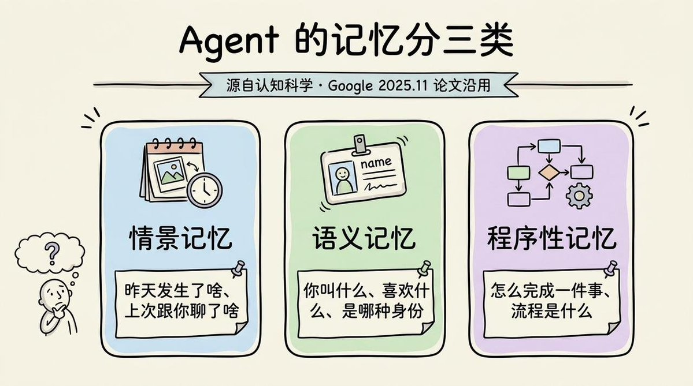
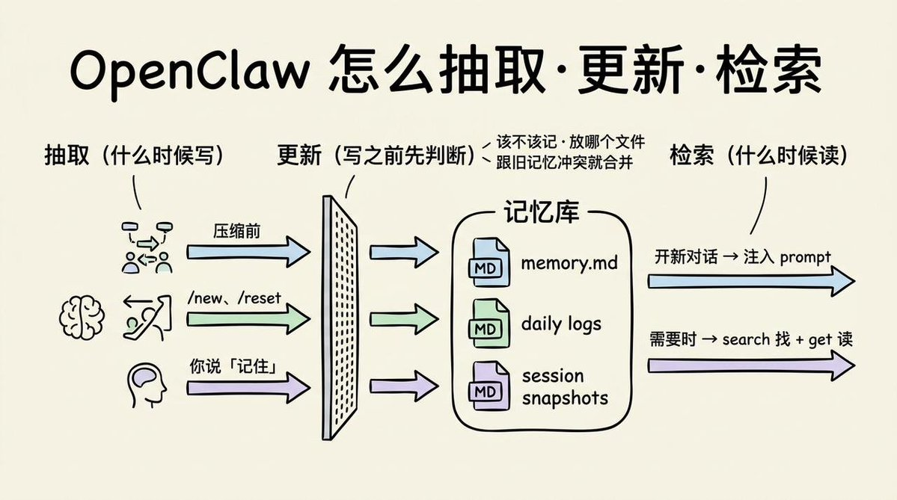
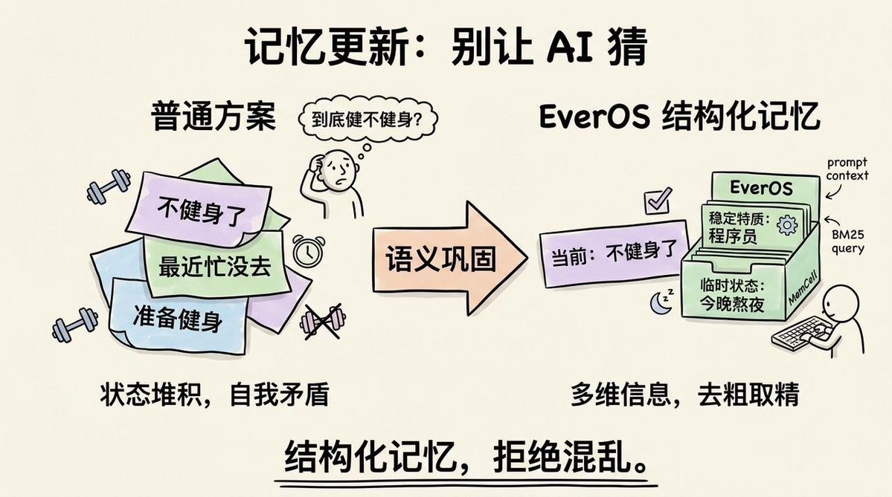

# AI Agent 如何记住东西

按社媒长文的主线整理，对照几份官方资料补充说明。

- 社媒参考：<https://x.com/lxfater/status/2054396603197505745>
- 本地 HTML 整理：`temp/X 上的 铁锤人："AI Agent 是如何记住东西？从原理到实战详细解释" _ X (2026_5_16 14：10：31).html`

原文把一堆容易混在一起的概念拆开了：单会话记忆、跨会话记忆、记忆分类、抽取、更新、检索，以及 OpenClaw 和 EverOS 这两类实现思路。下面按原意整理，再补本站的对照说明。

## 记忆机制的基础层

大模型本身不会自动记住上一次 API 调用里发生的事。你这次问它、下次再问它，如果系统没有把旧内容重新带进 prompt，它就不知道你前面说过什么。

所以"Agent 有记忆"这句话，通常说的"有记忆"，更多是在外层系统做了三件事：

1. 在单个会话里，把前文对话一起带给模型。
2. 上下文太长时，压缩旧内容，把摘要继续塞回 prompt。
3. 跨会话时，把重要信息存到外部记忆层，需要时再取回来。

所谓长期记忆，很多时候是"外部存储 + 适时召回"，不是模型自己天然拥有长期状态。

## 原文给出的理解框架

社媒原文把 Agent 记忆拆成两组问题，这个框架很好用：

- 记忆分几类，每类存什么。
- 记忆怎么抽取、更新、检索。

### 记忆通常分三类

社媒参考：<https://x.com/lxfater/status/2054396603197505745>

原文引用了一篇题为 *Context Engineering, Sessions and Memory* 的论文框架，把 Agent 记忆分成三类：

- **情景记忆**：昨天发生了什么、上次聊了什么。
- **语义记忆**：你是谁、喜欢什么、有哪些稳定偏好。
- **程序性记忆**：一件事怎么做，流程和套路是什么。

这个分类对应了工程里的三种不同数据：会话历史、用户画像、任务方法。很多项目实现不同，但大多都绕不开这三块。

### 记忆流程通常分三步

原文把"维护记忆"总结成三个动作：

- **抽取**：从对话和执行轨迹里挑出该记的内容。
- **更新**：旧信息冲突时，要合并、替换或降权。
- **检索**：新任务开始时，把相关记忆拉回来。

这三步里，最难的往往落在"更正"。评论区里有一句话很值得留下：错误记忆如果被当成稳定事实，体验会比没有记忆更糟。

## OpenClaw 的实现方式

### OpenClaw 的记忆分类

GitHub：<https://github.com/openclaw/openclaw>

按照社媒原文的整理，OpenClaw 主要用了三类文件：

1. `memory.md`
   - 偏语义记忆，存身份、偏好、稳定事实。
2. `daily logs`
   - 偏情景记忆，按天追加关键事件。
3. `session snapshots`
   - 在新会话开始前，总结旧会话里最后一段有意义的消息。

这个设计的优点是直观、好调试、文件也容易看懂。缺点也很明显：如果上下文特别长，或者任务跨度很大，Markdown 文件会越来越像"半结构化备忘录"，检索和更新都容易失真。

### OpenClaw 的抽取、更新、检索

GitHub：<https://github.com/openclaw/openclaw>

原文把 OpenClaw 的写法概括成三类触发时机：

- 压缩上下文前，把值得留下的内容写入日志。
- `/new`、`/reset` 开新会话时，生成会话快照。
- 用户明确说"记住这个"时，系统判断写去哪一层。

读的时候也分两种：

- 新会话启动时，把 `memory.md` 和最近日志注入 prompt。
- 运行中需要时，再通过搜索工具去找、再读取原文。

它代表的是一种很常见的工程做法：**一个始终注入的小记忆层，配一个按需搜索的大记忆层。**

## EverOS 的方案特点

### EverOS 的记忆拆得更细

GitHub：<https://github.com/EverMind-AI/EverOS>

官网：<https://evermind.ai>

文档：<https://docs.evermind.ai>

社媒原文拿 EverOS 做"企业级方案"的例子，主要因为它把记忆对象分得更细。

按原文说法，EverOS 在三大类下面继续细分：

- **语义记忆**：稳定特质、临时状态。
- **情景记忆**：Episode、EventLog、Foresight。
- **程序性记忆**：Agent Case、Agent Skill。

这个拆法背后的想法很朴素：

- 有些信息适合长期保留。
- 有些信息只在某段时间有效。
- 还有一类信息记录的是这类事通常怎么做，和人设本身关系不大。

原文里专门强调了两点：

- 它会把"未来要做什么"当成单独对象处理。
- 它会把反复做同类任务形成的方法蒸馏成 skill，不只留下原始日志。

### EverOS 重点解决的是"更新"问题

GitHub：<https://github.com/EverMind-AI/EverOS>

官网：<https://evermind.ai>

文档：<https://docs.evermind.ai>

原文讲得最透的一段，落在"怎么改"。

举的例子也很典型：

- 一个月前说准备健身。
- 两周前说最近忙，没去。
- 今天说算了，不健身了。

如果系统只是把三句话都塞进日志，检索时拿到哪条就算哪条，那记忆基本不可用。EverOS 的思路，是做所谓"语义巩固"，把重复、冲突、时效不同的信息重新整理，尽量得到一个当前可用的版本。

这也是为什么很多人第一次做 Agent memory，总觉得"我明明已经存了很多，怎么还是不好用"。问题常常不在存不够，而在更新规则太弱。

## 本站补充：它和 TencentDB-Agent-Memory、Hermes、PageIndex 是什么关系

### TencentDB-Agent-Memory：更强调分层和符号化记忆

GitHub：<https://github.com/Tencent/TencentDB-Agent-Memory>

TencentDB-Agent-Memory 仓库首页直接把核心口号写成了"symbolic short-term memory + layered long-term memory"。它和上面那篇社媒长文的共识，基本在同一方向：

- 不能把所有东西平铺到一个向量库里。
- 短期记忆和长期记忆该分层。
- 检索前最好先做结构化抽取和压缩。

它和 OpenClaw 的差别，在于它更强调**短期上下文也要分层管理**，例如把原始工具输出、步骤级摘要、顶层状态图拆开。和 EverOS 的差别，在于它更突出"短期任务过程怎么降 token、怎么保留结构"。

EverOS 更偏长期记忆操作系统这一路，TencentDB-Agent-Memory 则把**短期 + 长期**一起重新组织了一遍，尤其适合工具调用很多、上下文膨胀快的 Agent。

### Hermes：把记忆、技能和进化流程放到一起

文档：<https://hermes-agent.nousresearch.com/docs/>

社媒参考：<https://x.com/akshay_pachaar/status/2054884266522210425>

Hermes 走的是另一种组合方式。从社媒材料和相关文档摘要看，它常被概括成三层记忆：

- 很小的 `MEMORY.md` / `USER.md`，常驻 prompt。
- 基于 SQLite + FTS5 的会话全文检索。
- 可插拔的外部记忆提供者。

它和 OpenClaw 的相似点，在于都有一个常驻的小记忆层；它和 EverOS 又有共通处，都会把技能沉淀、自我更新、长期行为调整放进同一套流程里。

如果只盯着"记忆"二字，Hermes 会被看窄。它不只是一个记忆数据库，而是把**记忆、技能生成、进化验证**绑在一起的 agent runtime。

### PageIndex：它解决的是文档检索，不等于人格记忆

GitHub：<https://github.com/VectifyAI/PageIndex>

官网：<https://pageindex.ai/developer>

文档：<https://docs.pageindex.ai>

PageIndex 经常会被放进"记忆"讨论里，但它的重点不在用户画像、偏好演化或任务技能沉淀，而在**长文档检索**。

项目首页对它的定位很明确：vectorless、reasoning-based RAG。它不靠传统向量分块，做法是先建立树状索引，再做基于推理的树搜索。

它和前面几个项目的关系，可以这样理解：

- OpenClaw / EverOS / Hermes 主要处理 Agent 自己要记住什么。
- PageIndex 主要处理 Agent 要怎样读回外部长文档。

它可以成为记忆系统的"外脑检索层"，但不能直接替代用户记忆、情景记忆或技能记忆。

## 再回头看"记忆"两个字

这篇社媒长文最有价值的地方，是把问题拆开来讲。

如果你以后再看任何一个 Agent memory 项目，可以问四件事：

1. 它把记忆分成了哪几层。
2. 每层分别存什么。
3. 冲突信息怎么更新。
4. 检索时是直接搜，还是会先做结构化重建。

按这个框架去看，很多项目就不容易混了：

- OpenClaw 代表的是文件型、可解释、较轻量的记忆组织方式。
- EverOS 代表的是更细粒度、也更贴近生产系统的长期记忆设计。
- TencentDB-Agent-Memory 补的是分层短期记忆和符号化压缩。
- Hermes 把记忆和技能进化串成了完整流程。
- PageIndex 属于外部知识检索层。

本文属于**社媒参考 / 本地 HTML 整理**，保留了原文主线，但没有照搬长段原文，也不替代项目仓库、论文或官方文档。真要落地，还是要回到对应仓库看数据结构、检索链路和更新策略。
