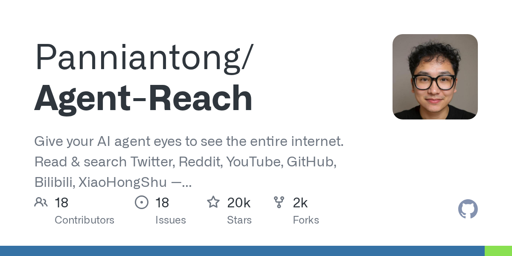

# Agent 读微信的两条路

公众号文章、社群聊天、朋友转发、会议通知、行业八卦、甲方需求——很多信息不会出现在公开网页，而是先在微信里流动。对做内容、做调研、做社群运营的人来说，微信同时也是中文资料入口。

Agent 能不能读微信？能，但路线不止一条。

- **Agent Reach**：不碰本地聊天数据库，重点是给 Agent 接出"微信公众号搜索 + 文章阅读"这类渠道。
- **wx-cli**：直接在本机读取微信本地数据，能查会话、搜消息、拉历史、看联系人和群成员。

这两类工具解决的问题差得很大，风险也不在一个层面。公众号检索更像外部资料读取，本地消息读取则已经碰到隐私、聊天记录和企业信息风险了。

## 两条路线怎么读

### Agent Reach 读的是"微信外层内容流"

Agent Reach 当前把"微信公众号"列进支持渠道，能力表述是：**搜索 + 阅读公众号文章（全文 Markdown）**。它提供的是一条公众号检索通道，让 Agent 能搜文章、读文章、整理文章。

按当前渠道说明，微信公众号这一项的实现选型是：

- `wechat.py`
- `Exa`
- `Camoufox`（可选增强）

它处理的是公众号文章这类公开或半公开内容，不碰你微信客户端里的私人聊天。

### wx-cli 读的是"本地微信数据库"

wx-cli 则完全不一样。它的首页定位是：**从命令行查询本地微信数据**。它能处理的是：

- 会话
- 聊天记录
- 搜索
- 联系人
- 群成员
- 群昵称
- 收藏
- 统计
- 导出

它属于"本地聊天记录工具层"。群消息总结、聊天资料回顾、公众号素材沉淀、个人知识整理这类需求，用它会更直接；一旦碰到公司微信、客户资料、内部群聊，风险就会明显上升。

## Agent Reach：微信公众号入口

### Agent Reach

GitHub：<https://github.com/Panniantong/Agent-Reach>

安装文档：<https://raw.githubusercontent.com/Panniantong/agent-reach/main/docs/install.md>

Agent Reach 把自己定义成一个 **Agent 脚手架**。它的重点在于接入 Twitter、Reddit、YouTube、GitHub、RSS、公众号这些常见资料源，再交给 Agent 调用。

项目当前对微信公众号这条线路的说明比较明确：

- 支持平台里有"微信公众号"
- 能力写的是"搜索 + 阅读公众号文章（全文 Markdown）"
- 当前渠道选型是 `Exa` + `Camoufox`
- 安装命令里可以把 `wechat` 作为 channel 单独装进去

这些点都能在公开资料和安装指南里对上。

### 项目能力

公众号这一段的关键信息主要有四点：

1. **支持微信公众号文章搜索和阅读**
2. **默认不读取本地微信聊天记录**
3. **按 channel 方式接入**
4. **把结果尽量转成 Agent 更好消费的 Markdown**

安装指南里还列出了支持的可选渠道名，里面包含：

```text
wechat
```

对应命令形式是：

```bash
agent-reach install --env=auto --channels=wechat
```

如果用户要一口气全装，也可以：

```bash
agent-reach install --env=auto --channels=all
```

### "绕过反爬读全文"该怎么写才稳

公开资料中能确认的是：

- 公众号搜索
- 文章阅读
- 全文 Markdown 化
- 依赖 Exa / Camoufox / 相关上游工具

按一手资料写，可以稳妥地表述为：**Agent Reach 当前支持微信公众号文章搜索与全文 Markdown 阅读**。至于具体是不是"绕过反爬"，那属于底层工具和站点策略之间的动态变化，不适合写成静态结论。

### 安装和使用方式

Agent Reach 的官方上手方式很"给 Agent 自己装"：直接把安装文档链接丢给 Claude Code、OpenClaw、Cursor 这类 Agent。

官方安装文档给的是：

```text
帮我安装 Agent Reach：https://raw.githubusercontent.com/Panniantong/agent-reach/main/docs/install.md
```

安装文档里实际让 Agent 执行的是类似这样的命令：

```bash
pipx install https://github.com/Panniantong/agent-reach/archive/main.zip
agent-reach install --env=auto
agent-reach install --env=auto --channels=wechat
agent-reach doctor
```

担心它自动改系统时，也可以改用安全模式或 dry run：

```bash
agent-reach install --env=auto --safe
agent-reach install --env=auto --dry-run
```

这组命令主要面向已经在用终端 Agent 的人，作用就是给 Agent 增加一个外部资料入口。

### 使用场景

Agent Reach 主要对应下面几类场景：

- 搜某个公众号最近写了哪些文章
- 把公众号文章转成 Markdown 再总结
- 做公众号素材池或选题库
- 让 Agent 从公开中文内容流里持续收集资料

比如你要做"公众号内容追踪"，链路可以是：

1. 让 Agent Reach 搜相关文章
2. 把正文拉成 Markdown
3. 让 Agent 提炼观点、金句、争议点
4. 再转进自己的选题库或写作草稿

它的重点在"公众号文章内容流"，不在"我的本地微信聊天记录"。



## wx-cli：直接读本地微信数据

### wx-cli

GitHub：<https://github.com/jackwener/wx-cli>

wx-cli 走的是更重的一条路。它不去搜公众号网页，直接在本机读微信数据。项目首页把它写得很清楚：这是一个本地工具，特点包括：

- 单一 Rust 二进制
- `history` / `search` / `sessions` / `new-messages` 等命令都对 Agent 友好
- **完全本地**：数据不出本机，实时解密，无需全量预解密

这句"完全本地"很重要。它说明的是**数据处理路径在本机**，不是在承诺"绝对安全"或者"绝对不会封号"。公开资料也没有这样承诺。

### 项目能力

项目列出来的核心能力比较扎实：

- `wx sessions`：看最近会话
- `wx unread`：看未读
- `wx new-messages`：看增量新消息
- `wx history`：拉历史消息
- `wx search`：全库搜索
- 还支持联系人、群成员、收藏、导出、统计

这就足够支撑几个很具体的场景：

- 群消息自动总结
- 公众号素材收集
- 项目聊天检索
- 周会前回看讨论上下文
- 持续内容生产时按关键词拉素材

### 安装方式

文档给了三类安装入口。

npm 推荐方式：

```bash
npm install -g @jackwener/wx-cli
```

如果你是直接给 Agent 安装 Skill，仓库里保留了这条命令：

```bash
npx skills add jackwener/wx-cli
```

这条必须原样保留。装完后，Agent 会自动读取仓库里的 `SKILL.md`。

Windows 还有一条官方 PowerShell 安装脚本：

```powershell
irm https://raw.githubusercontent.com/jackwener/wx-cli/main/install.ps1 | iex
```

macOS / Linux 则有 shell 安装脚本：

```bash
curl -fsSL https://raw.githubusercontent.com/jackwener/wx-cli/main/install.sh | bash
```

### Windows 安装：命令和权限都别省

- `npx skills add jackwener/wx-cli`
- 管理员 PowerShell
- `wx init`

更完整的 Windows 路线可以写成这样：

```bash
npx skills add jackwener/wx-cli
```

然后在 **管理员 PowerShell** 里安装或初始化。Windows 安装方式是：

```powershell
irm https://raw.githubusercontent.com/jackwener/wx-cli/main/install.ps1 | iex
```

初始化命令则必须保留：

```powershell
wx init
```

这里必须用管理员 PowerShell。原因有两个：

1. 初始化会碰到本地微信进程和相关系统资源
2. 安装脚本和后续命令需要足够权限把二进制放到用户路径、读取或准备本地环境

执行顺序可以理解成：

1. 装 Skill，让 Agent 知道怎么调用 wx-cli
2. 用管理员 PowerShell 装好可执行文件
3. 保持微信正在运行
4. 执行 `wx init`
5. 用 `wx sessions` 验证是否成功

安装脚本 `install.ps1` 里也明确写了安装完成后的快速开始提示：

```powershell
wx init
wx sessions
wx --help
```

### macOS 安装：四步都要做

- 对 `/Applications/WeChat.app` 签名
- TCC reset
- 重启微信
- `sudo wx init`

文档里的命令是：

```bash
codesign --force --deep --sign - /Applications/WeChat.app

for s in ScreenCapture Camera Microphone AppleEvents AddressBook \
         SystemPolicyDocumentsFolder SystemPolicyDownloadsFolder SystemPolicyDesktopFolder; do
  tccutil reset "$s" com.tencent.xinWeChat
done

killall WeChat && open /Applications/WeChat.app

sudo wx init
```

这四步各自的作用要说清楚。

#### 1. 重新签名 WeChat.app

```bash
codesign --force --deep --sign - /Applications/WeChat.app
```

wx-cli 的 macOS 指南写得很清楚：某些情况下要扫描微信进程内存，就得先处理微信应用的签名状态。文档采用的是 ad-hoc 重签名路线。

重签名的代价不小。官方文档提示，微信更新后可能要重做；部分功能、小程序或系统权限行为也可能受影响。

#### 2. 重置 TCC 授权记录

```bash
for s in ScreenCapture Camera Microphone AppleEvents AddressBook \
         SystemPolicyDocumentsFolder SystemPolicyDownloadsFolder SystemPolicyDesktopFolder; do
  tccutil reset "$s" com.tencent.xinWeChat
done
```

TCC 是 macOS 的隐私权限系统。配套文档解释得很明确：重签名之后，旧的权限记录可能和新的 code signature 对不上。跳过这一轮重置，就会出现"系统里看着已经授权，实际调用还是被拒绝"的情况。

这里是在清理旧权限状态，让微信下次重新向系统申请这些权限。

#### 3. 重启微信

```bash
killall WeChat && open /Applications/WeChat.app
```

这一段不能省。wx-cli 的文档强调，签名和权限状态改完以后，需要让微信完全退出再重开，并等它重新登录完成，否则新状态不会真正生效。

#### 4. 用 sudo 初始化

```bash
sudo wx init
```

这是初始化阶段的管理员操作。`sudo` 说明这里需要管理员权限。执行完后再跑：

```bash
wx sessions
```

如果能看到最近会话，说明初始化成功。

### macOS 这条路更折腾

wx-cli 的 `macos-permission-guide.md` 写得非常细，比首页说明还值得看。里面至少有几件事必须在正文里点出来：

- 如果微信是 Apple 官方签名，内存提取权限会受 Hardened Runtime 影响
- SSH、Terminal、本机 GUI、sudo、TCC Developer Tool 授权，分属不同层面的权限
- ad-hoc 重签名后，macOS 可能频繁弹出"微信想访问其他 App 的数据"
- 重签名可能影响登录态、小程序和部分权限行为
- 不同微信版本、不同签名状态、不同 macOS 版本，表现并不完全一样

macOS 这条路虽然能走，但绝对不能写成"装完就好"。它比 Windows 明显更重，也更容易踩隐私和权限坑。

### 典型使用方式

文档给出的这几个命令已经足够做日常工作：

```bash
wx sessions
wx unread
wx new-messages
wx history "张三"
wx history "AI群" --since 2026-04-01 --until 2026-04-15
wx search "关键词"
wx search "会议" --in "工作群" --since 2026-01-01
```

放到 Agent 工作流里，常见用法大概有三类。

#### 1. 群消息总结

项目群、学习群、临时活动群都适合这样用。把一段时间内的消息拉出来，再交给 Agent 总结重点、分歧和待办。

#### 2. 公众号素材收集

如果你平时会把文章转发到聊天窗口、文件传输助手或收藏，wx-cli 可以帮助你按关键词回捞这些内容，再让 Agent 分类。

#### 3. 持续内容生产

做选题库的人很容易遇到一个问题：灵感散在群里、朋友聊天里、转发文章里、收藏里。wx-cli 的价值就是把这些分散片段拉回一个命令行入口，让 Agent 帮你归档和筛选。

## 选型建议

如果你只想让 Agent 读公众号文章、搜公开内容，直接用 Agent Reach 就行。

如果你要处理的是：

- 本地聊天记录
- 群消息沉淀
- 联系人和会话检索
- 收藏和素材导出

那就得看 wx-cli。

也可以把两者串起来用：

- Agent Reach 负责公众号搜索和公开内容阅读
- wx-cli 负责你本机微信里的聊天和素材整理

一个读外层内容流，一个读本地数据库，分工很直观。


## "不联网不封号"这种说法要写得更保守

项目文档中没有"官方保证不封号"的表述，"不联网不封号"的说法需要谨慎看待。

一手资料能确认的是：

- wx-cli 强调**完全本地**
- 数据处理在本机
- 不需要全量预解密
- 需要针对不同系统做初始化和权限处理

但"完全本地"不自动等于"绝对安全"，更不等于"不会触发风控"。实际风险至少包括：

1. 微信客户端更新后行为变化
2. macOS 重签名、权限、内存读取路径的副作用
3. 企业微信、工作群、客户群里的敏感信息暴露
4. Agent 对本地聊天内容的误总结、误归档、误外发

更稳妥的表述是：**wx-cli 当前路线以本地数据读取为主，减少了把聊天记录发到第三方服务的需要，但这不能替代你自己对账号风险、隐私责任和合规责任的判断。**

## 隐私与公司数据风险

只要工具开始读微信，风险说明就不能放在文末一笔带过。

### 1. 私聊和群聊是高敏感数据

聊天记录里会混着：

- 个人隐私
- 客户资料
- 报价和合同信息
- 公司内部讨论
- 未公开项目进度

这些内容就算不出本机，也不代表可以随便交给 Agent 长期读取。更稳的做法是：

- 只在明确任务时拉取必要范围
- 先按时间、群、关键词缩小范围
- 不要把全量聊天长期喂给 Agent

### 2. 公司环境中的制度约束

如果你在公司电脑、公司微信、客户群环境里跑 wx-cli，重点已经变成"你是否有权这么做"。很多组织对聊天记录、客户数据、个人信息、日志留存都有明确制度。

### 3. 对外发送链路最好断开

更危险的是"读完再自动发"。

如果要把 wx-cli 接进内容工作流，建议至少做到：

- 读取和总结可以自动化
- 对外发布和转发保留人工确认
- 涉及客户、同事、公司内部信息时不做自动发布

## 更实际的使用建议

把这两类工具放回现实场景，可以这样分：

- **资料检索**：Agent Reach
- **聊天回顾**：wx-cli
- **公众号文章整理**：两者都能参与，但入口不同
- **群消息总结**：wx-cli
- **持续内容生产**：wx-cli 拉本地素材，再由 Agent 整理；公开补充材料再交给 Agent Reach

如果你只想"让 Agent 看看公众号最近在写什么"，没有必要碰本地微信数据库。

如果你真的要让 Agent 读自己的微信聊天，最好把权限、风险和设备范围想清楚，再动手。
