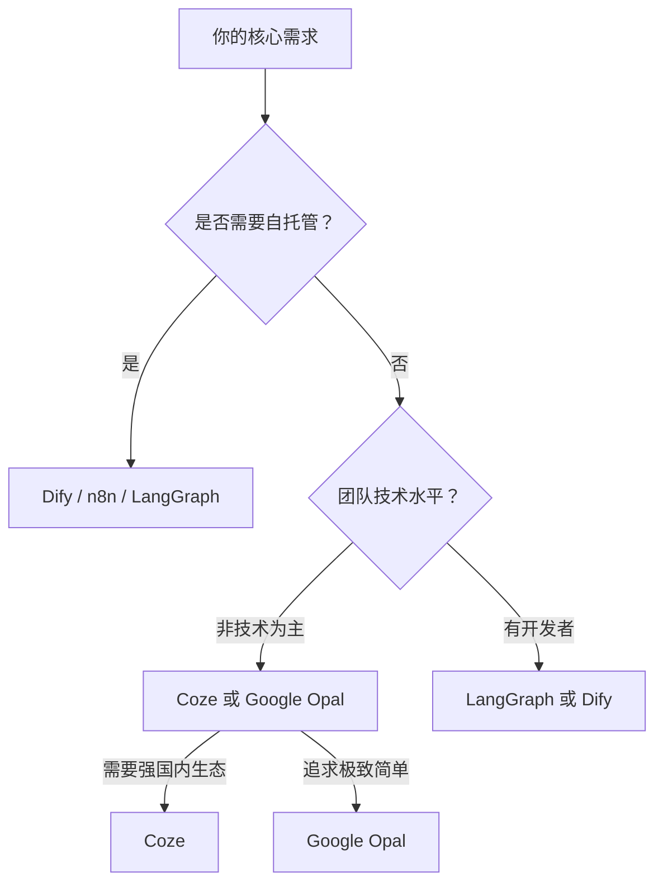

# Agent

## 1. Function Calling

### 1.1 什么是 Function Calling

Function Calling（函数调用 / Tool Use）是让大语言模型（LLM）能够调用外部工具和 API 的核心机制。模型根据用户请求和工具描述，决定何时调用工具，并返回结构化的调用请求。

**核心流程：**

1. **定义工具**：开发者提供工具的 schema（名称、描述、参数）
2. **模型判断**：LLM 分析用户请求，决定是否需要调用工具
3. **生成调用**：模型返回结构化的 `tool_use` 块
4. **执行工具**：应用程序执行实际操作
5. **返回结果**：将 `tool_result` 返回给模型
6. **生成响应**：模型基于结果生成最终回答

### 1.2 工具类型

#### Client Tools（客户端工具）
在你的应用中执行，模型返回 `tool_use` 块，你的代码执行并返回 `tool_result`。

**示例：自定义工具**
```python
tools = [
    {
        "name": "get_weather",
        "description": "获取指定城市的天气信息",
        "input_schema": {
            "type": "object",
            "properties": {
                "location": {
                    "type": "string",
                    "description": "城市名称，如 Beijing"
                }
            },
            "required": ["location"]
        }
    }
]

response = client.messages.create(
    model="claude-opus-4-8",
    max_tokens=1024,
    tools=tools,
    messages=[{"role": "user", "content": "北京今天天气怎么样？"}]
)
```

#### Server Tools（服务端工具）
在 Anthropic 基础设施上运行，无需你处理执行逻辑。

**示例：Web Search**
```python
response = client.messages.create(
    model="claude-opus-4-8",
    max_tokens=1024,
    tools=[{"type": "web_search_20260209", "name": "web_search"}],
    messages=[{"role": "user", "content": "火星探测器最新进展？"}]
)
```

**主要 Server Tools：**
- `web_search` - 网络搜索，带引用来源
- `web_fetch` - 获取网页/PDF完整内容
- `code_execution` - 在沙箱中执行 Python/bash 代码
- `computer_use` - 控制桌面环境（截图、鼠标、键盘）

### 1.3 OpenAI Function Calling

OpenAI 的 Function Calling 支持更严格的模式匹配：

**Structured Outputs（结构化输出）**
```python
tools = [{
    "type": "function",
    "function": {
        "name": "extract_user_info",
        "description": "从文本中提取用户信息",
        "parameters": {
            "type": "object",
            "properties": {
                "name": {"type": "string"},
                "age": {"type": "integer"},
                "email": {"type": "string"}
            },
            "required": ["name", "age"],
            "additionalProperties": False
        },
        "strict": True  # 确保输出严格匹配 schema
    }
}]
```

### 1.4 工具设计最佳实践

**来自 Anthropic "Building Effective Agents" 的指导：**

1. **明确的工具描述**：像写给初级开发者的文档一样
2. **减少重叠**：每个工具应有明确独立的职责
3. **降低格式开销**：避免复杂的字符串转义、行数计数等
4. **提供示例**：在描述中包含使用示例和边界情况
5. **Poka-yoke（防错设计）**：设计参数使错误难以发生

**反例：模糊的路径参数**
```python
# 不好：使用相对路径，agent 移动目录后容易出错
{"name": "edit_file", "parameters": {"path": "string"}}

# 好：强制使用绝对路径
{"name": "edit_file", "parameters": {"absolute_path": "string"}}
```

---

### 1.5 常用 MCP Server

MCP（Model Context Protocol）是 Anthropic 推出的开源标准，让 AI Agent 能够连接外部工具、数据和系统。以下是 6 个最常用的 MCP Server。

#### 1.5.1 Tavily MCP — AI 搜索

> 让 Agent 获得实时网络搜索能力，返回结构化结果和引用来源。

- **GitHub**: https://github.com/tavily-ai/tavily-mcp
- **npm**: https://www.npmjs.com/package/tavily-mcp

**安装方式：**

```bash
# Claude Code
claude mcp add tavily -- npx -y tavily-mcp
# 或带 API Key
claude mcp add tavily -e TAVILY_API_KEY=tvly-xxxxx -- npx -y tavily-mcp
```

```toml
# Codex (~/.codex/config.toml)
[mcp_servers.tavily]
command = "npx"
args = ["-y", "tavily-mcp"]
env = { TAVILY_API_KEY = "tvly-xxxxx" }
```

```json
// Cursor (.cursor/mcp.json)
{
  "mcpServers": {
    "tavily": {
      "command": "npx",
      "args": ["-y", "tavily-mcp"],
      "env": { "TAVILY_API_KEY": "tvly-xxxxx" }
    }
  }
}
```

> 🔑 API Key: 在 https://tavily.com 免费注册获取

#### 1.5.2 Context7 — 实时文档查询

> 为 Agent 提供最新的、版本特定的库文档和代码示例，避免幻觉 API。

- **GitHub**: https://github.com/upstash/context7
- **npm**: https://www.npmjs.com/package/@upstash/context7-mcp

**安装方式：**

```bash
# Claude Code
claude mcp add context7 -- npx -y @upstash/context7-mcp
```

```toml
# Codex (~/.codex/config.toml)
[mcp_servers.context7]
command = "npx"
args = ["-y", "@upstash/context7-mcp"]
```

```json
// Cursor (.cursor/mcp.json)
{
  "mcpServers": {
    "context7": {
      "command": "npx",
      "args": ["-y", "@upstash/context7-mcp"]
    }
  }
}
```

> 💡 无需 API Key，直接可用。在提示中加入 `use context7` 即可触发文档查询。

#### 1.5.3 MarkItDown MCP — 文档转 Markdown

> 将 PDF、Word、PPT、Excel、图片、音频等文件转换为 Markdown，供 Agent 读取。

- **GitHub (Microsoft 原版)**: https://github.com/microsoft/markitdown
- **npx 封装**: https://github.com/xkiranj/markitdown-mcp-npx
- **npm**: https://www.npmjs.com/package/markitdown-mcp-npx

**安装方式：**

```bash
# Claude Code
claude mcp add markitdown -- npx -y markitdown-mcp-npx
```

```toml
# Codex (~/.codex/config.toml)
[mcp_servers.markitdown]
command = "npx"
args = ["-y", "markitdown-mcp-npx"]
```

```json
// Cursor (.cursor/mcp.json)
{
  "mcpServers": {
    "markitdown": {
      "command": "npx",
      "args": ["-y", "markitdown-mcp-npx"]
    }
  }
}
```

> ⚠️ 首次运行会自动创建 Python venv 并安装依赖，需要系统已安装 Python 3.10+。

#### 1.5.4 Chrome DevTools MCP — 浏览器调试

> 让 Agent 控制和检查真实的 Chrome 浏览器：DOM 检查、Console/Network 读取、性能追踪、截图。

- **GitHub**: https://github.com/ChromeDevTools/chrome-devtools-mcp
- **npm**: https://www.npmjs.com/package/chrome-devtools-mcp
- **官方博客**: https://developer.chrome.com/blog/chrome-devtools-mcp

**安装方式：**

```bash
# Claude Code
claude mcp add chrome-devtools -- npx -y chrome-devtools-mcp
```

```toml
# Codex (~/.codex/config.toml)
[mcp_servers.chrome_devtools]
command = "npx"
args = ["-y", "chrome-devtools-mcp"]
```

```json
// Cursor (.cursor/mcp.json)
{
  "mcpServers": {
    "chrome-devtools": {
      "command": "npx",
      "args": ["-y", "chrome-devtools-mcp"]
    }
  }
}
```

> 💡 需要 Chrome 以 `--remote-debugging-port=9222` 启动，或使用默认端口自动连接。

#### 1.5.5 Firecrawl MCP — 网页抓取与爬取

> 搜索、抓取、交互实时网页，返回干净的、Agent 可读的 Markdown 内容。支持批量处理和 LLM 分析。

- **GitHub**: https://github.com/firecrawl/firecrawl-mcp-server
- **npm**: https://www.npmjs.com/package/firecrawl-mcp
- **官网**: https://www.firecrawl.dev

**安装方式：**

```bash
# Claude Code
claude mcp add firecrawl -e FIRECRAWL_API_KEY=fc-xxxxx -- npx -y firecrawl-mcp
```

```toml
# Codex (~/.codex/config.toml)
[mcp_servers.firecrawl]
command = "npx"
args = ["-y", "firecrawl-mcp"]
env = { FIRECRAWL_API_KEY = "fc-xxxxx" }
```

```json
// Cursor (.cursor/mcp.json)
{
  "mcpServers": {
    "firecrawl": {
      "command": "npx",
      "args": ["-y", "firecrawl-mcp"],
      "env": { "FIRECRAWL_API_KEY": "fc-xxxxx" }
    }
  }
}
```

> 🔑 API Key: 在 https://www.firecrawl.dev 注册获取（有免费额度）

#### 1.5.6 Playwright MCP — 浏览器自动化

> 由 Microsoft 官方维护，基于无障碍树（Accessibility Snapshot）与网页交互，无需截图即可精确操作页面元素。

- **GitHub**: https://github.com/microsoft/playwright-mcp
- **npm**: https://www.npmjs.com/package/@playwright/mcp
- **官方文档**: https://playwright.dev/docs/getting-started-mcp

**安装方式：**

```bash
# Claude Code
claude mcp add playwright -- npx -y @playwright/mcp
```

```toml
# Codex (~/.codex/config.toml)
[mcp_servers.playwright]
command = "npx"
args = ["-y", "@playwright/mcp"]
```

```json
// Cursor (.cursor/mcp.json)
{
  "mcpServers": {
    "playwright": {
      "command": "npx",
      "args": ["-y", "@playwright/mcp"]
    }
  }
}
```

> 💡 首次运行会自动安装 Chromium 浏览器。支持 headless 和 headed 两种模式。

#### 1.5.7 推荐资源：Awesome-MCP-ZH

以上只是冰山一角。MCP 生态正在快速发展，已有数百个 Server 可用。

**Awesome-MCP-ZH** 是专为中文用户打造的 MCP 资源合集，由云中江树维护，包含：
- MCP 基础介绍和教程
- MCP 客户端工具一览
- 精选 MCP Server 列表（分类整理）
- MCP Server 开发指南
- 社区资源和实战案例

> 📦 **GitHub**: https://github.com/yzfly/Awesome-MCP-ZH
> 
> ⭐ 已有 6000+ Stars，是中文社区最全面的 MCP 资源库。

---

## 2. Skills

### 2.1 什么是 Skills

Skills 是可复用的专业知识包，让 AI Agent 能够执行特定领域的复杂任务。Skills 通过渐进式披露（Progressive Disclosure）机制，只在需要时加载相关内容到上下文窗口。

**Skills 的三层加载机制：**

1. **Level 1: Metadata（元数据）** - 始终加载
   - Skill 名称和简短描述（~50 tokens）
   - 出现在系统提示中："PDF Processing - Extract text and tables from PDF files"

2. **Level 2: Instructions（指令）** - 触发时加载
   - Agent 通过 `bash: read pdf-skill/SKILL.md` 加载完整指令
   - 包含操作步骤、使用示例

3. **Level 3: Resources（资源）** - 按需加载
   - 仅当需要时读取（如 `FORMS.md`、数据库 schema）
   - 脚本执行时，只有输出进入上下文，代码本身不占用 token

### 2.2 Skill 结构

每个 Skill 需要一个 `SKILL.md` 文件，带 YAML frontmatter：

```markdown
---
name: pdf-processor
description: 从 PDF 文件中提取文本和表格，填充表单，合并文档
---

# PDF Processor

## Instructions
1. 使用 `extract_text.py` 从 PDF 提取文本
2. 使用 `extract_tables.py` 提取表格数据
3. 对于表单填充，参考 FORMS.md

## Examples
### 提取文本
\`\`\`bash
python extract_text.py input.pdf --output output.txt
\`\`\`
```

**目录结构示例：**
```
pdf-skill/
├── SKILL.md           # 主指令文件
├── FORMS.md           # 表单处理参考
├── extract_text.py    # 文本提取脚本
├── extract_tables.py  # 表格提取脚本
└── schemas/
    └── invoice.json   # 发票数据结构
```

### 2.3 使用 Skills

#### Claude API
```python
response = client.messages.create(
    model="claude-opus-4-8",
    max_tokens=1024,
    tools=[{"type": "code_execution_20250820"}],
    container={"skill_id": "pptx"},  # 使用预置 PowerPoint Skill
    messages=[{"role": "user", "content": "创建一个关于 AI 的演示文稿"}]
)
```

#### Claude Code
在项目目录创建 `.claude/skills/` 目录，Claude 会自动发现：

```bash
project/
└── .claude/
    └── skills/
        ├── database-query/
        │   └── SKILL.md
        └── api-testing/
            └── SKILL.md
```

### 2.4 预置 Agent Skills

**可直接使用的 Skills：**
- `pptx` - PowerPoint 创建和编辑
- `xlsx` - Excel 数据分析和报表
- `docx` - Word 文档创建和格式化
- `pdf` - PDF 生成和处理

### 2.5 Skills 的价值

**来自 Anthropic "Equipping Agents for the Real World with Agent Skills"：**

1. **渐进式披露**：无需将所有知识塞进系统提示
2. **可复用性**：跨项目、跨团队共享专业知识
3. **可组合性**：Skills 可以组合使用
4. **token 效率**：只加载需要的内容

**实际案例：**
一个 PDF 处理 Skill 可能包含 50 页文档和 10 个脚本，但如果任务只需要提取文本，Agent 只会：
- 加载 metadata（50 tokens）
- 读取 SKILL.md（~500 tokens）
- 执行 `extract_text.py`（只有输出进入上下文）
- 其余 49 页文档和 9 个脚本从不加载


### 2.6 Skills 分类与推荐

Skills 生态正在快速成熟，可以按用途分为以下几大类。以下推荐均来自社区实践和深度评测。

> 📖 **深度阅读**：[Skills 生态全景 2026](https://ain.hmgf.hxcn.space/ai/skills-ecosystem-202605) — 覆盖七层生态架构、20+ 核心项目分析

#### 2.6.1 代码工程类

| Skill | 用途 | GitHub |
|---|---|---|
| **taste-skill** | 给 AI 注入设计品味，前端审美提升 | https://github.com/Leonxlnx/taste-skill |
| **repomix** | 把整个代码仓库打包成单文件给 Agent | https://github.com/yamadashy/repomix |
| **mattpocock/skills** | 通用工程方法论（TDD、架构、重构） | https://github.com/mattpocock/skills |
| **vibe-codex** | Codex 自主编码增强（无限重试、自愈） | https://github.com/kks0488/vibe-codex |

> 📖 [Vibe Coding 常用 Skills](https://ain.hmgf.hxcn.space/ai/vibe-coding-common-skills-202605) — 前端设计品味提升实践：[如何通过 Skills 提升前端设计](https://ain.hmgf.hxcn.space/ai/improving-frontend-design-through-skills)

#### 2.6.2 写作与去 AI 味类

| Skill | 用途 | GitHub |
|---|---|---|
| **humanizer** | 通用去 AI 痕迹（中英文） | https://github.com/blader/humanizer |
| **Humanizer-zh** | 中文去 AI 腔，专门针对中文语感 | https://github.com/op7418/Humanizer-zh |
| **nuwa-skill** | 学习和统一个人写作风格 | https://github.com/alchaincyf/nuwa-skill |
| **stop-slop** | 删除 AI 套路废话和空洞修饰 | 社区 Skill |
| **ai-flavor-remover** | 通用 AI 味清理 | 社区 Skill |

> 📖 [去 AI 味十大 Skill 评测](https://ain.hmgf.hxcn.space/ai/de-ai-writing-tools-202605) — [IP 写作 Skills 指南](https://ain.hmgf.hxcn.space/ai/ip-writing-skills-202605)

#### 2.6.3 学术研究类

| Skill | 用途 | GitHub |
|---|---|---|
| **academic-research-skills** | 学术研究全流程（选题→投稿） | https://github.com/Imbad0202/academic-research-skills |
| **Auto-Empirical-Research-Skills** | 23000+ 社科实证研究技能库（斯坦福） | https://github.com/brycewang-stanford/Auto-Empirical-Research-Skills |
| **paper-plot-skills** | 顶会论文图表复现绘制 | https://github.com/Trae1ounG/paper-plot-skills |

#### 2.6.4 领域专业类

| Skill | 用途 | GitHub |
|---|---|---|
| **matlab-agentic-toolkit** | MATLAB 工程能力接入 Agent（MathWorks 官方） | https://github.com/matlab/matlab-agentic-toolkit |
| **text-to-cad** | CAD 建模 / 机器人 / 硬件设计 | https://github.com/earthtojake/text-to-cad |
| **reverse-skill** | 逆向工程 / 渗透测试 / 安全研究 | https://github.com/zhaoxuya520/reverse-skill |
| **next-ai-draw-io** | AI 驱动的专业绘图（32.5k ⭐） | https://github.com/DayuanJiang/next-ai-draw-io |

#### 2.6.5 知识管理类

| Skill | 用途 | GitHub |
|---|---|---|
| **book-to-skill** | 把技术书籍变成可调用的 Skill | https://github.com/virgiliojr94/book-to-skill |
| **dbskill** | 数据库领域知识 Skill | https://github.com/dontbesilent2025/dbskill |

#### 2.6.6 MCP + Skills 结合

MCP Server 和 Skills 可以组合使用：MCP 提供"能力"（搜索、抓取、执行），Skills 提供"方法论"（怎么用、何时用、用哪个）。

> 📖 [MCP + Skills 结合指南](https://ain.hmgf.hxcn.space/ai/mcp-skills-guide) — MCP Server 如何与 Skill 协同工作

**典型组合示例：**
- **taste-skill + Playwright MCP**：设计品味 Skill 指导前端实现，Playwright 验证视觉效果
- **academic-research-skills + Tavily MCP**：学术研究流程 Skill 驱动搜索，Tavily 提供实时文献检索
- **humanizer + MarkItDown MCP**：MarkItDown 提取文档内容，humanizer 去除 AI 痕迹后输出

#### 2.6.7 社区资源索引

| 资源 | 说明 | 链接 |
|---|---|---|
| **Awesome-Codex-Skills** | Codex Skills 精选列表 | https://github.com/ComposioHQ/awesome-codex-skills |
| **aitmpl.com/skills** | Skills 模板市场 | https://aitmpl.com/skills |
| **Skills 生态全景** | 七层架构深度分析 | https://ain.hmgf.hxcn.space/ai/skills-ecosystem-202605 |
| **如何设计好 Skills** | Skill 设计方法论 | https://ain.hmgf.hxcn.space/ai/how-to-design-good-skills-202605 |
| **PPT Skills 评测** | PPT 类 Skill 横评 | https://ain.hmgf.hxcn.space/ai/ppt-skills-review-202606 |
| **社区趣味 Skills** | 社区创意 Skill 合集 | https://ain.hmgf.hxcn.space/ai/fun-community-skills |

---


## 3. RAG（检索增强生成）

### 3.1 什么是 RAG

大模型有个致命缺陷：它只知道训练数据里的东西。要么不知道答案，要么一本正经地胡说八道（幻觉）。RAG 就是解决这个问题的。

**一句话理解**：先帮大模型"查资料"，再让它"回答问题"。就像开卷考试，你不需要记住所有知识，但你需要知道去哪里查。

**全称**：Retrieval-Augmented Generation（检索增强生成）

### 3.2 RAG 的核心流程

```
用户提问 → 检索相关文档 → 把文档塞进上下文 → 大模型基于文档生成答案
```

具体来说：

1. **离线准备（Indexing）**：把你的文档（PDF、网页、数据库）切分成小块，用嵌入模型（Embedding Model）转成向量，存入向量数据库
2. **在线检索（Retrieval）**：用户提问时，把问题也转成向量，在向量数据库中找到语义最相近的文档块
3. **增强生成（Generation）**：把检索到的文档块拼进 Prompt 的上下文部分，让大模型基于这些真实资料生成答案

### 3.3 RAG vs 微调 vs 长上下文

| 方式 | 原理 | 优点 | 缺点 |
|---|---|---|---|
| **RAG** | 运行时检索外部知识 | 知识可实时更新、可溯源、成本低 | 检索质量影响生成质量 |
| **微调（Fine-tuning）** | 用新数据重新训练模型 | 响应快、风格可控 | 成本高、知识会过时、可能遗忘 |
| **长上下文** | 把所有文档塞进上下文窗口 | 简单直接 | Token 成本高、长文本幻觉率上升 |

> 💡 2025-2026 年的趋势：三者并非互斥，而是互补。前沿做法是 RAG + 长上下文 + 轻量微调的组合方案。

### 3.4 RAG 的关键组件

| 组件 | 作用 | 代表产品 |
|---|---|---|
| **嵌入模型（Embedding）** | 把文本转成向量 | OpenAI text-embedding-3、BGE-M3、Qwen3-Embedding |
| **向量数据库** | 存储和检索向量 | Milvus、Qdrant、Chroma、Pinecone、Weaviate |
| **重排序模型（Reranker）** | 对初步检索结果精排 | Cohere Rerank、BGE-Reranker、Qwen3-Reranker |
| **分块策略（Chunking）** | 把长文档切成合适大小 | 按段落/句子/语义分块 |

### 3.5 RAG 的演进方向

- **Naive RAG**：基础版，直接检索→拼接→生成。简单但效果有限
- **Advanced RAG**：加入查询改写（HyDE）、多路检索（向量+BM25）、重排序、自适应检索等优化
- **Modular RAG**：模块化架构，按需组合检索策略。2025-2026 年的主流方向
- **Graph RAG**：结合知识图谱，用图结构组织实体关系，增强对复杂关系的理解
- **Agentic RAG**：Agent 自主决定何时检索、检索什么、是否需要多轮检索。是当前最前沿的方向

> 📖 **参考**：model.md §2.1.6 嵌入模型、§2.1.7 重排序模型

---

## 4. AGENTS.md

### 4.1 什么是 AGENTS.md

AGENTS.md 是一个简单、开放的文件格式，用来给 AI 编程助手"写说明书"。

**一句话理解**：README.md 是给人看的，AGENTS.md 是给 AI Agent 看的。就像新员工入职时要读的员工手册，只不过这个"员工"是 AI。

### 4.2 为什么需要 AGENTS.md

当你让 Claude Code、Codex、Cursor 等 AI 编程助手帮你改代码时，它需要知道：
- 这个项目怎么构建？怎么测试？
- 代码风格是什么？有什么约定？
- 有哪些坑需要注意？

没有 AGENTS.md 的时候，AI 只能靠自己"猜"，或者你每次都要手动告诉它。有了 AGENTS.md，这些信息一次写好，AI 自动读取。

### 4.3 基本格式

AGENTS.md 就是普通的 Markdown 文件，放在项目根目录。没有固定格式，写你需要的内容即可：

```markdown
# AGENTS.md

## 构建命令
- 安装依赖：`pnpm install`
- 启动开发：`pnpm dev`
- 运行测试：`pnpm test`

## 代码风格
- TypeScript 严格模式
- 单引号，无分号
- 优先使用函数式模式

## 测试要求
- 提交前必须运行 `pnpm lint` 和 `pnpm test`
- 修改代码时同步更新测试

## PR 规范
- 标题格式：[项目名] 标题
```

### 4.4 哪些工具支持 AGENTS.md

AGENTS.md 已被 60,000+ 开源项目采用，由 Agentic AI Foundation（Linux 基金会下）维护。以下工具原生支持：

| 类别 | 工具 |
|---|---|
| **CLI Agent** | OpenAI Codex、Gemini CLI、Aider、goose |
| **IDE Agent** | Cursor、Windsurf、VS Code Copilot、Zed、Junie（JetBrains） |
| **平台 Agent** | GitHub Copilot Coding Agent、Devin、Factory、Amp |

### 4.5 AGENTS.md vs 其他配置文件

| 文件 | 给谁看 | 用途 |
|---|---|---|
| `README.md` | 人类 | 项目介绍、快速开始、贡献指南 |
| `AGENTS.md` | AI Agent | 构建/测试命令、代码约定、安全注意事项 |
| `.cursorrules` | Cursor 专属 | Cursor 特定的规则（正在被 AGENTS.md 统一） |
| `CLAUDE.md` | Claude Code 专属 | Claude Code 特定的指令 |
| `SKILL.md` | AI Agent | 可复用的技能包（详见 §2 Skills） |

> 💡 **最佳实践**：大项目可以在子目录放多个 AGENTS.md，Agent 会自动读取最近的那个。OpenAI 的主仓库就有 88 个 AGENTS.md 文件。

> 🔗 **官网**：https://agents.md ｜ **GitHub**：https://github.com/agentsmd/agents.md

---


## 5. 四大工程

### 5.1 总览：从"会说话"到"会干活"

大模型本身只能做文字接龙，不断预测下一个 Token。要让它成为可靠的"员工"，需要在四个层次上持续投入：

| 工程 | 一句话 | 解决什么问题 |
|---|---|---|
| **Prompt Engineering** | 怎么跟 AI 说话 | 模型听不懂模糊指令 |
| **Context Engineering** | 给 AI 什么信息 | 模型缺少必要的背景知识 |
| **Harness Engineering** | 给 AI 什么规矩 | 模型行为不可控、不可预测 |
| **Loop Engineering** | 让 AI 自己跑起来 | 单次对话无法完成复杂/持续任务 |

> 💡 **Prompt Engineering 可以理解为 Context Engineering 的子集**，调整说话方式本质上也是在管理上下文。

---

### 5.2 Prompt Engineering（提示词工程）

**直觉**：小 L 很聪明但没经验，你说"帮我写个方案"，他交上来的东西一塌糊涂。你学会了怎么跟他说话：给清楚的背景、明确的要求、提供示例、指定输出格式。

#### 5.2.1 核心原则

Prompt Engineering 是编写和组织 LLM 指令以获得最佳结果的方法。

**OpenAI Prompt 结构建议：**

```markdown
# Identity（身份）
你是一个帮助执行 snake_case 变量命名的编码助手...

# Instructions（指令）
* 定义变量时使用 snake_case（如 my_variable）而非 camelCase
* 使用 var 关键字支持旧浏览器
* 不使用 Markdown 格式，直接返回代码

# Examples（示例）
Q: 如何声明一个 first name 的字符串变量？
A: var first_name = "Anna";

# Context（上下文）
<current_file path="app.js">
// 当前文件内容...
</current_file>
```

#### 5.2.2 消息角色

| 角色                   | 用途                 | 优先级 |
| ---------------------- | -------------------- | ------ |
| `developer` / `system` | 应用开发者提供的指令 | 最高   |
| `user`                 | 终端用户提供的输入   | 中等   |
| `assistant`            | 模型生成的响应       | -      |

**示例：**
```python
messages = [
    {"role": "developer", "content": "你是一个海盗风格的助手"},
    {"role": "user", "content": "JavaScript 中分号是可选的吗？"}
]
```

#### 5.2.3 Few-shot Learning

提供示例帮助模型理解任务模式：

```markdown
# 情感分类示例

Example 1:
Input: "我非常喜欢这个耳机 — 音质太棒了！"
Output: Positive

Example 2:
Input: "电池续航还行，但耳罩感觉很廉价"
Output: Neutral

Example 3:
Input: "客服太差了，再也不会买了"
Output: Negative
```

#### 5.2.4 GPT-5.5 vs Reasoning Models

**GPT 模型**（如 gpt-5.5）：
- 需要明确、详细的指令
- 像给初级同事分配任务：提供明确步骤

**Reasoning 模型**（如 o1）：
- 只需高层目标
- 像给高级同事分配任务：说明目标，他们自己规划

```python
# GPT-5.5 提示：详细指令
"""
1. 读取 input.csv 文件
2. 过滤 age > 18 的行
3. 按 name 排序
4. 输出到 output.csv
"""

# Reasoning 模型提示：高层目标
"""
处理 input.csv，只保留成年人，按姓名排序输出
"""
```

---

### 5.3 Context Engineering（上下文工程）

**直觉**：小 L 虽然会说话了，但他不知道你公司的内部情况。你问他"这个项目进展如何"，他只能瞎猜。你开始给他提供背景资料，比如项目文档、会议记录、数据库查询结果。


#### 5.3.1 为什么需要 Context Engineering

**来自 Anthropic "Effective Context Engineering for AI Agents"：**

Context（上下文）是 LLM 的有限资源，就像人类的工作记忆。随着上下文增长，模型的注意力预算（attention budget）会被稀释，导致：

- **Context Rot（上下文腐烂）**：信息检索准确性下降
- **注意力分散**：n² 的 Token 关系难以维持
- **位置理解降级**：长上下文中位置编码的准确性下降

#### 5.3.2 最小化高信号 Token 集

**系统提示优化：**
- 避免硬编码脆弱逻辑（太低层）
- 避免模糊高层指导（太高层）
- 找到"Goldilocks Zone"：具体但灵活的启发式规则

**工具设计：**
- 返回 Token 高效的信息
- 鼓励高效的 Agent 行为
- 避免臃肿的工具集

#### 5.3.3 Just-in-Time Context Retrieval

**传统 RAG（预检索）：**
```
用户请求 → 向量检索 → 加载大量文档 → 模型推理
```

**Agentic Search（运行时探索）：**
```
用户请求 → Agent 使用工具导航 → 动态加载相关内容 → 渐进式发现
```

**上下文的来源多种多样**：
- 你手动写进去的背景信息
- RAG 从知识库检索出来的文档（§3）
- MCP 工具调用返回的结果（§1.5）
- Skill 中预置的说明和脚本（§2）
- 历史对话的压缩摘要（Memory）

#### 5.3.4 长时程任务的上下文策略

**Compaction（压缩）：**
将接近上下文窗口限制的对话总结，重新初始化新窗口。

```python
# Claude Code 的 compaction 策略：
# 1. 传递消息历史给模型总结
# 2. 保留架构决策、未解决 bug、实现细节
# 3. 丢弃冗余工具输出
# 4. 加上最近访问的 5 个文件
```

**Structured Note-taking（结构化笔记）：**
Agent 定期写笔记到上下文窗口外的持久化存储。

```markdown
# NOTES.md
## 当前进度
- 已完成用户认证模块
- 正在实现支付集成
- 遇到问题：Stripe webhook 验证失败

## 待办事项
1. 修复 webhook 签名验证
2. 添加支付重试逻辑
3. 编写集成测试
```

**Sub-agent Architecture（子代理架构）：**
- 主 Agent 协调高层计划
- 子 Agent 处理深度技术任务（可能使用数万 Token）
- 子 Agent 只返回压缩摘要（1000-2000 Tokens）

---

### 5.4 Harness Engineering（驾驭工程）

**直觉**：你给小 L 配了工具、给了资料，结果他为了回答"今天几号"，先去买充电器，再去银行取钱，最后把手机都抵押了。虽然最终回答了问题，但过程完全失控。你开始制定规矩：哪些权限要收敛、哪些流程要固定、哪些行为要约束。

#### 5.4.1 什么是 Harness

Harness 是 Agent 运行的环境和基础设施，包括工具、权限、反馈循环和状态管理。

**来自 OpenAI "Harness Engineering"：**

> 人类引导，Agent 执行。我们的角色不再是编写代码，而是设计环境、明确意图、构建反馈循环，让 Codex Agent 能够可靠工作。

#### 5.4.2 知识库即代码

**AGENTS.md 作为目录而非百科全书（§4）：**

```
project/
├── AGENTS.md              # ~100 行，指向其他文档
├── ARCHITECTURE.md        # 系统架构地图
├── docs/
│   ├── design-docs/
│   ├── exec-plans/
│   ├── product-specs/
│   └── QUALITY_SCORE.md
```

**机械化验证：**
- Linters 验证知识库结构
- CI 检查文档交叉引用
- "doc-gardening" agent 定期扫描陈旧文档

#### 5.4.3 Anthropic 的双Agent架构

**来自 "Effective Harnesses for Long-Running Agents"：**

解决长时程任务的上下文连续性问题：

**Initializer Agent（初始化代理）：**
```markdown
任务：设置项目环境

输出：
1. init.sh - 启动脚本
2. tests.json - 200+ 特性列表（全部标记为 failing）
3. claude-progress.txt - 进度日志
4. 初始 git commit
```

**Coding Agent（编码代理）：**
```markdown
每次会话：
1. 运行 pwd 确认目录
2. 读取 git log 和 progress 文件
3. 读取 tests.json 选择下一个特性
4. 运行 init.sh 启动服务
5. 执行基础端到端测试
6. 实现一个特性
7. 测试验证
8. 更新 git 和 progress 文件
9. 标记特性为 passing
```

**关键机制：**
- 每个特性单独实现（增量进度）
- Git commits 提供回滚能力
- 浏览器自动化工具端到端测试
- Progress 文件桥接会话

**Harness 做的事情总结**：
- **权限控制**：Agent 能访问哪些目录、哪些 API
- **行为约束**：AGENTS.md 中定义的代码规范、测试要求（§4）
- **流程固化**：把稳定的工作流写成 Skill 或脚本，不让 Agent 每次自由发挥
- **状态管理**：跨会话的进度追踪、Git 提交记录、进度文件

> 💡 **Harness 不是某个具体的技术**，而是"让不可控的强大智能朝着我们想要的方向走"的所有办法。

---

### 5.5 Loop Engineering（循环工程）

**直觉**：任务越来越复杂，一次对话完不成。你需要 AI 能自己跑循环，比如定时检查、自动修复、持续运行。


#### 5.5.1 什么是 Loop Engineering

**来自 Addy Osmani "Loop Engineering"：**

> Loop Engineering 是设计系统来提示 Agent 的过程，而不是你自己提示它。

**核心思想：**
- 让 Agent 在循环中运行
- 每次迭代观察、计划、执行
- 使用反馈自动修正

> ⚠️ **泼个冷水**：Loop Engineering 本质上就是"定时任务 + Agent 调用"，概念并不新鲜。对大部分人来说，连一个 AGENTS.md 都还没写好，谈什么 Loop Engineering 呢？先把前三步走踏实。

#### 5.5.2 常见 Loop 模式

**Evaluator-Optimizer Loop（评估-优化循环）：**


```python
# 文学翻译循环
while not evaluator_satisfied:
    translation = translator_llm(source_text)
    critique = evaluator_llm(translation, source_text)
    if critique.satisfied:
        break
    source_text = f"{source_text}\n\nFeedback: {critique.feedback}"
```

**Ralph Loop（自主修复循环）：**
```python
# Codex 自主工作流
while not task_complete:
    pr = agent.implement_feature(task)
    self_review = agent.review_code(pr)
    agent_reviews = [reviewer.review(pr) for reviewer in agent_reviewers]
    if all(review.approved for review in agent_reviews):
        pr.merge()
        break
    else:
        agent.address_feedback(agent_reviews)
```

**Iterative Repair Loop（迭代修复循环）：**
```python
# OpenAI Cookbook 示例
max_attempts = 5
for attempt in range(max_attempts):
    code = agent.write_code(spec)
    test_results = run_tests(code)
    if test_results.all_passed:
        return code
    spec = f"{spec}\n\nTest failures:\n{test_results.failures}"
```

#### 5.5.3 OpenAI Codex 的自主循环

**来自 "How Agents Are Transforming Work"：**

- 99th percentile 工程师：每天 60+ 小时的 Agent 运行时间
- Agent 并行协作
- 监控 CI，自主解决失败
- 单次 Codex 运行可工作 6+ 小时（通常在人类睡觉时）

**Goal-Directed Loops（目标导向循环）：**
```python
# 使用 Goals API
response = client.responses.create(
    model="gpt-5.5",
    instructions="修复 bug #1234",
    goal="所有测试通过且 bug 不再复现",
    # Agent 会循环直到达成 goal
)
```

#### 5.5.4 Anthropic 的生成-评估循环

**来自 "Harness Design for Long-Running Apps"：**

```python
# 每次生成迭代 5-15 次
for iteration in range(5, 15):
    ui_code = generator_agent.create_ui(spec)
    page = playwright.goto(local_server)
    observations = evaluator_agent.observe(page)
    score = evaluator_agent.score(observations, spec)
    critique = evaluator_agent.critique(observations)
    if score >= threshold:
        break
    spec = f"{spec}\n\nIteration {iteration} feedback:\n{critique}"
```

**动态并行循环：**
```python
# Claude Code 动态工作流
orchestration = agent.generate_orchestration(task)
subagents = orchestration.spawn_parallel_agents()
for result in subagents.results:
    verification = adversarial_verifier.check(result)
    if not verification.passed:
        result.agent.fix(verification.issues)
```

---

### 5.6 四大工程的关系

```
你（老板）
  │
  ├── Prompt Engineering  ── 怎么跟 AI 说话
  │
  ├── Context Engineering ── 给 AI 什么信息
  │       ↑ 包含 Prompt Engineering
  │       ↑ 包含 RAG、Skill、Memory、MCP 返回值
  │
  ├── Harness Engineering ── 给 AI 什么规矩
  │       ↑ AGENTS.md、权限、流程固化
  │
  └── Loop Engineering    ── 让 AI 自己跑起来
          ↑ 定时任务、自动触发、持续运行
```

### 5.7 一切技术的本质

所有这些工程，归根结底就是两件事：

1. **帮 AI 补充信息**：RAG、Search、Skill、Memory，都是往上下文里塞内容
2. **帮人类减少沟通**：Agent 代替你和大模型对话，子 Agent 代替主 Agent 处理子任务

**Agent 是什么？** 就是一个程序，把所有"不需要智能"的部分（文件读取、API 调用、格式转换、权限检查）用代码实现，只在需要"判断"的时候才问大模型。

> 📖 **参考视频**：
> - [【闪客】一口气拆穿 Skill/MCP/RAG/Agent 底层逻辑](https://www.bilibili.com/video/BV1ojfDBSEPv/) — 用大白话讲清所有概念的关系
> - [【闪客】你管这破玩意叫 Harness？](https://www.bilibili.com/video/BV1cNdrB4Evw/) — Harness 的来龙去脉
> - [【闪客】新名词诈骗！你管这破玩意叫 Loop Engineering？](https://www.bilibili.com/video/BV1Xg7v6PEr9/) — Loop Engineering 的真相

---

## 6. Agent 工具

### 6.1 Claude Code：Anthropic 官方编码 Agent

Claude Code 是 Anthropic 推出的命令行编码 Agent，支持 Computer Use、文件编辑、浏览器控制和长期会话。

#### 配置文件修改

Claude Code 的配置文件位于：
- **全局**：`~/.claude/settings.json`
- **项目级**：`.claude/settings.json`

> ⚠️ **Claude Code 原生只支持 Anthropic API 格式。** 如果你的自定义端点是 OpenAI 格式（`/v1/chat/completions`），必须先用本地代理网关（如 cc-switch 的代理功能）做 API 格式转换，再填入 `ANTHROPIC_BASE_URL`。

**① 环境变量方式（推荐，立即生效，重启终端需重设）**

```bash
export ANTHROPIC_BASE_URL="https://your-custom-endpoint/v1"
export ANTHROPIC_API_KEY="sk-xxx"

claude   # 启动后自动读取环境变量
```

**② 写入配置文件（永久生效）**

编辑 `~/.claude/settings.json`（或项目内 `.claude/settings.json`）：

```json
{
  "permissions": {
    "allow": ["Read", "Edit", "Write", "Bash"],
    "deny": []
  },
  "env": {
    "ANTHROPIC_BASE_URL": "https://your-custom-endpoint/v1",
    "ANTHROPIC_API_KEY": "sk-xxx"
  }
}
```

> **配置字段说明**
> - `permissions.allow`：允许 Agent 操作的工具列表
> - `env.ANTHROPIC_BASE_URL`：你的 Anthropic API 端点（必须是 `/v1` 结尾）
> - `env.ANTHROPIC_API_KEY`：你的 API Key

> ⚠️ Claude Code 不使用 `~/.claude/config.toml`，配置文件为 `settings.json`。`[api]`、`[model]` 等 TOML 分段格式是 Codex 的写法，不适用于 Claude Code。

#### 关闭首次安装强制登录

```bash
# 方法一：环境变量（推荐）
CLAUDE_SKIP_LOGIN=1 claude

# 方法二：写入配置
claude config set --no-forced-login true
```

#### 推理参数调整

Claude Code 的推理参数通过命令行或会话内命令设置，不在配置文件中：

```bash
# 启动时指定
claude --model claude-sonnet-4-20250514 --max-tokens 128000

# 会话内切换
/model claude-sonnet-4-20250514
/effort high
```

#### 引用文件与工具调用

- 引用文件：直接输入 @文件名 或 @文件夹路径，支持多文件同时引用。
- MCP：使用 /mcp 命令管理。
- Skills：使用 /skills 查看和调用。

#### 常用 / 命令

- /new 或 /clear：开启新对话，清空上下文。
- /compress：压缩当前会话上下文，保留核心信息。
- /init：在当前目录初始化项目配置。
- /config：查看或修改当前会话配置。
- /model：切换模型（支持自定义模型）。
- /effort 或 /thinking：设置思考强度（low/medium/high）。
- /fast：快速模式，降低思考深度加速回复。
- /hook：管理会话钩子（pre/post 命令）。
- /login 与 /logout：仅官方 Anthropic 账号可用。
- /permissions：查看和修改 Agent 权限（读写、浏览器、终端等）。
- /plan：让 Claude 先输出详细执行计划。
- /goal：设置长期目标，Agent 会持续追踪。
- /loop：进入自动循环模式，直到目标完成。
- /plugin：管理第三方插件。
- /restore：恢复历史会话。
- /sandbox：进入沙盒环境。
- /status：显示当前 Agent 状态。
- /todo：内置任务管理系统。
- /vim：进入 Vim 编辑模式。
- /ps：查看当前运行的子任务。
---

### 6.2 Codex：OpenAI 官方编码 Agent + oh-my-codex（OMX）

Codex 是 OpenAI 的编码 Agent，搭配 oh-my-codex（OMX）框架后成为目前最强的工程化 Agent 系统。

#### 配置文件（config.toml）

位于 ~/.codex/config.toml：

```toml
[default]
provider = "custom"
base_url = "https://your-api.com/v1"
api_key = "sk-xxx"
model = "gpt-5.5"
reasoning_effort = "high"

[omx]
mode = "ralph"
default_plan_model = "gpt-5.5"
```

#### 引用文件

使用 @文件名 或 @文件夹/，支持递归引用整个目录。

#### MCP 与 Skills

- MCP：Codex 默认自动启用所有可用 MCP，无需手动调用。
- Skills：使用 \$ 触发，例如 $deep-interview、$ralplan、$team、$ralph、$ultraqa。

#### 常用 / 命令

- /new、/clear：新对话、清空上下文。
- /compress：压缩会话。
- /init：初始化项目。
- /config：查看修改配置。
- /model：切换模型。
- /effort：设置 reasoning effort（low/medium/high）。
- /fast：快速模式。
- /hook：管理钩子。
- /login、/logout：官方账号登录退出。
- /permissions：权限管理。
- /plan：生成执行计划。
- /goal：设置目标。
- /loop：循环执行模式。
- /plugin：插件管理。
- /restore、/session：会话恢复。
- /sandbox：沙盒模式。
- /status：当前状态。
- /todo：任务管理。
- /vim：Vim 模式。
- /ps：查看进程。

oh-my-codex（OMX）额外提供了 $ralplan（共识规划）、$team（多 Agent 协同）、$ralph（可视化验证循环）等高级工作流。

---

### 6.3 OpenCode：高性能开源编码 Agent

OpenCode 是目前 Stars 最高的开源编码 Agent（16 万+），基于 Go 开发，支持 75+ 模型，提供 TUI 界面和 LSP 支持。

#### 接入模型

```bash
# 方式一
opencode connect

# 方式二（推荐）
opencode login
```

#### 配置文件（opencode.json）

```json
{
  "model": "custom",
  "api_base": "https://your-endpoint/v1",
  "api_key": "sk-xxx",
  "temperature": 0.1,
  "max_tokens": 128000,
  "reasoning_effort": "high"
```
### 6.4 Hermes Agent

Hermes Agent 是 Nous Research 开发的开源 AI 智能体（MIT 许可），本质是「编程 Agent + IM」的组合体。它在 OpenClaw 的基础上进行了彻底重构，专注于自进化能力、稳定性和安全。

#### OpenClaw 与 Hermes 的区别

OpenClaw 是 2026 年初火起来的开源 AI Agent，标志是龙虾，做的事是让 LLM 能干活：工具调用、自动化执行、长期记忆、沙箱、多平台接入。像个开箱即用的数字管家。

两家在本地优先、数据不上云、走即时通讯入口这些方向上一致。分歧在路径：

- **技能来源**：OpenClaw 靠人写（开发者用代码或 Prompt 定义 Skill，稳定可预测，但上限取决于你愿意手写多少）。Hermes 靠涌现（完成复杂任务后自己抽方法存成 Skill，下次直接复用）。
- **记忆方式**：OpenClaw 本质是 RAG，知道信息在哪，需要时去取。Hermes 用分层记忆，额外建了一个用户模型，跨会话记住你的代码风格和技术栈偏好。
- **Token 消耗**：OpenClaw 跨 24 小时任务容易 token 烧完事情只干一半，同样场景早过 10 万 token。Hermes 用户反馈聊很久也能维持在三四万，遇到错误会继续搞到明确成功或失败为止。
- **安全差距**：OpenClaw 增长太快，已披露多个高危 CVE（CVE-2026-25253 的 CVSS 8.8 可一键 RCE），ClawHub 里多次被爆出恶意技能偷凭证。Hermes 更保守，危险操作需人工批准（Tirith 预执行扫描器先检查终端命令），到现在没出现类似的集中高危事件。
- **代码质量**：OpenClaw 的主分支有时直接构建失败，PR 卡 CI、回归 bug 频发。Hermes 核心文件结构干净，CI 投诉远少于 OpenClaw，社区主流评价是「更稳、更注重深度而非广度」。

> 💡 社区主流看法并非替代关系，而是互补：OpenClaw 干活，Hermes 动脑。常见做法是把 Hermes 当规划器挂在 OpenClaw 之上，`hermes claw migrate` 一行命令就能把现有技能、记忆和配置平滑搬过来。

#### 安装接入

安装脚本（Linux / macOS / WSL2 / Android Termux）：

```bash
curl -fsSL https://raw.githubusercontent.com/NousResearch/hermes-agent/main/scripts/install.sh | bash
```

安装后进入 Setup Wizard。如果是从 OpenClaw 迁移，向导会自动检测并列出全部可迁移项（配置、记忆、技能、API 密钥等），确认后一键迁移。

**接入自定义模型提供商：**

```bash
hermes model
```

使用方向键选中 Quick setup，按空格勾选后回车。选择自定义提供商，输入 Base URL、API Key 和模型名称。

配置文件位于 `~/.hermes/config.yaml`（模型与推理参数）和 `~/.hermes/.env`（API Key）：

```yaml
# ~/.hermes/config.yaml 示例
model:
  provider: custom
  base_url: https://your-custom-endpoint/v1
  name: claude-sonnet-4-20250514
  max_tokens: 128000
  temperature: 0.1
  reasoning_effort: high
```

安装与迁移详情参考官方迁移文档：[从 OpenClaw 迁移到 Hermes Agent 保姆级教程](https://hs.cnies.org/archives/openclaw2hermes-migration)。

#### 引用文件（@）

直接输入 `@文件名` 或 `@文件夹路径`，支持递归引用整个目录。拖拽文件同样生效。

#### / 命令与常用指令

Hermes 的 `/` 命令风格接近 Claude Code，但提示词优化更强：

- `/skills`：列出可用 Skills，选择编号调用（与 OpenCode 流程一致）。
- `/mcp`：管理 MCP Server（同 `/skills` 选择流程）。
- `/init`：在当前目录初始化项目配置与 AGENTS.md。
- `/model`：切换模型或重新配置提供商。
- `/effort` 或 `/thinking`：设置推理强度（low/medium/high）。
- `/variants`：生成多个方案对比。
- `/plan`：生成结构化执行计划。
- `/computer`：启用 Computer Use（截图、鼠标、键盘控制）。
- `/bash`：执行终端命令。
- `/edit`：编辑文件。
- `/browser`：浏览器控制与抓取。
- `/gateway setup`：重新配置网关与聊天平台。
- `/pairing approve <平台> <配对码>`：绑定 IM 平台账号。

#### Computer Use

通过 `/computer` 激活，支持桌面环境截图、鼠标点击、键盘输入，稳定性优于 OpenClaw。配合长期记忆机制，Hermes 可以跨会话记住操作习惯。

#### 网关与 IM 集成

将网关注册为系统服务后可开机自启：

```bash
hermes gateway setup
```

支持飞书、Telegram、Discord、Slack 等平台接入。推荐配合 AstrBot 作为常驻机器人使用（详见 AstrBot 章节）。

---

### 6.5 Oh My Pi（OMP）

**OMP 是 oh-my-codex（OMX）的 Rust 重写版**，保留了 OMX 的全部工作流能力（`$ralph`、`$team`、`$deep-interview`、`$ultraqa`），同时提供：
- **Rust 原生运行时**：内存占用远低于 Node.js 版本，启动速度快 3-5 倍
- **完整 OMX 生态兼容**：`.omx/` 目录、`$` 命令、Skills、MCP 配置均与 OMX 100% 兼容
- **LSP/DAP 集成**：内置语言服务器协议和调试器支持（OMX 不具备）

> 💡 **官网**：https://omp.sh ｜ **GitHub**：https://github.com/Yeachan-Heo/oh-my-codex（同一仓库，Rust 版在 `omp/` 分支）

#### 配置文件修改（自定义 API）

主配置文件位于 `~/.omp/config.toml`（或项目内 `.omp/config.toml`）：

```toml
[default]
provider = "custom"
base_url = "https://your-custom-endpoint/v1"
api_key = "sk-xxx"
model = "gpt-5.5"
reasoning_effort = "high"
temperature = 0.1
max_tokens = 128000

[omx]
mode = "ralph"
default_plan_model = "gpt-5.5"
```

**推理参数修改**：直接编辑 `[default]` 下的 `reasoning_effort`、`temperature` 等字段，或运行 `omp model` 进入交互式配置。

#### 引用文件（@）

使用 `@文件名` 或 `@文件夹/`，支持递归引用整个目录。

#### MCP 与 Skills

OMP 的命令风格与 Codex/OMX 一致，但部分命令使用冒号语法以区分：

- `/skills:` 或 `/skills`：列出 Skills，选择或直接输入名称调用（OMP 推荐 `/skills:` 精确匹配）。
- `/mcp:`：管理 MCP Server（同 `/skills:` 流程）。

#### 常用 / 命令

- `/init`：初始化项目与 AGENTS.md。
- `/model`：切换模型。
- `/effort`：设置 reasoning effort（low/medium/high）。
- `/variants`：生成多个方案对比。
- `/plan`：生成结构化计划（支持 `$ralplan` 共识规划）。
- `/goal`：设置持久化目标，Agent 循环直到完成。
- `/compress`：压缩上下文。
- `/status`：查看当前状态与 HUD。
- `/todo`：内置任务管理。

#### 特色功能

- 极致轻量：Rust 实现，内存占用远低于 Node.js 版本。
- 完整 OMX 工作流支持：`$deep-interview` → `$ralplan` → `$ralph` / `$team`。
- `$team`：启动多 Agent 协同模式，tmux 并行 Worker 在独立 git worktree 中工作。
- `$ralph`：启动可视化验证循环，不完成不停止。
- `$ultraqa`：对抗性动态 QA 工作流。
- HUD 实时监控：`omp hud --watch`。
- 持久化状态：`.omx/` 目录存储计划、日志、状态，跨会话不丢失。

---

### 6.6 AstrBot

AstrBot 是一个轻量、高扩展性的多平台机器人框架（支持 QQ、微信、Telegram、Discord、飞书等），可与 Hermes / OMP 等 Agent 深度集成，实现「聊天即编程」的完整闭环。适合需要长期驻留、接受自然语言指令的场景。

#### 核心特性

- 多平台统一接入：一套配置同时支持多个 IM 平台。
- 插件化架构：轻松扩展 Skills 与 MCP。
- 与 Hermes 深度整合：可作为 Hermes 的前端 IM 层，常驻运行并转发指令。
- 轻量高效：资源占用低，适合在 VPS 或本地常驻。

#### 安装与配置

```bash
# 安装 AstrBot
pip install astrbot

# 或使用官方脚本
curl -fsSL https://raw.githubusercontent.com/AstrBot/AstrBot/main/install.sh | bash
```

配置文件示例（`config.yaml`）：

```yaml
bot:
  platforms:
    - type: feishu
      app_id: your_app_id
      app_secret: your_app_secret
    - type: telegram
      token: your_telegram_token

agent:
  backend: hermes   # 或 omp
  endpoint: http://localhost:8080
```

#### 与 Hermes / OMP 结合使用

1. Hermes / OMP 启动网关后，AstrBot 通过 WebSocket 或 HTTP 连接。
2. 用户在 IM 中 @机器人 或发送消息，即可触发 Agent 执行任务。
3. 结果自动回传到聊天平台，支持长期记忆与 Skill 复用。

#### 常用命令

- `astrbot start`：启动机器人。
- `astrbot plugin install <name>`：安装插件。
- `astrbot config`：编辑配置。
- 支持 `/skills`、`/mcp` 等透传命令直接转发给后端 Agent。

AstrBot 让 Hermes / OMP 从「终端工具」变成「常驻数字员工」，特别适合需要 24/7 响应的场景。


### 6.7 编码 Agent 增强工具

这类工具不从零造轮子，而是在现有编码 Agent（Claude Code、Codex、OpenCode 等）之上叠加能力层：统一管理 Provider、解锁受限功能、注入子智能体和工作流。

#### 6.7.1 cc-switch：多 CLI 统一管理

> 一个桌面应用，统一管理 7 个 AI 编码工具的 Provider 配置，告别手动编辑 JSON/TOML/.env。

- **GitHub**: https://github.com/farion1231/cc-switch
- **Stars**: 89K+ | **协议**: MIT | **技术栈**: Tauri 2 (Rust)
- **平台**: macOS 12+、Windows 10+、Linux（Ubuntu/Debian/Fedora/Arch）

**支持的 CLI 工具：**

| CLI | 配置文件 |
|---|---|
| Claude Code | `~/.claude/settings.json` |
| Claude Desktop | 通过本地代理网关（v3.16+） |
| Codex | `~/.codex/config.toml` + `auth.json` |
| Gemini CLI | `~/.gemini/.env` + `settings.json` |
| OpenCode | `~/.config/opencode/opencode.json` |
| OpenClaw | `~/.openclaw/openclaw.json` |
| Hermes Agent | `~/.hermes/config.yaml` + `.env` |

**核心功能：**

1. **50+ Provider 预设**：AWS Bedrock、NVIDIA NIM、各种中转服务，粘贴 API Key 即可切换
2. **本地代理热切换**：处理不同 Provider 的 API 格式转换，支持自动故障转移；Claude Code 支持不重启终端热切换
3. **系统托盘快速切换**：不打开主界面，直接从托盘换 Provider
4. **统一 MCP 管理**：一个面板管理所有 CLI 的 MCP Server，支持双向同步
5. **统一 Skills 管理**：从 GitHub 仓库或 ZIP 一键安装 Skill
6. **Deep Link 协议**：`ccswitch://` URL 一键导入配置
7. **CLI 版本**：cc-switch-cli 提供 TUI + CLI 双模式，适合脚本自动化

**安装：**
```bash
# macOS
brew install --cask cc-switch
# Windows：从 GitHub Releases 下载 .msi
# Linux：从 GitHub Releases 下载 .deb / .AppImage
```

#### 6.7.2 oh-my-codex（OMX）：Codex 工作流增强

> 为 Codex CLI 添加结构化工作流、子智能体编排和持久化状态，让 Codex 从"单次对话"变成"自主开发循环"。

- **GitHub**: https://github.com/Yeachan-Heo/oh-my-codex
- **Stars**: 29K+ | **协议**: MIT

**核心工作流：**
```bash
# 标准路径：访谈 → 计划 → 执行
$deep-interview "把认证模块从 session 迁移到 JWT"
# [回答问题，审核计划]
$ralph "执行已批准的认证迁移计划"

# 并行模式：3 个 worker 并行执行
$team 3:executor "并行执行认证迁移计划"
```

**主要功能：**

1. **结构化工作流**：`$deep-interview`（需求澄清）→ `$ralplan`（计划共识）→ `$ralph`（单人执行循环）→ `$team`（多人并行）
2. **tmux 并行 Worker**：每个 Worker 在独立 git worktree 中工作，互不干扰
3. **持久化状态**：`.omx/` 目录存储计划、日志、状态，跨会话不丢失
4. **33 个专业 Agent Prompt**：architect、debugger、verifier、researcher 等角色
5. **36 个内置 Skill**：TDD、代码审查、战略规划等
6. **HUD 监控**：`omx hud --watch` 实时查看会话状态
7. **Goal 模式**：`/goal` 命令设定持久化目标，Agent 循环直到完成

**安装：**
```bash
codex plugins add oh-my-codex
# 或
npx oh-my-codex setup
```

#### 6.7.3 codex++：Codex Desktop 解锁增强

> Codex App 的外部增强启动器，通过 CDP 注入解锁受限功能（如 API Key 模式下的插件市场、区域锁定的 Computer Use）。

- **GitHub**: https://github.com/nicepkg/codex++
- **Stars**: 1.1K+（发布 9 天内）

**解决问题**：Codex Desktop 部分功能按订阅等级或地区锁定（如 Computer Use 仅部分地区可用、API Key 模式无法使用插件市场）。

**核心功能：**

1. **插件入口解锁**：API Key 模式下也能使用插件市场
2. **Computer Use 解锁**：为区域锁定用户（如 EU）启用 Computer Use 插件
3. **会话管理增强**：真正的会话删除（带确认和撤销）、会话在普通聊天和本地项目间移动
4. **Markdown 导出**：带时间戳的对话导出
5. **对话时间线导航**：快速跳转到对话历史中的任意节点
6. **Provider Sync**：切换 Provider 后保留历史会话的可见性
7. **Codex++ 菜单**：在 Codex App 中注入增强菜单

**工作原理**：不修改 Codex 安装文件，通过 Chromium DevTools Protocol 参数启动 Codex，运行本地辅助服务，向渲染进程注入增强脚本。

> ⚠️ **注意**：codex++ 是社区工具，非 OpenAI 官方。使用前了解风险，且功能可能随 Codex 更新而失效。

#### 6.7.4 Oh My Openagent：OpenCode 增强框架

> 为 OpenCode 注入子智能体系统、后台代理、AST 工具和 MCP 集成，完全兼容 Claude Code 的 hooks/commands/skills/plugins。

- **GitHub**: https://github.com/code-yeongyu/oh-my-openagent
- **npm**: https://www.npmjs.com/package/oh-my-openagent
- **官网**: https://ohmyopenagent.com

**核心功能：**

1. **多智能体系统**：Hephaestus（编码）、Prometheus（规划）、Oracle（架构/调试）、Librarian（文档/搜索）、Explore（快速代码库检索）、Multimodal Looker
2. **后台代理**：多个 Agent 并行运行——GPT 调试时 Claude 尝试不同方案，Gemini 写前端时 Claude 处理后端
3. **AST 工具**：重构、重命名、诊断、AST 感知代码搜索
4. **Hash 锚定编辑**：`LINE#ID` 引用在应用前验证内容，零过期行错误
5. **Claude Code 完全兼容**：你的 hooks、commands、skills、MCP、plugins 全部直接可用
6. **内置 MCP**：websearch（Exa）、context7（文档）、grep_app（GitHub 搜索），运行时自动注入
7. **Skill 内嵌 MCP**：Skill 自带 MCP Server，无需额外配置
8. **Ralph Loop**：自引用循环，不完成不停止
9. **`/init-deep`**：自动生成层级化 `AGENTS.md` 文件
10. **Team Mode（v4.0）**：tmux 布局中同时监控所有 Agent 成员

**安装：**
```bash
# 在 opencode.json 中添加插件
{
  "plugins": ["oh-my-openagent"]
}
# 或使用 Claude Code 兼容模式
npx oh-my-openagent setup
```

#### 6.7.5 Agents Anywhere：跨设备远程控制编码 Agent

> 从手机控制运行在 Mac/Windows/Linux 上的 Codex、Claude Code 等编码 Agent。代码留在本地设备，手机只是遥控器。

- **GitHub**: https://github.com/anywhere-labs/Agents-Anywhere
- **Stars**: 400+ | **协议**: 开源 | **技术栈**: FastAPI + Next.js + Android/iOS

**解决的问题**：Agent 在电脑上跑着，人离开了怎么办？Agents Anywhere 让你用手机查看会话、审批操作、预览文件、打开终端。

**功能：**

1. **统一会话管理**：创建、查看、置顶、归档、接管远程会话
2. **Codex 深度集成**：运行时发现、会话同步、时间线更新、审批、中断/接管
3. **Claude Code 基础支持**：会话发现和基本控制流（深度能力还在完善）
4. **文件浏览**：远程浏览工作区、读写文件、上传下载
5. **远程终端**：执行 shell 命令、交互式终端
6. **设备配对**：通过 Connector 桌面应用或 CLI 配对 Mac/Windows/Linux
7. **自托管后端**：FastAPI + SQLite/PostgreSQL，Docker 一键部署
8. **多客户端**：Web 控制台 + Android APK（iOS 开发中）

**架构：**
```
手机/Web → FastAPI Server → Connector（本地守护进程）→ Codex/Claude 运行时
```

**支持的 Agent：**
| Agent | 状态 | 说明 |
|---|---|---|
| Codex | ✅ 完整支持 | 会话同步、审批、终端、文件访问 |
| Claude Code | ✅ 基础支持 | 会话发现和基本控制，深度能力在完善中 |
| Cursor / OpenCode / Gemini CLI | 🔜 即将支持 | 适配器开发中 |

**快速部署：**
```bash
POSTGRES_PASSWORD=change-me \
AGENT_SERVER_SECRET=change-me-too \
docker compose -f docker/docker-compose.postgres.yml up --build
# 访问 http://127.0.0.1:5174
```

**中国区**：Beta 服务已上线，免费试用，仅对中国用户开放。加入企微/飞书/QQ 群申请。

2026 年出现了"从手机控制编码 Agent"的赛道，三类产品各有侧重：

| 维度 | Agents Anywhere | Codex Mobile | Claude Code Remote Control |
|---|---|---|---|
| **发布方** | 开源社区 | OpenAI 官方 | Anthropic 官方 |
| **形态** | 独立 App + 自托管 Server | 集成在 ChatGPT App 内 | `claude remote-control` + 扫码 |
| **支持的 Agent** | Codex + Claude（更多开发中） | 仅 Codex | 仅 Claude Code |
| **Worker 机器** | Mac/Windows/Linux | 仅 macOS | Mac/Linux/Windows |
| **费用** | 免费开源，可自托管 | 免费起（所有 ChatGPT 计划） | 需 Claude Pro 或更高 |
| **推送审批** | ✅ | ✅ 锁屏卡片 | ✅ |
| **模型切换** | 跟随 Agent 本身 | ✅ Codex 系列模型 | ✅ Sonnet/Opus/Haiku |
| **自托管** | ✅ | ❌ | ❌ |
| **优势** | Agent 无关、开源、自托管 | 零配置、免费、ChatGPT 生态 | Claude 原生、三平台支持 |

**其他竞品**：
- **Omnara**：iOS/Android App，专注 Claude Code 远程控制，语音优先
- **CodeAgent Mobile**：支持 Claude Code + Codex + Cursor + Copilot 等多 Agent
- **vibetunnel**：把 Mac 终端代理到浏览器，4.4K Stars，专为看 Agent 输出设计

> 💡 **怎么选**：只用 Codex → Codex Mobile 零配置够用。只用 Claude Code → 官方 Remote Control 最方便。两者都用或要自托管 → Agents Anywhere。

### 6.8 工作流

开源工作流框架让你用代码或可视化界面构建 **AI 驱动的自动化管道**。2026 年主流方案已从"简单链式调用"进化到"**Agentic Workflow**"（智能体自主决策工作流）。

#### 6.8.1 LangChain / LangGraph（最成熟的 Agent 框架）

> LangChain 负责"搭积木"，LangGraph 负责"搭蓝图"。2026 年两者均已进入 v1.0，是企业级复杂 Agent 的首选。

- **官网**: https://www.langchain.com
- **GitHub**: https://github.com/langchain-ai/langchain （125K+ Stars）
- **语言**: Python / JavaScript | **协议**: MIT

**具体功能：**

- **LangChain 核心组件**：
  - LCEL 声明式管道：`chain = prompt | llm | parser`
  - 1000+ 集成（模型、向量库、工具、记忆、评估）
  - 高级记忆系统（`ConversationBufferWindowMemory`、`SummaryMemory`、`EntityMemory`）
  - 结构化输出（`.with_structured_output()` + Pydantic）
  - Corrective RAG、Self-RAG 等高级检索模式

- **LangGraph 核心功能**：
  - `StateGraph` + `add_node` / `add_edge` / `add_conditional_edges`
  - **持久化检查点**（Checkpoint）：支持中断、恢复、时间旅行调试
  - **Human-in-the-Loop**：任意节点可暂停等待人工审批
  - **并行节点执行**：大幅降低多步流程延迟
  - **Fault Tolerance**：内置自动重试、超时控制、错误处理器

- **LangSmith**：全链路追踪、提示优化、离线评估、自动化回归测试
- **Deep Agents**：专为长时间运行任务设计的 Agent harness（规划 → 上下文管理 → 多 Agent 协作）

**典型代码示例：**
```python
from langgraph.graph import StateGraph, END
from langchain_core.messages import add_messages
from typing import TypedDict, Annotated

class AgentState(TypedDict):
    messages: Annotated[list, add_messages]

workflow = StateGraph(AgentState)
workflow.add_node("research", research_node)    # 研究节点
workflow.add_node("critic", critic_node)        # 评审节点
workflow.add_node("writer", writer_node)        # 写作节点

workflow.add_conditional_edges("research", route_to_next)  # 条件路由
workflow.add_edge("critic", "writer")
workflow.add_edge("writer", END)

# 持久化检查点：支持中断恢复和时间旅行调试
app = workflow.compile(checkpointer=MemorySaver())
```

**真实案例**：Klarna 使用 LangGraph 构建客服 Agent，替代 700 名人工客服，节省约 4000 万美元/年。

**适用场景**：复杂多 Agent 系统、RAG 管道、需要精细状态控制和长期运行的生产级项目。

> 💡 **LangChain vs LangGraph**：LangChain 是"积木"（组件/工具），LangGraph 是"蓝图"（流程/控制）。简单任务用 LangChain，需要状态管理和循环的复杂 Agent 用 LangGraph。

#### 6.8.2 n8n（自动化 + AI 的最佳平衡）

> 拥有 400+ 原生集成节点的可视化工作流平台，2026 年 AI Agent 节点已高度成熟，被称为"自动化领域的瑞士军刀"。

- **官网**: https://n8n.io
- **GitHub**: https://github.com/n8n-io/n8n （194K+ Stars）
- **语言**: TypeScript | **协议**: Fair-code

**具体功能（2026 版）：**

1. **AI Agent 节点**：原生集成 LangChain，支持工具调用、记忆、RAG 管道
2. **400+ 集成节点**：覆盖 CRM、ERP、数据库、邮件、社交、云存储等几乎所有常用服务
3. **核心 AI 节点**：
   - AI Agent、Vector Store、Embeddings、LLM Chain、Code（支持 LangChain 代码节点）
   - 多模态处理（Gemini、GPT-4o 等图像/视频节点）
4. **强大自动化能力**：Webhook、Cron 定时、错误重试、子工作流嵌套
5. **触发机制**：Webhook、定时调度、邮件触发、文件监控、消息队列
6. **自托管特性**：队列模式、横向扩展、VPC 支持、Docker 一键部署

**典型工作流示例：**
```
客户邮件进入 → AI 意图分类 → 自动创建 Jira 工单 → 生成回复邮件 → Slack 通知负责人
PDF 发票上传 → OCR 提取 → LLM 结构化解析 → 写入数据库 → 发送财务通知
```

**定价**：自托管完全免费；云版约 €24/月起。

**定位**：最适合**把 AI 能力嵌入现有业务流程**的团队。

#### 6.8.3 Dify（最易用的开源 LLM 应用平台）

> GitHub 111K+ Stars 的开源 LLM 应用开发平台，主打"可视化 + RAG + Agent"一站式体验，被称为"开源版的 LangChain + Retool"。

- **官网**: https://dify.ai
- **GitHub**: https://github.com/langgenius/dify （111K+ Stars）
- **语言**: Python（FastAPI）+ Next.js | **协议**: Apache-2.0

**具体功能（2026 最新）：**

1. **可视化工作流构建器**：DAG 图结构，支持分支、循环、并行执行、代码节点
2. **企业级 RAG 知识库**：
   - 支持 PDF、Word、Excel、网页等多种格式上传
   - 灵活分块策略、可调检索参数
   - 内置 Weaviate 向量数据库，也支持 Qdrant、pgvector、Milvus
3. **Agent 编排**：内置 ReAct、Plan-and-Execute、Function Calling 等多种 Agent 模板
4. **工具系统**：100+ 内置工具 + 自定义工具 + MCP 支持
5. **模型管理**：集成数百个 LLM 提供商（OpenAI、Anthropic、Google、本地模型）
6. **可观测性**：原生集成 Langfuse、Opik、Arize Phoenix 进行 trace 追踪
7. **团队协作**：工作空间、角色权限、审批流、审计日志
8. **插件系统**：Dify Marketplace 提供社区插件

**快速部署：**
```bash
git clone https://github.com/langgenius/dify.git
cd dify/docker
docker compose up -d
# 访问 http://localhost/install 开始配置
```

**定价**：自托管免费；云版 $59/月起（有免费层）。

**适用场景**：快速构建生产级 RAG 应用、内部知识助手、智能客服、报告生成器。

### 6.9 其他商业工作流平台

商业平台以**零代码 + 托管服务**为核心，适合非技术人员快速落地 AI 工作流。

#### 6.9.1 Google Opal（自然语言驱动的工作流构建器）

> Google Labs 出品，用自然语言描述需求即可自动生成工作流的实验性平台，2026 年已成为 Gemini 生态的重要组件。

- **官网**: https://opal.withgoogle.com
- **模型**: Gemini 3 Flash | **定价**: 完全免费（实验性产品）

**具体功能：**

1. **自然语言生成工作流**：输入"帮我做一个 YouTube 视频总结工具"，自动生成完整流程
2. **Agent 步骤**（2026.2 重磅更新）：Agent 自主选择工具、模型和路由逻辑，而非固定步骤
3. **持久化记忆**：跨会话记住上下文
4. **动态路由**：根据自定义逻辑选择不同执行路径
5. **交互式聊天**：工作流中可嵌入用户输入节点
6. **多模态原生支持**：文本、图片、视频、音频（集成 Veo、Imagen）
7. **模板库 + Remix**：可基于他人作品一键修改
8. **一键分享**：生成公开链接，无需部署

**典型案例**：输入"YouTube 视频链接"→ 自动总结内容 → 生成美观网页 → 输出分享链接。

**定位**：极致易用，适合快速原型验证和个人/小团队轻量工具开发。

#### 6.9.2 Coze（扣子）：字节跳动 AI Bot 工厂

> 国内最成熟的零代码 AI 智能体开发平台，强调"快速搭建 + 多平台发布"。

- **官网**: https://www.coze.com（国际版）/ https://www.coze.cn（国内版）
- **母公司**: 字节跳动 | **定价**: 免费层可用，Pro 约 $9/月

**具体功能：**

1. **可视化工作流编排**：拖拽式构建，支持循环、条件分支、并行、代码节点、变量管理
2. **知识库**：多格式文档自动向量化，支持分段策略和 RAG 检索增强
3. **插件系统**：100+ 官方插件 + 社区技能商店
4. **长期记忆**：Bot 可跨对话记住用户偏好和历史信息
5. **多渠道发布**：一键发布到飞书、微信、Discord、Telegram、网页等多平台
6. **多模型支持**：GPT-4、Claude、Gemini、豆包等
7. **内置数据库**：KV 数据库，工作流可读写结构化数据
8. **扣子空间**（企业版）：团队协作、权限管理、企业知识库、VPC 私网连接

**与 Dify 的区别：**
| 维度 | Coze（扣子） | Dify |
|---|---|---|
| 定位 | Bot 构建 + 发布平台 | LLM 应用开发平台 |
| 上手门槛 | 极低，面向非技术用户 | 低，但开发者更友好 |
| 发布渠道 | 多平台一键发布 | API + Web 嵌入 |
| 自托管 | ❌ 仅 SaaS | ✅ 开源自托管 |
| 国内生态 | ✅ 飞书/微信/抖音 | ✅ 但需自建渠道 |

**优势**：国内生态极佳，上手门槛极低，特别适合要做 IM 机器人或内部工具的团队。

#### 6.9.3 ChatGPT GPTs / Custom Actions

> OpenAI 官方自定义 GPT 生态，通过知识上传 + Actions（API 连接）打造专属助手。

**2026 现状：**

1. **Custom GPTs**：上传文件作为知识库、设定严格指令、固定人格
2. **Actions**：通过 OpenAPI Schema 连接外部服务（功能已被弱化，但仍可使用）
3. **GPT Store**：支持发布和商业变现
4. **Code Interpreter + Advanced Data Analysis**：GPT 内执行 Python 代码，处理数据和文件

**局限性：**
- Actions 调试困难，错误处理有限
- 不支持可视化工作流编排（相比 Coze/Dify/n8n）
- 数据隐私依赖 OpenAI 平台

> 💡 **定位**：更像是"带知识的增强版个人助手"，而非工作流平台。适合个人快速定制，不适合企业级自动化。

#### 6.9.4 其他值得关注

| 平台 | 特点 | 适合场景 |
|---|---|---|
| **Zapier AI** | 7000+ 应用集成，AI 增强自动化 | 业务流程自动化（非 AI 原生） |
| **Make（Integromat）** | 可视化场景构建，复杂逻辑支持 | 多步骤跨应用自动化 |
| **FastGPT** | 国产开源，知识库 + 工作流 | 中文场景 RAG 应用 |
| **Flowise** | LangChain 可视化前端，自托管 | 开发者快速原型 |
| **Voiceflow** | 语音 + 聊天 Bot 设计 | 客服/语音助手场景 |

#### 6.9.5 如何选择工作流平台？



> 💡 **趋势**：2026 年的方向是"Agentic Workflow"——不再是固定的 if-else 流程，而是 Agent 根据目标、上下文和可用工具自主规划执行路径。Google Opal 的 Agent 步骤、Coze 的工作流节点、Dify 的 Agent 节点、LangGraph 的状态图都在朝这个方向演进。


---

## 7. Codex 常见问题与解决方案

### 7.1 HTTP 状态码错误

#### 7.1.1 413 Request Entity Too Large（请求实体过大）

**错误信息**：
```
unexpected status 413 Payload Too Large: <html>
<head><title>413 Request Entity Too Large</title></head>
<body>
<center><h1>413 Request Entity Too Large</h1></center>
<hr><center>openresty</center>
</body>
</html>, url: https://api.xxxx.xyz/responses, cf-ray: axxxxxxxxxx-NRT
```

**原因**：单次请求的 Token 数量过多（上下文 + 文件 + 图片），或一次性上传大量文件/图片。中转站通常有更严格的请求大小限制。

**解决方案**：
1. **压缩上下文**：使用 `/compress` 命令压缩当前会话
2. **减少历史消息**：使用 `/new` 或 `/clear` 开启新对话
3. **分批处理**：避免一次性发送多张图片或大文件
4. **检查中转站限制**：如果使用中转站，确认其单请求大小限制

#### 7.1.2 403 Forbidden（禁止访问）

**错误信息**：
```json
{"code":"INSUFFICIENT_BALANCE","message":"Insufficient account balance"}
```

**原因**：
- 余额不足（最常见）
- 地区/IP 不支持（中国大陆常见）
- 权限问题（模型未授权、组织限制）
- 中转/代理认证失败

**解决方案**：
1. **余额不足**：立即充值
2. **检查 API Key**：确认 Key 正确、未过期、匹配当前组织
3. **地区限制**：使用支持地区的代理/VPN（注意合规）
4. **重新登录**：运行 `codex auth login` 重新认证
5. **确认模型权限**：部分高级模型需单独申请

#### 7.1.3 503 Service Unavailable（服务不可用）

**错误信息**：
```
The engine is currently overloaded, please try again later.
```

**原因**：OpenAI 服务器高负载、维护中、模型容量不足，或中转站后端问题。

**解决方案**：
1. **等待重试**：等待 10-60 秒后重试（使用 exponential backoff）
2. **切换模型**：从高负载模型换成更稳定的模型
3. **检查状态页**：访问 status.openai.com 查看服务状态
4. **更换中转站**：如果使用中转站，换一个节点或降低请求频率

#### 7.1.4 429 Too Many Requests（请求过多）

**错误信息**：
```
Rate limit reached
You exceeded your current quota
tokens_exceeded_error
```

**原因**：超过 RPM（每分钟请求）、TPM（每分钟 Token）、每日/每周配额，或会话限制。

**解决方案**：
1. **实现指数退避**：使用 exponential backoff 重试机制
2. **减少请求频率**：缩短上下文，减少调用次数
3. **检查使用量**：访问 platform.openai.com/usage 查看配额
4. **注意会话上限**：Codex 有每 3 小时消息数限制

#### 7.1.5 401 Unauthorized / Invalid Authentication（认证失败）

**错误信息**：
```
Incorrect API key provided
Invalid Authentication
```

**原因**：API Key 错误、过期、复制不完整、组织不匹配、缓存问题。

**解决方案**：
1. **重新生成 Key**：访问 platform.openai.com/settings/organization/api-keys
2. **清除缓存**：清除浏览器/客户端缓存
3. **检查配置**：确认环境变量或配置文件中的 Key 正确
4. **检查组织 ID**：确认是否需要组织 ID

#### 7.1.6 400 Bad Request（请求无效）

**错误信息**：
```
context_length_exceeded
invalid_request_error
OperationNotSupported
```

**原因**：
- 上下文长度超过模型限制
- 参数错误（model 名拼错、temperature 范围错）
- JSON 格式无效

**解决方案**：
1. **缩短 prompt**：使用更长上下文模型（如支持 128k+ 的模型）
2. **检查参数**：参考官方 API 文档验证请求体
3. **验证 JSON**：检查格式和必填字段

#### 7.1.7 其他常见错误

| 错误代码 | 原因 | 解决方案 |
|---|---|---|
| **500** | 服务器内部错误 | 等待后重试，或切换模型 |
| **402** | 账号欠费或需要升级计划 | 充值或升级账号 |
| **404** | 模型不存在或 endpoint 错误 | 检查 model 名称和 API 地址 |
| **Timeout / 408** | 请求超时 | 增加超时设置、简化 prompt |
| **Moderation** | 内容被安全过滤 | 修改 prompt 避免敏感词 |

### 7.2 内容安全与使用限制

#### 7.2.1 Cyber Abuse 警告

**什么是 Cyber Abuse？**

OpenAI（ChatGPT、Codex 等）的使用政策中明确禁止 Cyber Abuse。定义如下：

> "Cyber Abuse" means unauthorized access, exploitation, credential theft, data exfiltration, malware or destructive capabilities, social engineering, evasion, lateral movement, denial-of-service activity, or assistance to any sanctioned entities or identified malicious cyber actors.

**简单翻译**：禁止使用 GPT 协助进行网络攻击或恶意网络行为，包括：
- 黑客攻击（未经授权访问系统）
- 凭证窃取 / 撞库
- 制作恶意软件（malware）
- 社会工程学（钓鱼、社会操纵）
- DDoS、数据窃取、横向移动等
- 帮助恶意黑客

**例外**：允许防御性、研究、教育、红队测试（red teaming）、漏洞分析等合法安全研究，只要不造成实际伤害、不针对真实系统未经授权使用。

**为什么会触发警告？**

1. 你询问了编写 exploit、payload、钓鱼邮件、破解方法、恶意脚本等内容
2. 即使是"学习目的"，GPT 的安全过滤器（moderation）也会检测到高风险关键词并发出警告或拒绝
3. 多次触发可能导致账号被限流、警告邮件，甚至临时/永久封禁

**如何避免**：
1. 明确说明是学习/研究目的
2. 避免请求具体的攻击代码
3. 使用防御性安全研究的表述方式
4. 遵守 OpenAI 使用政策

### 7.3 最佳实践

#### 7.3.1 上下文管理

1. **定期压缩**：长会话使用 `/compress` 命令
2. **分批处理**：大任务拆分成多个小会话
3. **清理历史**：定期使用 `/new` 开启新对话
4. **避免重复**：不要重复发送相同内容

#### 7.3.2 错误处理

1. **实现重试机制**：对临时性错误（503、429）使用指数退避
2. **监控配额**：定期检查使用量，避免意外超限
3. **备份 API Key**：准备多个 Key 以备不时之需
4. **记录错误**：记录错误信息便于排查

#### 7.3.3 安全建议

1. **保护 Key**：不要在代码中硬编码 API Key
2. **使用环境变量**：通过环境变量或配置文件管理 Key
3. **定期轮换**：定期更换 API Key
4. **监控使用**：设置使用量告警，防止异常消耗
