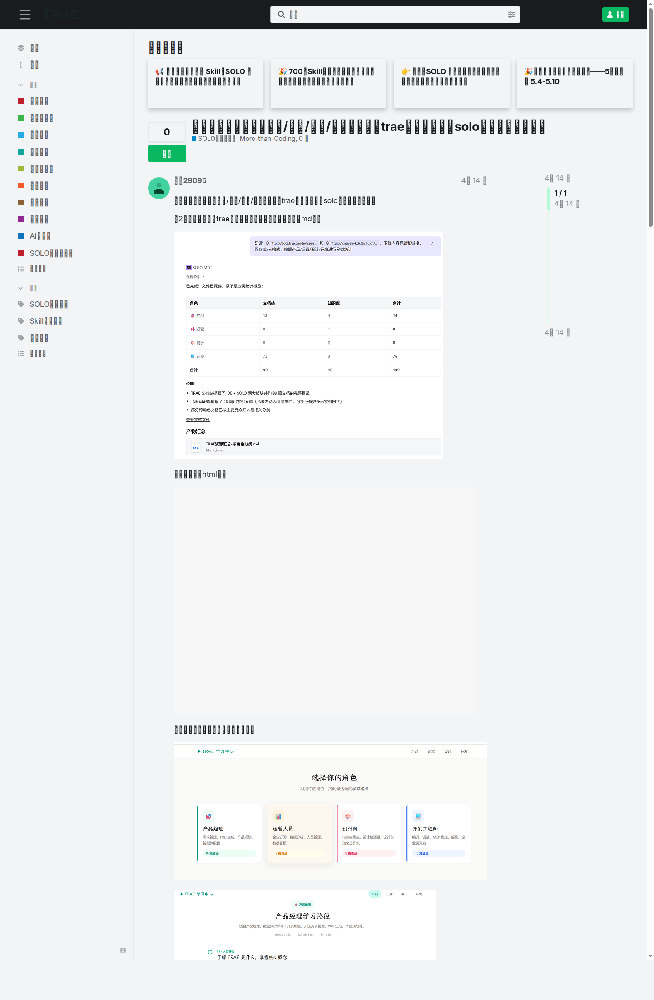
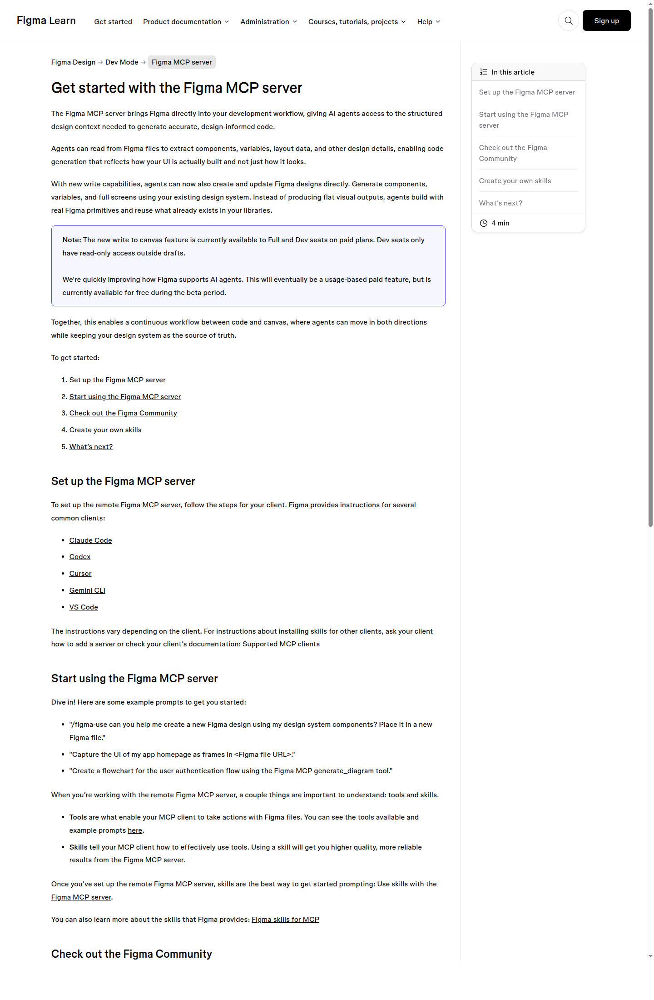

# AI 协作开发方法

非程序员用 AI 写产品原型时，最常见的卡点是**报错文本能读，定位不到是哪一步出了问题**。模型已经生成了页面、命令也跑了、终端里还给了错误信息，但下一步该查环境变量、查依赖、查日志、查路由，还是回到需求本身重写，根本没方向。

`temp/ai-rewrite-checklist.md` 第 6.7 节给的原始参考，核心抓得很准：字节系 AI IDE 的官方知识库覆盖了 Agentic AI、Spec、rules、MCP、skills、Figma 等模块，真正容易缺的是把**调试规则模板前置**。产品经理或设计同事第一次进入 AI IDE 时，通常不缺需求想法，缺的是把错误定位到"环境、规则、上下文，还是工具接入"的能力。这篇就围着这个问题写。

## 协作链路

Trae 官方中文社区里有一篇学习中心整理帖，把文档站、知识库、Figma、MCP、Rules、Skills 和问题排查全串起来了。它的价值在于把 AI 协作开发拆成了几段清楚的链路：

- 用 `Spec & Plan` 把需求写成可执行说明
- 用 Agent 承担拆解、分析、改动和交付
- 用 Rules 固定项目约束
- 用 MCP 接外部工具和资料
- 用 Skills 固定高频工作流
- 用 Figma 和预览能力把设计上下文接进来
- 用问题排查文档和模板兜住调试阶段



这条链里，非程序员最容易掉下去的地方通常有两个：

1. 需求已经说了，但没说成 AI 能执行的规格
2. 报错已经出现了，但没人把排查顺序写成模板

所以这篇文章重点只放一件事：**协作方法怎么排**。

## Agentic AI 是什么

Trae 的官方学习中心把 Agent、Skills、Rules、MCP、SOLO、Spec 放在同一条知识路径上，这已经很能说明它理解的 Agentic AI 是一套工作方式。

从 `智能体概述` 页面能看出，Trae 把 Agent 的工作流拆成几步：理解需求、分析现状、方案设计、实施变更、交付验收。两个事实值得记住：

- Agent 不只回答问题，它会分析文件、编辑文件、运行命令、调用工具
- Agent 能不能稳定下来，靠的是前面几层约束是否已经准备好

说得简洁一点：

> Agentic AI 可以理解成：能在明确约束下接手一段工作流的执行者。

这些约束主要来自 Spec、Rules、MCP、Skills 这四层。

## Spec：把想法写成 AI 真能执行的开发说明

Trae 官方学习中心把 `工作流：Spec & Plan（需求规格与计划）` 放在产品经理和进阶能力入口里，这个位置很合理。对非程序员来说，Spec 就是进入协作开发的翻译层。

很多口头需求在团队里是能聊明白的，但丢给 AI 就会变形。比如：

- "做个活动页" 太宽
- "像某某网站那样高级一点" 太虚
- "把登录优化一下" 太模糊

Spec 要做的，是把这些模糊说法压成可执行说明。至少要写出几件事：

### 1. 目标是什么

可以写成：

- 要解决哪个业务问题
- 谁是用户
- 用户完成什么动作才算成功

### 2. 页面或功能范围是什么

比如：

- 需要哪些页面
- 哪些状态要覆盖
- 哪些交互先不做
- 哪些依赖外部服务

### 3. 验收标准是什么

比如：

- 移动端能打开
- 表单提交能成功
- 错误提示完整
- 埋点字段齐全
- 接口失败时有回退状态

非程序员最容易忽略的，通常是第三点。因为没有验收标准，AI 生成的结果就只有"像不像"，没有"过不过"。

一个最小可用的 Spec 模板，可以写成这样：

```markdown
# 需求名称

## 目标
- 面向谁：
- 解决什么问题：
- 成功动作：

## 页面与功能范围
- 需要实现：
- 本轮不做：

## 关键流程
1. 用户进入页面
2. 用户执行操作
3. 系统返回结果
4. 失败时如何提示

## 数据与依赖
- 接口：
- 设计稿：
- 素材与文案：

## 验收标准
- 功能验收：
- 视觉验收：
- 异常验收：
```

这一步做得越扎实，后面的 Rules、MCP、Skills 越省力。

## Rules：把项目约束前置，别等 AI 写偏了再救火

Trae 的学习中心把 `规则（Rules）` 放在 Agent 和 Skills 同一级，这个顺序非常重要。Rules 管的是整个项目有哪些底线。

对团队协作来说，Rules 应该前置写清楚的通常有五类：

### 1. 目录与命名

- 页面文件放哪
- 组件怎么命名
- 接口文件怎么组织
- 图片和静态资源放哪

### 2. 技术栈与依赖范围

- 用哪套框架和路由
- 可以新增哪些依赖
- 哪些库禁止引入
- 是否允许直接改构建配置

### 3. 代码风格和实现偏好

- 是否统一 TypeScript
- 是否优先函数组件 / Composition API
- 表单、状态管理、测试用什么方案

### 4. 风险操作禁令

- 禁止直接删库或清空目录
- 禁止越权修改生产配置
- 禁止在未确认前批量重构

### 5. 调试与提交规则

- 报错时先收集哪些信息
- 每次修改后先跑什么验证
- 记录哪些命令输出
- 提交说明需要包含什么内容

Rules 的价值，在于把"团队默认共识"变成机器可见的约束。否则 Agent 每次都得重新猜：能不能随便装包、能不能改目录、能不能直接推重构。

一个简版 Rules 模板，可以写成这样：

```markdown
# Project Rules

## Stack
- Framework:
- Router:
- State:
- Styling:

## File Rules
- New pages go to:
- Shared components go to:
- Static assets go to:

## Do Not
- Do not change:
- Do not delete:
- Do not add dependencies without:

## Validation
- After each change, run:
- Before handoff, provide:
```

如果团队里有产品经理、设计师、开发一起和 AI 协作，这份 Rules 最好一开始就公开，不要只留在开发自己的脑子里。

## MCP 和 Skills：一个负责接工具，一个负责接流程

这两个词很容易被混着说，但角色不一样。

### MCP 负责接外部工具和资料

Trae 官方社区的 FAQ 直接把 MCP 解释成协议：它让智能体作为 MCP 客户端去请求 MCP Server，使用外部工具和服务。学习中心里也把 `模型上下文协议（MCP）概览`、`添加 MCP Server`、`在智能体中使用 MCP Server`、`查看 MCP Server 的日志`、`MCP 教程：将 Figma 设计稿转化为前端代码`、`MCP 教程：实现网页自动化测试` 摆成完整路径。

在协作开发里，MCP 主要管三件事：

- 读外部资料，例如设计稿、网页、文档
- 调外部工具，例如 Playwright、Figma、地图服务
- 把工具日志带回调试链路

### Skills 负责固定高频工作流

Skills 更像一段已经跑顺的固定流程。Trae 学习中心同时给了 `技能（Skills）`、`研发场景十大热门 Skill 推荐`、`如何写好一个 Skill：从创建到迭代的最佳实践` 这些入口，可以看出它把 Skill 当成长期可维护的工作流单元。

对协作开发来说，常见拆分方式是：

- MCP 负责"能不能拿到上下文 / 能不能动到工具"
- Skill 负责"拿到之后按什么步骤做"

比如：

- Figma MCP 解决"能不能读设计稿、能不能写回画布"
- Figma 相关 Skill 解决"如何把设计系统、组件、变量和落地方式串起来"
- Playwright MCP 解决"能不能跑浏览器自动化"
- 测试 / 调试 Skill 解决"报错后先查哪几步"

如果把两个层级混了，团队会很容易出现一种假忙：工具接了很多，流程还是靠临场发挥。

## Figma 接入：设计上下文如何进入开发链路

第 08 篇要求必须覆盖 Figma，这里用两组官方资料一起讲最合适：

- Trae 官方：`MCP 教程：将 Figma 设计稿转化为前端代码`
- Figma 官方：`Get started with the Figma MCP server`、`Use skills with the Figma MCP server`

Figma 官方文档有一句话很关键：Figma MCP server 会把结构化设计上下文直接带进开发工作流，让 Agent 能读组件、变量、布局数据，并生成更准确、更贴近设计系统的代码。它还明确区分了工具和 Skills：

- **Tools** 让 MCP 客户端对 Figma 文件执行动作
- **Skills** 告诉 MCP 客户端如何更有效地使用这些工具



这对协作开发有两个直接影响：

### 1. 设计师给开发的，不再只是静态图

有了 Figma MCP，Agent 能看到：

- 组件结构
- 变量
- 布局规则
- 设计系统里已经存在的原子

这比"甩一张截图让 AI 猜"靠谱得多。

### 2. 设计工作流也能被写成 Skill

Figma 官方还专门讲了 `Use skills with the Figma MCP server` 和 `Create skills for the Figma MCP server`。设计协作同样可以写成固定工作流，例如：

- 读设计稿后，先抽组件清单
- 再标哪些组件已有代码映射
- 再列出缺失状态和交互说明
- 再生成前端落地任务

这样产品经理、设计师、开发者面对的，就会是一条更完整的设计到代码链路，不再只是含糊指令。

## 调试模板要前置

前面这些概念都重要，但第 08 篇最该落重锤的，还是调试。

Trae 学习中心里，开发者路径最后单独列了一个 `问题排查（12 篇）` 区块：通用问题、MCP Server、Python、Go、Java、TypeScript、Vue、Remote SSH、性能、SOLO 问题排查都有。这已经说明：代码能生成出来，不等于就能顺利落地。

非程序员为什么特别容易卡在这里？因为他们通常具备三分之一能力：

- 能读懂报错的大意
- 能知道哪里红了
- 能把报错复制给 AI

但他们缺的是后面三分之二：

- 不知道先查哪一层
- 不知道哪些日志要保留
- 不知道什么时候该回退到 Spec 或 Rules 重写

调试不能等到出错后才讲，应该在项目开始前就给一份固定模板。

### 一个够用的调试规则模板

```markdown
# Debug Rules

## When any error happens
1. 不要连续尝试三种修法
2. 记录完整报错原文
3. 标注报错发生在哪一步
4. 保存最近一次执行的命令
5. 说明本次修改过哪些文件

## Reproduction
- 当前分支：
- 运行命令：
- 输入数据：
- 预期结果：
- 实际结果：

## Logs to collect
- 终端输出：
- 浏览器控制台：
- Network 请求：
- 服务端日志：
- MCP Server 日志（如果用了 MCP）：

## Triage Order
1. 环境与依赖
2. 配置与环境变量
3. 路由 / 文件路径 / 命名
4. 接口返回与数据结构
5. 规则冲突
6. Spec 本身是否写漏

## Escalation
- 如果连续两轮修复都失败：停止继续改代码
- 回到 Spec / Rules / 输入数据重新核对
- 输出"已确认无效的尝试"清单
```

这份模板的作用很直接：它把"乱试"改成"收集，分类，排查"。

### 调试规则前置的必要性

调试失败时，上下文往往已经污染了：

- 前面几轮试错没有留下清晰记录
- Agent 改了太多文件，没人知道从哪一步开始歪
- 设计、产品、开发口中的"正确结果"都不一样
- 报错已经变成连锁反应

把调试模板前置，至少能带来四个改善：

1. 让非程序员知道先交什么材料
2. 让开发者不用从一堆聊天记录里捞上下文
3. 让 Agent 每次排查都按同样顺序走
4. 让失败尝试也能沉淀成团队经验

## 面向产品、设计与开发的协作分工

如果同一个 AI 项目里有多角色参与，最稳的分工通常是这样：

### 产品经理

负责：

- Spec 初稿
- 业务目标与验收标准
- 范围说明
- 异常状态优先级

不要直接跳过的文档：

- `Spec & Plan`
- `智能体概述`
- `规则（Rules）`

### 设计师

负责：

- Figma 文件与组件范围
- 设计系统、变量、交互说明
- 哪些地方允许 AI 自由发挥，哪些不允许

最该接入的链路：

- Figma MCP
- Figma Skills
- Preview / design-to-code 教程

### 开发者

负责：

- 把 Rules 写实
- 决定 MCP 接哪些工具
- 给团队准备调试模板
- 收口最终验证和风险操作范围

最该提前公开的内容：

- 项目目录规则
- 环境变量规范
- 本地运行命令
- 排查顺序
- 哪些改动需要人工确认

### Agent

负责：

- 在这些约束内执行
- 调工具、跑命令、改代码、做验证
- 按模板返回进度和问题

Agent 承担的是中间那段重复执行工作，不负责替团队抹掉这三种角色。

## 协作顺序

把前面的内容压成实际流程，大概就是这六步：

```text
需求想法
→ 写 Spec
→ 补 Rules
→ 接 MCP
→ 装 Skills
→ 前置调试模板
→ 再让 Agent 开始做事
```

很多团队会直接从 Agent 开始，这也是最容易出事的地方。Agent 一启动，所有含糊、遗漏和约束缺失，都会在调试阶段一起爆出来。

更省时间的做法，是让团队少在第三轮、第四轮报错时迷路。
