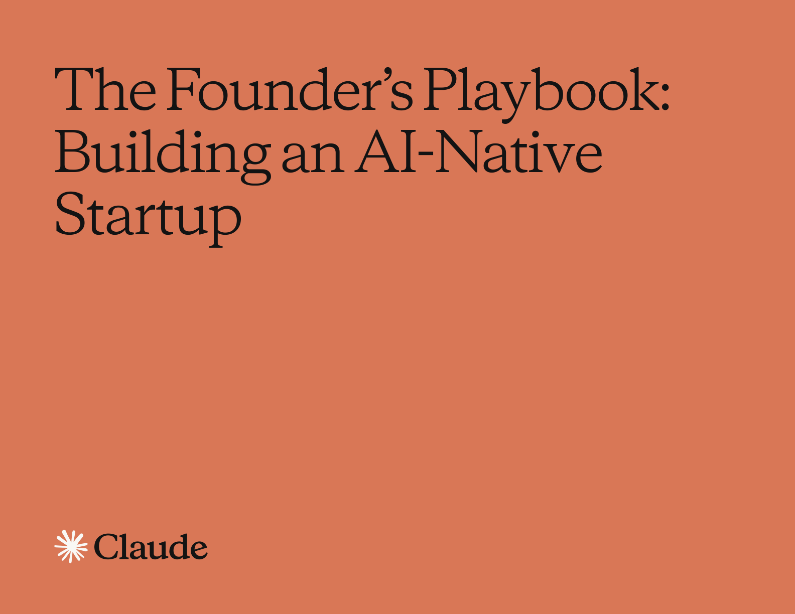

# AI 创业与一人公司

过去几年，很多创业建议默认你解决的是"能不能做出来"。

现在这个前提变了。代码、设计、调研、内容分发、运营自动化，都可以被 AI 拉平一大截。创始人最缺的能力，越来越像一件前置工作：在开工之前想清楚，这东西到底值不值得建。

Anthropic 在 2026 年 5 月 14 日发布的《The founder's playbook: Building an AI-native startup》把这件事说得很明确：AI 让创业更像编排系统，执行门槛降下去之后，创始人也更容易一路狂奔，最后做出一个根本没人要的产品。

这篇文章关心的是另一个更难的问题：**如果你只剩下一个人、几个月时间和一堆 AI 工具，你该怎么判断自己现在应该建什么，不应该建什么。**

## 这几份资料各管什么

我把这篇文章用到的资料分成两类。

第一类是"判断资料"：它们不直接替你交付产品，但会强迫你回答创业里最不舒服的那些问题。

第二类是"链路资料"：它们展示了一人公司实际会用到的执行形态——从验证、交付，到增长、变现，各自大概长什么样。

### `awesome-ceo`：一份创始人的问题清单

GitHub：<https://github.com/kuchin/awesome-ceo>

`awesome-ceo` 把内容分成 `Fundraising`、`Entrepreneurship`、`Product`、`Sales`、`Marketing`、`Management`、`Hiring`、`Finance`、`Books` 九类。它是一份带明显主观取舍的 CEO 阅读入口。

它的价值不在链接数量，而在于把创始人需要回答的问题摆在了一处：

- 你融资时到底该怎么讲故事，怎么讲估值。
- 你产品的价值、可用性、可行性、商业可行性，分别站不站得住。
- 你前 10 个客户从哪里来。
- 你招人、分钱、做预算时，哪些是最容易一开始就做错的。

如果你顺着里面几篇代表性资料往下看，比如 YC 的种子轮指南、Sam Altman 的 `Startup Playbook`、Marty Cagan 的 `Product is Hard`、Rob Fitzpatrick 的 `The Mom Test`，你很快会发现：好创始人的核心工作，首先是**把问题定义得足够尖锐，以至于错误方案没有藏身之处**。

所以，`awesome-ceo` 适合放在创业前打底。它不能替你判断，但能把你必须判断的维度列完整。

### `one-person-company`：一人公司常见工具坑

GitHub：<https://github.com/cyfyifanchen/one-person-company>

`one-person-company` 是中文语境里很典型的一类资料：作者直接把仓库命名成"一人公司"，开门第一句就是"有些工具是宝，有些工具是坑"。

这类资料的价值主要在密度。作者按一人公司最常碰到的工作分成了很多块：

- 大语言模型
- TTS
- 代码
- 设计工具
- 生产力工具
- 网站系列
- 学习系列
- 恶搞系列

其中"代码"下面又继续拆成"全栈开发与快速构建""代码理解与文档"等子类。这种写法很贴近真实创业现场：一个人要做的不只是写代码，还得同时面对选模型、选开发栈、选设计工具、选增长工具、选学习路径。

它的提醒也很重要：**一人公司靠的是持续做工具取舍，不会有一个模型把所有问题一次解决。**

不过，它主要是一张"踩坑地图"，离创业论证还有一段距离。它能帮你少走弯路，但回答不了"为什么值得做"。放在判断之后、执行之前更合适。

### `JustHireMe`：比"自动海投"更重要的是问题定义

GitHub：<https://github.com/vasu-devs/JustHireMe>

官网：<https://www.justhireme.ai>

之所以单独写 `JustHireMe`，是因为它很能说明：产品形态要建立在问题定义足够准确的前提上。

它把自己定义为一个 **local-first AI job intelligence workbench**：本地优先、面向求职情报的桌面工作台。资料重点不在"帮你疯狂投简历"，而在另外几件更克制的事：

- 抓取职位来源并做标准化。
- 用 `Quality Gate` 过滤掉陈旧、低信息量、骚扰型、纯高阶、不适配的岗位。
- 用可解释的规则做职位质量评分和候选人匹配。
- 结合 `Kuzu` 图数据和 `LanceDB` 向量数据，把简历、项目经历和岗位需求对起来。
- 生成定制化的简历 PDF、求职信 PDF、外联草稿，保留人工审阅空间。

它的可视化工作流很清楚，顺序如下：

1. 导入简历 / 个人资料。
2. 建本地图谱和向量索引。
3. 抓取职位来源。
4. 通过质量闸门清洗线索。
5. 做匹配和评估。
6. 生成面向具体岗位的申请材料。

技术栈也明确：前端工作台 + Python sidecar API + SQLite + Kuzu + LanceDB + Tauri；浏览器自动化和 auto-apply 代码虽然存在，但项目明确标成实验性质，默认不作为主打能力。

如果你要研究"求职 / 招聘 / 雇佣效率"这类创业方向，`JustHireMe` 很有参考价值。它提醒你，问题常常出在这些地方：

- 怎样把垃圾线索挡在前面；
- 怎样让匹配理由可解释；
- 怎样让敏感资料留在本地；
- 怎样把 AI 生成的材料保留在"可审阅草稿"的状态。

项目给出的本地开发入口也很具体：

```bash
npm install
cd backend
uv sync --dev
cd ..
npm run tauri dev
```

如果要把它接进 Agent 工作流，仓库还提供了 `skills/justhireme/SKILL.md` 和一个轻量级 MCP server。它更聚焦在**求职与岗位匹配这条链路里最容易被做成黑盒的部分**。

## 两个更贴近执行面的项目

前面三个项目更偏判断与选型，`agency-agents` 和 `AiToEarn` 则更贴近创业进入执行面之后会遇到的两类系统：一个解决"我怎么临时拥有一个团队"，另一个解决"我怎么把内容增长和变现跑起来"。

### `agency-agents`：把一支人工智能服务团队拆成可装配角色

GitHub：<https://github.com/msitarzewski/agency-agents>

`agency-agents` 的定位非常明确：它是一整套"AI specialists"。资料里还提到，它起源于一个 Reddit 讨论串，之后经历了几个月迭代。

它把不同岗位拆成很多有明确人格、流程、交付物和成功标准的角色。这和用户复制原文里"一个全方位的人工智能服务团队，触手可及"的说法是一致的，项目文档也列出了更具体的角色名单。例如：

- 工程侧有 `Frontend Developer`、`Backend Architect`、`Rapid Prototyper`、`Security Engineer`。
- 设计侧有 `UI Designer`、`UX Researcher`、`Brand Guardian`。
- 增长侧有 `Growth Hacker`、`Content Creator`、`Reddit Community Builder`。
- 项目推进有 `Project Shepherd`、`Experiment Tracker`。
- 质量与支持有 `Reality Checker`、`Evidence Collector`、`Support Responder`。

它给出的场景设计很像一家小公司会经历的真实链路。

比如"Building a Startup MVP"这个场景，项目直接给出一组搭配：

- `Frontend Developer`
- `Backend Architect`
- `Growth Hacker`
- `Rapid Prototyper`
- `Reality Checker`

它把"谁来做前端、谁来补后端、谁来跑增长、谁来做快速原型、谁来卡上线质量"这件事，用一套角色化的 AI 编排跑起来。

另一个例子是"Marketing Campaign Launch"，它把 `Content Creator`、`Twitter Engager`、`Instagram Curator`、`Reddit Community Builder`、`Analytics Reporter` 组合起来。这很像一人公司最常见的痛点：产品能做，分发做不动。

安装方式也很直接。文档推荐给 Claude Code 装全量角色：

```bash
./scripts/install.sh --tool claude-code
```

如果你只想要某一类角色，也可以手动复制，例如只拷贝工程类：

```bash
cp engineering/*.md ~/.claude/agents/
```

如果你用的是 Copilot、Cursor、Aider、Windsurf、OpenClaw、Kimi、Qwen 这类别的工具，文档也给了统一的转换与安装入口：

```bash
./scripts/convert.sh
./scripts/install.sh
```

这组角色主要落在三个阶段：

1. **产品发现期**：让 `UX Researcher`、`Product Trend Researcher`、`Reality Checker` 帮你把需求问深。
2. **MVP 交付期**：让工程和设计角色分工，减少一个人频繁切角色带来的上下文损耗。
3. **上线后运营期**：把增长、支持、分析这些通常会把创始人拖住的工种做成 AI 版骨架。

它终究还是一套 Agent 角色库，不会自动变成一家公司。编排、取舍和最终决策，仍然在你手里。把它看成一块临时团队工作台更合适。

### `AiToEarn`：一人公司的内容增长与变现工具

GitHub：<https://github.com/yikart/AiToEarn>

官网：<https://aitoearn.ai>

`AiToEarn` 的一句话定位非常直白：**OPC（一人公司）的 AI 内容营销智能体。**

用户复制原文把它概括成"一人公司的 AI 内容营销智能体"，项目则把能力进一步拆成四个词：`Monetize · Publish · Engage · Create`。这四个词合起来，刚好构成一人公司在内容增长上的完整链路。

#### 它覆盖到哪一步

按项目当前说明，`AiToEarn` 面向 OPC、创作者、品牌和企业，支持的渠道覆盖很广，包括：

- 抖音、小红书、快手、哔哩哔哩、视频号、微信公众号
- TikTok、YouTube、Facebook、Instagram、Threads、X、Pinterest、LinkedIn

它把能力拆成四层。

第一层是 **Monetize**：把内容和结果导向的结算机制挂起来，项目列了 `CPS`、`CPE`、`CPM` 三种模式。

第二层是 **Publish**：全网分发和日历排期，解决"同一条内容怎么多平台发"的问题。

第三层是 **Engage**：通过浏览器插件做自动互动、评论回复和高转化信号识别。

第四层是 **Create**：用 Agent 化方式重构内容制作，从想法到成品尽量缩短路径。

很多"一人公司内容工具"只覆盖写作环节，后面的分发、跟进、转化、结算仍然还要手工补。`AiToEarn` 想把后面这段也接起来。

#### 安装 / 使用方式

项目给了 5 种使用方式：

1. 直接打开网站。
2. 在 OpenClaw 里使用。
3. 在 Claude / Cursor / 其他兼容 MCP 的 AI 助手中使用。
4. Docker 一键部署。
5. 源码开发。

接入现有 AI 工作流时，最关键的是第三种。项目明确写了它支持 MCP，接入时要拿 API Key，再按环境选择地址；环境和 Key 不匹配会报 `401`。

对团队或想私有化的人，Docker 路径最短：

```bash
git clone https://github.com/yikart/AiToEarn.git
cd AiToEarn
docker compose up -d
```

如果需要借用官方凭据完成社交平台授权，文档还要求在 `docker-compose.yml` 里补 `RELAY_API_KEY` 和对应的 `RELAY_SERVER_URL`，再执行 `docker compose restart aitoearn-server`。

本地开发模式也写得很全，后端用 `pnpm nx serve`，前端用 `pnpm run dev`，甚至连一个相关仓库 `AttAiToEarn` 的启动方式都留了出来。看得出来，作者在把整套内容运营链路慢慢产品化。

#### 适用阶段

`AiToEarn` 不适合想法阶段。你还没验证需求时，内容自动化只会把错误判断放大。

它主要对应两个时间点：

- **产品刚上线，需要稳定分发和早期增长时**：把多平台发布、互动、信号采集跑起来。
- **一人公司已经找到初步受众，开始追求变现效率时**：让内容、分发、互动、结算不再完全靠手工。

所以它放到产品上线之后更合适，处理的是**持续曝光和流量转化**这两个问题。

## Anthropic《创始人手册》：判断要不要建

官方博客：<https://claude.com/blog/the-founders-playbook>

官方 PDF：<https://cdn.prod.website-files.com/6889473510b50328dbb70ae6/69fe2a55b93bb0732b1fe33c_The-Founders-Playbook-05062026_v3%20%281%29.pdf>

我把相关材料都归档到了本地：

- 官方博客页：`docs/ai/references/ai-startup-native-company/anthropic-source.html`
- 官方 PDF：`docs/ai/references/ai-startup-native-company/The-Founders-Playbook.pdf`
- 本地转载 HTML：`docs/ai/references/ai-startup-native-company/source.html`

下面这张图就是我从官方 PDF 抽出来的封面页：



Anthropic 在博客摘要里强调的重点也很集中：这份手册覆盖 `Idea`、`MVP`、`Launch`、`Scale` 四个阶段，讨论如何验证问题、控制技术债、分辨真假 PMF，以及在不同阶段使用 Chat、Claude Cowork、Claude Code。

### 原文翻译 / 原文整理：这份手册在讲什么

这一节只做原文整理，不掺我的评论。

#### 1. 创业生命周期在 2026 年被重画了

Anthropic 的核心判断是：AI 已经把创业公司的默认增长路径改写了。过去常见的路径是"验证 → 融资 → 招人 → 建产品 → 再融资 → 增长 → 再招人"，现在 AI 抹掉了其中一个默认假设：**每进入一个新阶段，都必须换来更大的团队、更多的职能和新一轮资金。**

手册把 AI Native 创业拆成四个阶段：`Idea`、`MVP`、`Launch`、`Scale`。在这四个阶段里，创始人的角色也在变化：重心会从亲自执行，转到研究、编码和运营自动化系统的编排。

手册把 AI 能力概括成三类：

- 研究与对话式智能：竞品分析、市场测算、投资人材料、PRD、情景推演。
- Agentic coding：把"我有一个想法"压缩成"我已经有一个能工作的产品"。
- 工作流自动化：把排程、CRM、周报、文档、内容发布、合规跟踪等运营性工作从创始人身上卸下来。

#### 2. 想法阶段（Idea Stage）

这一阶段的核心是验证。

手册给出的目标是：在投入资源做产品之前，确认问题真实存在，而且你的方案真的在解决那个问题。

离开这一阶段之前，创始人至少要能回答三个问题：

- 这个问题是否真实且具体。
- 你的方案是否真的在解决实际问题，别停留在最初的自我设想里。
- 你是否已经拿到了足够信号，足以证明做 MVP 是一个经过推理的决策。

手册把这一阶段最典型的失败写得很重：

- 把"能做原型"误当成"已经被验证"。
- 在没有问题—方案匹配之前就开始过早扩张。
- 让 AI 只替你搜集支持证据，结果只是把确认偏误放大得更快。

在工具选择上，手册给了一个非常明确的矩阵：

- 快速问题、改写、头脑风暴，用 `Chat`。
- 研究、分析、基于文件输出完整文档，用 `Claude Cowork`。
- 写代码、测试、真正交付软件，用 `Claude Code`。

#### 3. MVP 阶段（MVP Stage）

Anthropic 认为，MVP 阶段仍然是在收集证据，只是对象从问题空间转向了解决方案本身：真实用户会不会回来、会不会付费、会不会推荐。

这一阶段的目标有两个：

- 把一个已验证的问题做成真实用户会用的最小产品。
- 在快速推进的同时，不积累会在后续持续复利的技术债。

手册特别强调了几类风险：

- `Agentic technical debt`：AI 让速度不再是问题，但如果每个 session 都临时重推架构，代码库会越来越散。
- 虚假的 PMF：漂亮的早期数据不等于产品—市场匹配。
- 零摩擦带来的范围蔓延：功能加得太轻松，反而更容易失焦。
- 不安全的"先上线再说"：AI 生成的代码能跑，不等于已经安全。

它建议创始人在写第一行正式代码前，用 Claude 定义架构原则，并把结果保存成 `CLAUDE.md` 之类的上下文文件，再让 `Claude Code` 进入施工阶段。

#### 4. 上线阶段（Launch Stage）

MVP 解决的是"产品值不值"，上线阶段要解决的是"业务能不能增长"。

Anthropic 给的上线阶段退出条件有三条：

- 增长已经变成可重复、可归因、可解释的渠道增长。
- 产品能承担真实生产负载，安全、合规、可靠性都过关。
- 运营不再严重依赖创始人亲自盯每一环。

这时冒出来的主要问题包括：

- MVP 期间欠下的技术债开始计息。
- 创始人本人开始变成瓶颈。
- 安全与合规不能再拖。
- 很多团队会在准备还不够时就贸然扩市场。

手册建议：

- 用 `Claude Code` 做架构审计和技术债优先级排序。
- 用 `Claude Cowork` 审计运营负担，区分哪些能自动化，哪些必须人工，哪些必须保留给创始人判断。
- 用 Claude 设计轻量产品管理系统，例如 sprint 节奏、最小 spec 模板、bug 分类树、周度指标简报。

#### 5. 规模化阶段（Scale Stage）

到了规模化阶段，创始人的工作重心继续上移：从建设者，变成越来越对外、越来越系统化的管理者。

这一阶段的目标，一方面是把公司做成一门可持续的生意，另一方面是建立更难被复制的护城河。Anthropic 特别强调三种深度：

- 产品里沉淀的领域专业知识。
- 与其他工具平台的深度集成。
- 与时间和场景绑定的专有系统数据与工作流。

退出条件不再只是一个小里程碑，更像一道门槛：公司即使在创始人逐步退出日常细节后，也能持续运转。现实里，这通常体现为可持续盈利、IPO 就绪，或者被收购。

这一阶段的主要难点包括：

- 把创始人脑子里的隐性知识变成可交接、可审计、可复用的系统。
- 把技术运营提升到企业级可靠性。
- 补齐招聘、薪酬、财务、法务等组织功能。
- 从自然增长走向真正的 GTM 组织。

Anthropic 在这里非常强调 `Claude Cowork` 和 `Skills`。前者适合接管工单、续约跟踪、内容流程、CRM 卫生等运营层；后者适合把一再出现的领域流程编码成可复用程序，让公司逐渐积累自己的专有方法。

### 结合四个阶段看 Chat / Cowork / Code 的分工

前面整理的是手册原意，下面结合一人公司场景补几句实际用法。

#### 想法阶段：Chat 负责提问，Cowork 负责归纳，Code 暂不前置

很多人一有点想法，就想立刻开 `Claude Code`。

Anthropic 这里给出的顺序，我基本认同：

- `Chat` 拿来做高频、快速、尖锐的问题追问。它最适合扮演那个不停打断你的角色：到底是谁痛，多久痛一次，为什么现有工具没解决。
- `Claude Cowork` 用来整理访谈、竞品、行业资料，把多个来源压缩成一个可读文档。
- `Claude Code` 放到已经有了初步证据之后，再去做轻量原型。

想法阶段最怕的，就是在证据还不够的时候把速度拉满。

#### MVP 阶段：Code 是施工主力，Cowork 管上下文，Chat 管小决策

一旦进入 MVP，`Claude Code` 就该成为主工具，但有一个前提：架构、范围、约束文档写清。

这一阶段最容易犯的错，是让每次 session 都从头开始，于是功能虽然在涨，系统却越来越散。更稳的做法是：

- 用 `Claude Cowork` 维护 spec、范围约束、评审记录、指标定义；
- 用 `Claude Code` 真正写、改、测、重构；
- 用 `Chat` 处理零碎判断，例如一句对外说明、一段定位文案、一个灰区案例的快速讨论。

#### 上线阶段：Cowork 的价值突然变大，因为创始人的注意力才是真瓶颈

产品一上线，很多创始人还以为自己最缺的是更多代码。实际上，这时最缺的往往是注意力预算。

客服、发布、数据汇总、需求优先级、内容更新、运营对接，都会开始抢你的脑子。到了这里，`Claude Cowork` 承担的就是串系统、拉文档、跑定时任务这类运营工作。

对应地：

- `Claude Code` 继续负责技术债审计、测试补强、上线前安全检查；
- `Claude Cowork` 负责把零碎运营变成可重复流程；
- `Chat` 更适用于日常判断和对外表达润色。

#### 规模化阶段：护城河来自你沉淀了什么

等公司进入规模化，几乎所有人都会"用 AI"。这时差异更多在积累。

谁把领域知识写进了 `Skills`、写进了测试集、写进了内部流程；谁把灰区案例、合规要求、客户偏好、组织经验变成了系统的一部分，谁的 AI 才会越来越像公司资产，越来越接近组织能力。

所以到这个阶段：

- `Chat` 可以当成创始人的随身思考伙伴；
- `Claude Cowork` 负责运营系统和组织知识的编排；
- `Claude Code` 继续负责技术护城河和测试护城河的建设。

## 放回一人公司的日常里看

把这些资料放在一起看，几条分工线会更容易看清。

`awesome-ceo` 帮你看清创始人到底要回答哪些问题；`one-person-company` 告诉你一人公司在工具层会碰到什么现实摩擦；`JustHireMe` 展示了一个好问题定义如何长成产品；`agency-agents` 提供了临时团队的角色骨架；`AiToEarn` 则把增长和变现这条最累的链路做成了可接入系统。

但无论工具多全、角色多细、交付多快，都替代不了一个最前置的问题：

**这个东西值得建吗？**

如果你现在已经准备开工，至少把问题验证、MVP 证据和上线后的运营负担分开看，再决定该调用哪些工具。AI 会把执行提速，但前面的判断还是省不掉。

## 参考链接

- `awesome-ceo`：<https://github.com/kuchin/awesome-ceo>
- `one-person-company`：<https://github.com/cyfyifanchen/one-person-company>
- `JustHireMe` GitHub：<https://github.com/vasu-devs/JustHireMe>
- `JustHireMe` 官网：<https://www.justhireme.ai>
- `agency-agents`：<https://github.com/msitarzewski/agency-agents>
- `AiToEarn` GitHub：<https://github.com/yikart/AiToEarn>
- `AiToEarn` 官网：<https://aitoearn.ai>
- Anthropic 官方博客：<https://claude.com/blog/the-founders-playbook>
- Anthropic 官方 PDF：<https://cdn.prod.website-files.com/6889473510b50328dbb70ae6/69fe2a55b93bb0732b1fe33c_The-Founders-Playbook-05062026_v3%20%281%29.pdf>
- 代表性阅读：YC `A Guide to Seed Fundraising`、Sam Altman `Startup Playbook`、Marty Cagan `Product is Hard`、Stripe `Your first 10 customers`、Rob Fitzpatrick `The Mom Test`
