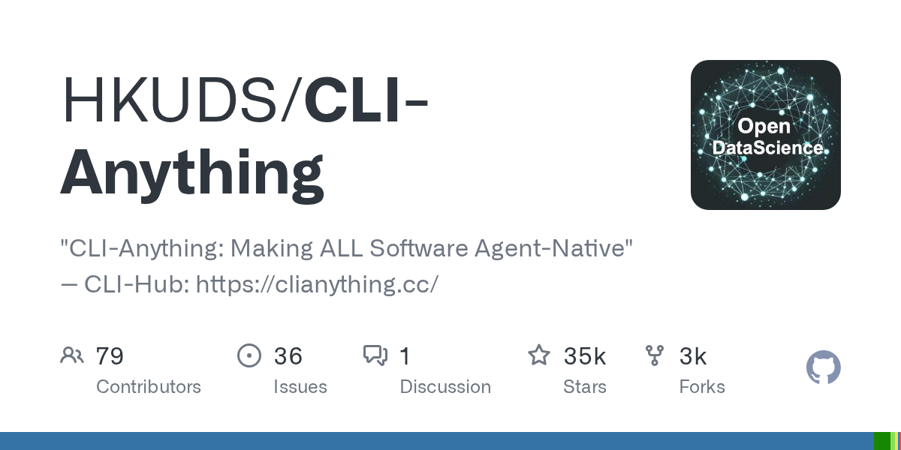
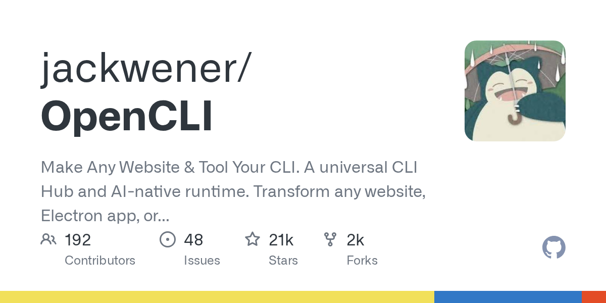
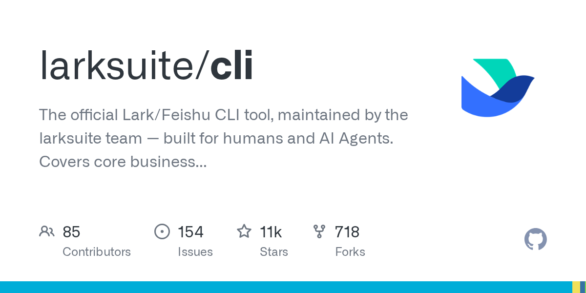

# CLI 与 Agent 工作流

如果把 GUI 理解成给人看的操作面，那 CLI 就是给人和 Agent 共用的控制面。按钮、弹窗、悬浮层这些东西，人看着顺手，Agent 却要识别页面结构、判断状态、决定点击顺序；命令行反过来，输入和输出都更直白，参数、返回值、错误信息也更容易串到下一步里。

这一波 CLI 回潮，核心原因是 Agent 工作流需要更稳的接口。人当然还会用 GUI 处理确认、预览、授权这些动作，但最适合让 Agent 接手的，往往还是 CLI 这一层：容易组合，容易复盘，也更容易加权限控制。

## CLI 回潮的背景

这股趋势有很直接的项目热度支撑。2026 年 5 月 16 日核对 GitHub 时，三个相关项目的热度都不低：

- `HKUDS/CLI-Anything`：35,020 Stars
- `jackwener/OpenCLI`：21,105 Stars
- `larksuite/cli`：10,910 Stars

它们代表了三种不太一样的路线：

- **CLI-Anything**：把原本没有命令行的软件，包装成 Agent 能调用的 CLI
- **OpenCLI**：把网站、浏览器会话、Electron 应用和本地工具接进统一命令面
- **飞书 CLI**：把企业协作软件里的文档、日历、会议、待办这类"落地动作"变成可编程命令

前两个项目解决的是"怎么接进去"，第三个项目解决的是"结果怎么落下去"。

## CLI-Anything：把软件改造成 Agent 可调用命令

### CLI-Anything

GitHub：<https://github.com/HKUDS/CLI-Anything>

官网：<https://clianything.cc/>

CLI-Anything 的仓库标题就是：**Making ALL Software Agent-Native**。它盯着的是更上游的问题：很多软件根本没有为 Agent 准备可调用接口，既没有现成 API，也没有像样的 CLI。它的做法，是反过来补一层 CLI。

当前有两条主要使用路径。

第一条是给 Agent 用的：

```bash
npx skills add HKUDS/CLI-Anything --skill cli-hub-meta-skill -g -y
```

这条命令会把 CLI-Hub 的技能装进支持 SKILL 的 Agent 里。官方站点列出的兼容对象包括 OpenClaw、Nanobot、Claude Code、Codex、Antigravity 等。

第二条是给人直接用的：

```bash
pip install cli-anything-hub
cli-hub search
cli-hub install <name>
```

这条链路相当于一个"CLI 市场"。装好 `cli-anything-hub` 之后，就可以用 `search`、`info`、`install` 浏览和安装社区里已经做好的 CLI。

### 核心能力

CLI-Anything 不只是套一层壳。项目资料反复强调几个特征：

- CLI 是给 Agent 的通用接口
- 输出尽量结构化，方便下一步继续接
- `--help` 本身就是可发现文档
- 生成后的 CLI 还能继续被 Skill 化、市场化分发

它还专门解释了"为什么是 CLI"：

- 文本命令天然适合和 LLM 上下文拼接
- 参数和返回值容易组合
- JSON 输出比屏幕截图更稳定
- 跨系统开销小，不依赖完整 GUI 环境

### 安装和使用方式

已经在 Claude Code 这类环境里工作的话，文档给的是插件式入口：

```bash
/plugin marketplace add HKUDS/CLI-Anything
/plugin install cli-anything
```

装完后，直接用一条命令生成目标软件的 CLI：

```bash
/cli-anything ./gimp
```

不走插件路线的话，也可以把 CLI-Hub 当成资料库和安装器来用：

```bash
pip install cli-anything-hub
cli-hub list
cli-hub search blender
cli-hub install <name>
```

### 使用场景

CLI-Anything 位于"前置改造层"。它不负责让 Agent 直接写日报，更常见的用法是：

1. 为原本只有 GUI 的软件补一套 CLI
2. 让 Agent 通过命令行驱动它
3. 把命令结果继续接给文档、发布、通知这些后续工具

比如设计、GIS、视频剪辑、桌面软件自动化这类场景，往往第一步最难。CLI-Anything 为原本只有 GUI 的软件补一套 CLI。




## OpenCLI：把网站、登录态和多模型命令压成一套接口

### OpenCLI

GitHub：<https://github.com/jackwener/OpenCLI>

官网：<https://opencli.info/>

OpenCLI 解决的是另一类痛点：软件未必缺 CLI，但网站和桌面 App 的现成交互太散，Agent 不好接。它的副标题写得很清楚：**Convert any website into a CLI & Drive your logged-in browser from AI agents.**

这句话里有两个关键词：

- **convert any website into a CLI**
- **drive your logged-in browser**

前者是适配器思路，后者是登录态复用思路。也正因为第二点，它和传统"开个干净浏览器再自动化点击"的路线差别很大。

### 项目能力

项目文档把能力分成三层：

1. 用内置适配器直接操作网站
2. 让 Agent 通过浏览器桥接控制任意网页
3. 用 `opencli browser` 和 Skill 自己写新适配器

它的内置命令范围已经很大。仓库首页列出的站点和工具已经覆盖：Bilibili、知乎、小红书、Reddit、Hacker News、Twitter/X，以及 `gh`、`docker`、`ntn`、`longbridge` 这类本地 CLI，还有 Cursor、Codex、ChatGPT 这类 Electron 应用。

这组命令在适配器表里能对上相当一部分。比如：

- `claude`：`ask`、`send`、`new`、`status`、`read`、`history`、`detail`
- `gemini`：`new`、`ask`、`image`、`deep-research`
- `twitter`：`search`、`trending`、`post`、`reply`、`bookmarks` 等

文档里的 **ask / send / read / new / history** 都能找到对应。

### 安装和浏览器桥接

OpenCLI 官方要求 Node.js 版本不低于 21：

```bash
node --version
npm install -g @jackwener/opencli
```

然后要装浏览器桥接扩展。文档给了两种方式：Chrome Web Store 直接安装，或者从 GitHub Releases 手动加载扩展。

装完后跑自检：

```bash
opencli doctor
```

有多个 Chrome Profile 的话，还可以明确指定给哪个登录态用：

```bash
opencli profile list
opencli profile rename <contextId> work
opencli profile use work
opencli --profile work browser state
```

这里需要明确一件事。OpenCLI 的优势来自**复用浏览器登录态**，所以必须明确 Agent 接管的是哪个 Profile、哪个账号、哪套 Cookie。

### 典型使用方式

直接跑内置命令时，它本身就是一个聚合 CLI：

```bash
opencli list
opencli hackernews top --limit 5
opencli bilibili hot --limit 5
```

给 Agent 用时，文档推荐装 Skill：

```bash
npx skills add jackwener/opencli
```

也可以只装某个技能：

```bash
npx skills add jackwener/opencli --skill opencli-adapter-author
npx skills add jackwener/opencli --skill opencli-browser
```

`opencli-adapter-author` 的定位很明确：既可以让 Agent 实时操作网站，也可以顺手把一个新网站写成可复用适配器。

### 多模型串联

OpenCLI 最有用的地方，在于它把原来分散在网页、桌面应用、浏览器标签页里的动作压成了统一命令面。这样一来，多模型串联就不再非得自己写一堆 SDK wrapper。

一条典型的链路如下：

1. 用 Grok 或 X/Twitter 相关适配器找实时讨论
2. 把结果交给 Claude 结构化整理
3. 再让 ChatGPT 起草文案
4. 把命令真正发出去，或者写进下一步系统

这条链路需要的命令基础，在项目文档里都能找到：

- `twitter search`、`twitter trending` 用来抓实时内容
- `claude ask / send / read / history` 用来做多轮整理
- `gemini new / ask`、`claude new / ask` 这类命令可以并进同一条链
- `twitter post` 用来完成发布动作

不同模型之间有了统一的命令接口。

### 它和 Playwright 这类方式的区别

OpenCLI 和 Playwright 这类工具的分工并不一样：

- Playwright 更偏测试、回归、脚本化固定流程
- OpenCLI 对**带登录态的日常生产工作流**更有用

原因很简单。很多现实任务卡在点进去之后没有登录态、没有个人环境、也没有现成上下文。OpenCLI 把浏览器会话和命令层接起来，刚好补上了这一截。



## 飞书 CLI：把 Agent 结果写回文档、日程和待办

### 飞书 CLI

GitHub：<https://github.com/larksuite/cli>

官网：<https://open.feishu.cn/document/home/index>

飞书 CLI 的官方仓库名是 `larksuite/cli`，标题叫 `lark-cli`。但从定位上看，它就是官方维护的飞书 / Lark CLI。开头第一段已经说明了它的身份：**The official Lark/Feishu CLI tool, maintained by the larksuite team — built for humans and AI Agents.**

飞书 CLI 和前两个项目解决的问题不一样。CLI-Anything、OpenCLI 更偏"怎么接工具"，飞书 CLI 更偏"怎么把成果写回业务系统"。

很多人的工作流起点是 Codex 或 Claude Code，但跑完 agent task 之后，结果常常还停在终端里，仍然得手动复制进文档、会议纪要或者日程系统。飞书 CLI 补的就是这一段。

### 项目能力

截至 2026 年 5 月 16 日核对项目文档时，官方写的是：

- 覆盖 17 个业务域
- 提供 200+ 命令
- 内置 24 个 Agent Skills

能力表里已经明确列出：

- Docs：创建、读取、更新、搜索文档
- Markdown：创建、获取、覆盖 Drive 原生 `.md` 文件
- Calendar：查看与创建日程、查找会议室、空闲时间建议
- Tasks：创建、查询、更新、完成任务
- Meetings / Minutes：查询会议记录、会议纪要、AI 总结、Todo、录音录像
- Messenger：发消息、回消息、搜索消息

这些场景基本都能在能力表里对上：

- 调研后写入飞书文档
- 安排出差日程
- 读取飞书妙记
- 自动生成会议纪要
- 补 Todo

### 安装、配置和登录

官方推荐安装方式：

```bash
npx @larksuite/cli@latest install
```

如果从源码编译，文档还要求 Go `v1.23+` 和 Python 3。

随后是配置和登录：

```bash
lark-cli config init
lark-cli auth login --recommend
lark-cli auth status
```

文档还单独给了 Agent 模式的说明：

- `lark-cli config init --new` 会在后台输出授权 URL
- `lark-cli auth login --recommend` 同样需要用户在浏览器里完成授权
- 这些步骤要把授权链接提取出来再交给用户确认

官方在这里留了很明确的人工确认环节：Agent 可以驱动流程，但应用配置和授权还是要回到人手里确认。

### 文档、日历、会议纪要、待办怎么落地

文档里已经给了几条很实用的示例。

文档写入示例：

```bash
lark-cli docs +create --api-version v2 --doc-format markdown --content $'<title>Weekly Report</title>\n# Progress\n- Completed feature X'
```

这条命令很适合接在 Agent 的调研、周报、会议总结后面。上游模型把内容整理成 Markdown，下游一条命令直接落到飞书文档里。

再看日历：

```bash
lark-cli calendar +agenda
```

文档还列出了更多日历相关能力，比如空闲时间查询、会议室查找、实例视图和权限域配置。这正好对应"跟 AI 对话，让飞书 CLI 安排出差日程"的用法。

会议纪要和妙记这一块，文档里没有直接写"妙记"两个字，但有两组能力非常接近：

- `lark-vc`：查询 meeting minutes，包括 summary、todos、transcript
- `lark-minutes`：处理 minutes metadata、AI artifacts、summary、todos、chapters，支持上传音视频生成 minutes

文章里写"读飞书妙记、写会议纪要、安排 Todo"是有依据的，只是更准确的说法要落在文档里的 `meeting minutes`、`summary`、`todos` 这些术语上。

任务管理则是另一条线：

- `lark-task`：任务、任务列表、子任务、提醒、成员分配

这条线刚好接住会议纪要里的待办拆解。

### 一个更完整的飞书工作流

把前面的 OpenCLI 和这里的飞书 CLI 接起来，一条常见链路大概是这样：

1. 用 OpenCLI 或其他搜索工具抓实时讨论和外部资料
2. 让 Claude、ChatGPT 或 Gemini 整理成结构化摘要
3. 用飞书 CLI 直接写进文档
4. 顺手创建日程、补会议纪要、拆待办

写成命令思路，大概会长这样：

```bash
# 1. 外部资料检索
opencli twitter search "opencli" --limit 20

# 2. 结构化整理
opencli claude new
opencli claude send "请把刚才的结果整理成一份 5 点摘要，并补一个结论段"
opencli claude read

# 3. 写入飞书文档
lark-cli docs +create --api-version v2 --doc-format markdown --content $'<title>CLI 调研</title>\n# 结论\n- ...'

# 4. 查看日程或继续派生任务
lark-cli calendar +agenda
```

实际接入时，中间结果通常会做成变量或脚本，不会手工一段段贴。这条链路已经足够说明，飞书 CLI 解决的是"生产结果真正落回业务系统"这一段。



## CLI、MCP、Skill 怎么分工

这三个词最近经常被混着说，但它们做的事并不一样。

### CLI：执行面

CLI 负责把动作压成稳定命令：参数是什么，输出是什么，失败了报什么错。它最适合做高频、可组合、可脚本化的动作。

更直白地说，**CLI 是 Agent 最容易稳定调用的执行面。**

### MCP：连接面

MCP 更像"把工具能力接进模型上下文"的协议层。它适合把搜索、浏览器、数据库、抓取器这类工具注册给模型，让模型知道"我能调用什么"。

换成工作流语言，**MCP 负责接入，CLI 负责执行。**

### Skill：方法面

Skill 解决的重点不在"有没有接口"，而在"这类任务应该怎么走"。比如：

- OpenCLI 的 `opencli-adapter-author` 会告诉 Agent 怎样勘测一个网站、怎样写适配器、怎样验证
- 飞书 CLI 的一组 Skills 会把授权、身份切换、命令边界、安全提示一起打包
- CLI-Anything 的 Skill 则负责把"给某个软件生成 CLI"这件事做成可复用流程

换成更落地的说法，**Skill 是把经验压成可重复工作流。**

### 放在一起看

更实用的理解方式是：

- **MCP** 让模型知道外面有工具
- **CLI** 让工具变成稳定命令
- **Skill** 让 Agent 知道这类命令该怎么串

这三者并不互斥，更常见的是叠在一起用。也因为这样，不少人又开始重视 CLI：MCP 负责接入，执行还是要落到稳定的命令面上。

## 登录态复用、权限与误操作风险

这类工具一旦真的好用，风险也会一起变真实。

### 1. 登录态复用有成本

OpenCLI 最强的地方，就是复用你已经登录的浏览器 Profile。但这意味着：

- Agent 能看到那个 Profile 当前可见的页面和会话
- Cookie、已登录身份、已保存偏好都会参与执行
- 如果 Profile 里同时登录了工作账号和私人账号，选错一次就可能把结果写错地方

所以在实际使用里，最好把自动化用的浏览器 Profile 单独隔出来，不要和日常混用。

### 2. 授权范围要收窄

飞书 CLI 的安全章节写得很明确：Agent 在你授权的范围内，会以你的身份执行动作，风险包括敏感数据泄露、未授权操作、提示注入等。

这类工具刚上手时最容易犯的错，就是图省事直接给一大串权限。更稳妥的做法是：

- 按域授权，不要一次放开全部业务域
- 文档、日历、任务、会议最好分阶段开
- 能用只读就别先给写权限
- 高风险命令先加 `--dry-run`

文档甚至专门建议，集成了飞书 CLI 的机器人更适合放在私人对话里，不要直接扔进群聊里让所有人都能触发。

### 3. 误操作一定会发生，关键是怎么兜底

Agent 调 CLI 当然会出错，而且一旦出错，速度更快、影响面也更大。

常见问题包括：

- 把搜索结果发到错误平台
- 把草稿写进正式文档
- 在错误账号下创建日程或任务
- 读到了不该暴露的浏览器页面内容

更稳妥的做法是：

- 把写操作和读操作分开
- 对外发布前保留人工确认
- 重要命令跑测试账号、测试空间或测试文档库
- 让生成链和发布链分离，中间留审阅点

## 生产环境中的典型工作流

把三类项目放在一起，一个比较完整的 Agent 流程会是这样：

1. **外部接入**：OpenCLI 复用浏览器登录态，抓 X/Twitter、Bilibili、知乎、Hacker News 等实时内容
2. **能力补齐**：遇到某个目标软件还没有可用命令面时，就用 CLI-Anything 补一层 CLI
3. **方法编排**：用 Skill 约束搜索、提取、整理、校验和写入顺序
4. **结果落地**：飞书 CLI 把内容写进文档、加到日程、接进会议纪要和任务系统

这条链把从信息抓取到组织内落地的过程连起来了。

## 相关视频与文档

### 视频参考

- Bilibili：<https://www.bilibili.com/video/BV1G29EBGE8b/>《为什么巨头都在做 CLI（命令行界面）？比 MCP 有哪些优势？》
- Bilibili：<https://www.bilibili.com/video/BV18VX2ByEfA/>《飞书CLI开源，OpenClaw，Claude Code，Codex丝滑操控飞书》
- Bilibili：<https://www.bilibili.com/video/BV16zDfBtECQ/>《为什么越来越多的人抛弃 MCP，转向 CLI？》

### 官方文档与仓库

- CLI-Anything GitHub：<https://github.com/HKUDS/CLI-Anything>
- CLI-Hub：<https://clianything.cc/>
- OpenCLI GitHub：<https://github.com/jackwener/OpenCLI>
- OpenCLI 官网：<https://opencli.info/>
- 飞书 CLI GitHub：<https://github.com/larksuite/cli>
- 飞书开放平台首页：<https://open.feishu.cn/document/home/index>
- 飞书服务端 API 列表：<https://open.feishu.cn/document/ukTMukTMukTM/uYTM5UjL2ETO14iNxkTN/server-api-list>
- 飞书应用权限列表：<https://open.feishu.cn/document/ukTMukTMukTM/uYTM5UjL2ETO14iNxkTN/scope-list>
- 飞书自建应用开发流程：<https://open.feishu.cn/document/home/introduction-to-custom-app-development/self-built-application-development-process>

## 为什么 CLI 又回来了

CLI 重新受到关注，与 Agent 工作流对执行接口的需求有关。MCP 负责接入，Skill 负责流程，CLI 负责落地执行。三层分工摆正之后，就更容易判断：什么时候该接浏览器，什么时候该补命令面，什么时候该把结果直接写回协作系统。
