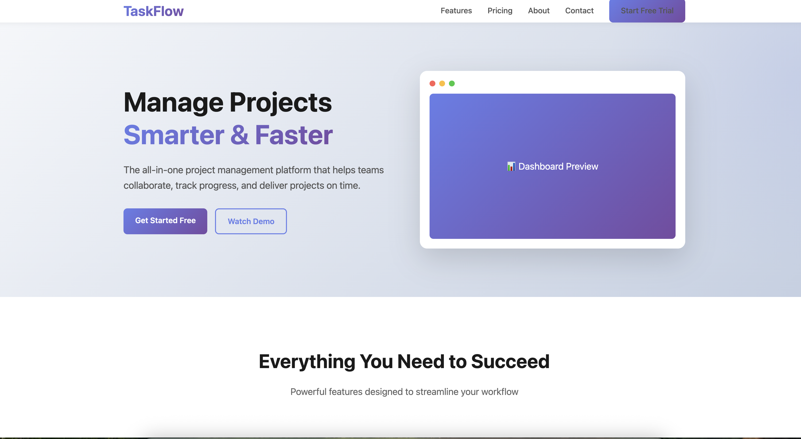
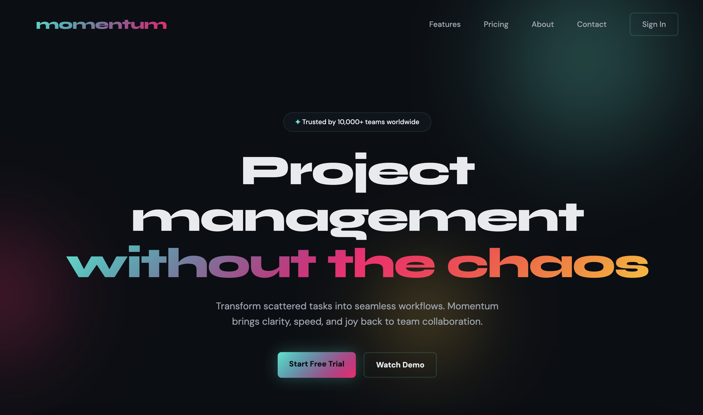
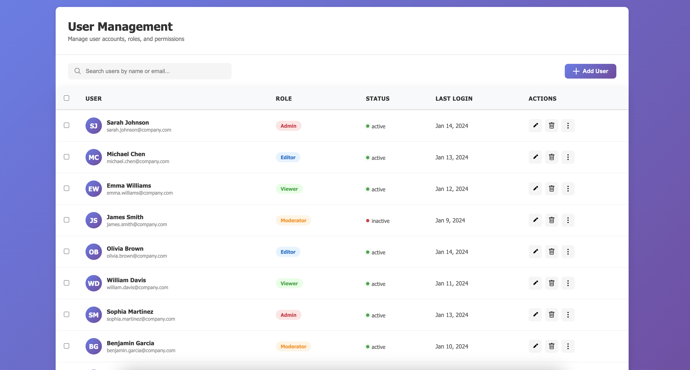
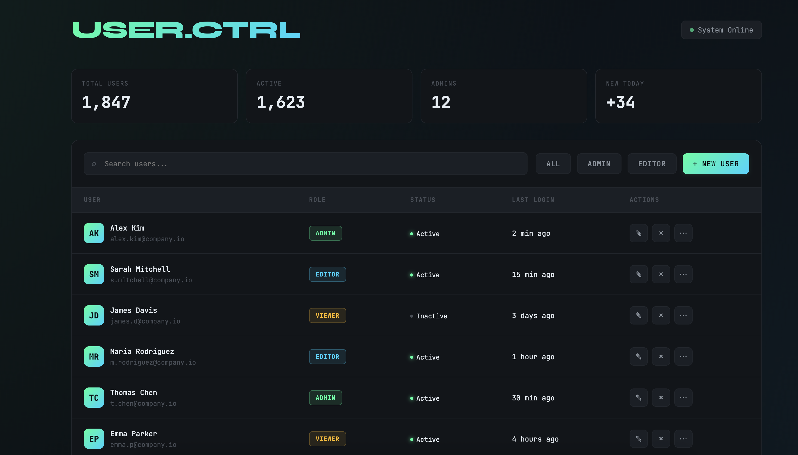

# 前端去 AI 味：从字重、容器到 Skill

AI 生成页面难看，问题出在默认答案太像统计平均值。约束不够时，模型会滑向训练语料里最安全、最常见、最少挨骂的那一类界面：大粗标题、圆角卡片、浅灰辅助文案、每块内容都单独圈起来、按钮和状态标签塞满屏幕。这种做法胜在稳，代价是没有辨识度。

Anthropic 在 [《通过 Skills 改善前端设计》](/ai/improving-frontend-design-through-skills) 和 Frontend Aesthetics Cookbook 里把这个问题讲得很清楚：模型会向高概率的默认设计收敛。落到前端上，收敛出来的就是模板 UI。不一定丑，但品牌感、信息密度和阅读节奏会被一起磨平。

这篇讲怎么把"前端去 AI 味"整理成一套能落地的规则，再把它做成 Skill，让模型在生成前端前带上约束。

## 项目介绍

- GitHub：<https://github.com/anthropics/claude-code/tree/main/plugins/frontend-design>
- GitHub：<https://github.com/anthropics/claude-cookbooks/blob/main/coding/prompting_for_frontend_aesthetics.ipynb>
- 官网：<https://www.anthropic.com/news/skills>
- 文档：<https://resources.anthropic.com/hubfs/The-Complete-Guide-to-Building-Skill-for-Claude.pdf>

## 模型为什么总会做出模板 UI

模型做前端时，最爱用的几招很固定：加粗、加卡片、加圆角、加阴影、加色块、加状态点。原因并不复杂。

第一，训练语料里充满了组件库、后台模板、SaaS 落地页和教程示例。它们本来就偏向清楚、规整、低风险。模型只要照着这些平均值采样，成品就不容易出大错。

第二，粗标题、独立卡片、明显边框，是最省事的层级表达方式。模型不需要认真处理信息节奏，只要把每一块内容框起来，页面看上去就像已经做完了。

第三，很多生成请求本身就很短。只说"做一个 dashboard"或"做一个 landing page"，模型就会自动回到最熟的那套答案。Anthropic 的 cookbook 把这个现象写得很直白：没有额外引导时，模型会默认白底、紫色渐变、普通字体和保守布局。

下面这组示例很能说明问题。相同任务下，默认生成和加入前端设计约束后的结果，差别不在功能，而在节奏、层级和记忆点。

### SaaS 落地页对比





### 后台界面对比





默认结果的问题，不只是"像 AI"，它会把所有元素推到同一音量上：标题太硬，辅助信息太轻，容器太多，留白没有形成秩序，视线一路都在撞框。

## 用户复制原文：12 条去 AI 味清单（用户复制原文 / 社媒参考）

> 1. 所有的字，尤其是标题，都不要过粗。
> 2. 小字不要显得太小。
> 3. 避免使用全大写单词。
> 4. 避免使用太多卡片。
> 5. 尽量避免阴影。
> 6. 尽量避免状态圆点。
> 7. 白背景上避免太淡的灰色，提高对比度和可见性。
> 8. 红色不要那么鲜亮。
> 9. 避免卡片套卡片。
> 10. 金额数字和标题使用更有风格的字体但仍需是常见 UI 字体。
> 11. 广告右侧配插图。
> 12. 评论：卡片是 AI 味极重，尤其圆角卡片；AI 老想把标题加得像健身教练，压细一半立刻像人设计；真正拉胯的是卡片套卡片；这份清单大部分是"不要做什么"，本质是在教 AI 做减法；UI 和文案的 AI 味本质都是太规整；list 条目之间可加若隐若现的分隔线；AI 生成 UI 永远想把每个元素框起来，真实设计师第一反应是去掉 80% 容器；这其实是在设计人的视线和认知成本，而不是简单消除 AI 感；Codex 尤其喜欢卡片嵌套卡片。

这 12 条里，最有用的部分集中在"少做什么"。模型天然偏向加法，人做界面时更常靠减法出层级。

## 字重和排版：别让标题用吼的

字重问题是 AI 页面最容易被认出来的地方。模型很爱把标题直接拉到黑体极粗，再把按钮、标签、统计数字、价格一起抬粗。结果就是：页面里没有清楚主次，只有一群抢前排的人。

### 标题压下来，层级才会出来

"标题不要过粗"不等于让页面全变细，是把粗体留给少数关键节点：主标题、关键数据、少量需要停顿的位置。常见页面里，`600` 到 `700` 的标题已经够用，很多营销页甚至 `500` 到 `600` 更顺眼。标题一旦全往 `800`、`900` 冲，页面会有健身房海报那种顶头感，信息显得又硬又累。

### 小字要小得清楚，不要小得像灰尘

"小字不要显得太小"说的是阅读门槛。模型为了做层级，喜欢把辅助信息压到 12px、11px，再配极浅灰。这样的次级信息肉眼看上去像被撤退了，用户还是得读，只是读得更费劲。

WCAG 2.2 对正文文本给出的最低对比度要求是 4.5:1，大号文本是 3:1。文档还专门提醒：细字和特殊字体在实际渲染时会显得比设定颜色更淡。页面里如果同时出现小字号、细字重、浅灰字，损失会叠加，设计稿里看起来"高级"，落到屏幕上只剩发虚。

### 全大写会把识别速度拖慢

全大写单词的问题，不在审美争议，在阅读轮廓。字母变成整齐方块后，词形差异变弱，按钮、标签、分组标题都会带上模板零件的味道。少量缩写和导航项可以保留大写，整页大面积铺开就会显得发硬、发旧，还会把语气抬得过满。

### 标题和金额需要一点性格，但别跑到装饰字体那边去

"金额数字和标题使用更有风格的字体但仍需是常见 UI 字体"，这条说得很准。标题和金额确实可以承担一点识别度，但方向应该落在稳定、常见、屏幕友好的字体家族上，比如 `IBM Plex Sans`、`Geist`、`Manrope`、`SF Pro Display`、`Segoe UI Variable` 这一类。它们有自己的骨架和数字气质，放在价格、统计数字、章节标题上能拉出记忆点，又不会把界面拖进海报设计。

最容易翻车的情况，是标题一套字体，数字再换一套炫技 display font，正文又回系统字体。这样很难形成统一风格，只会让几套字体互相打架。标题、数字和正文最好还是待在同一套字体体系里。

## 容器减法：框少一点，页面就会顺很多

用户复制原文里最锋利的几句评论，全指向同一个问题：AI 生成 UI 总想把每个元素框起来。卡片、卡片里的卡片、卡片里的列表、列表里的标签，再叠一个 hover 阴影，页面就会进入塑封状态。

### 太多卡片，会把信息切得像抽屉墙

卡片本来是好工具。跨背景分组、可拖拽单元、独立操作对象、带状态切换的模块，用卡片都合理。问题出在"什么都卡片化"。一旦统计、说明、列表、提示、筛选器全都各自独立成卡，页面读起来就像走迷宫。

容器越多，视线越容易频繁停顿。人眼扫页面时，需要的是连续路径，不是连续撞墙。很多时候，留白、分栏、标题间距、细分隔线就足够分组，根本不用每块都加框。

### 圆角卡片更容易显模板味

卡片本身已经很强提示，圆角、描边、浅阴影再叠上去，模板味会翻倍。尤其是营销页和中后台首页，圆角卡片一多，页面立刻有"组件库截图拼接"的感觉。

做减法时，最见效的动作有三个：

- 把纯信息展示模块从卡片里拿出来，直接回到页面栅格。
- 把同类模块合并成一个信息区，别一格一格切开。
- 把圆角收窄，或者只在需要点击、拖拽、悬浮反馈的对象上保留圆角。

### 阴影别当默认层级手段

模型偏爱阴影，因为它能快速制造"有层次"的假象。可一旦每块都有阴影，页面会像飘在雾里。白底界面尤其明显：浅阴影 + 浅灰边 + 圆角，最后全页都在发虚。

常规处理是靠布局层级解决大部分问题：上下间距、左右对齐、字体对比、色块密度。阴影只留给确实需要浮起的元素，比如弹层、悬浮操作、拖拽对象。大部分列表、表单、数据区，只靠背景差异和分组线就够了。

### 状态圆点要少用

状态圆点本来是高密度界面里的速记符号。到了模型手里，它经常变成每一行都附赠一个小绿点、小红点、小黄点。数量一多，信息密度没有真正提升，视觉噪声却先上来了。

如果状态本身不是页面核心，文字、边框、标签色就能表达清楚。只有在在线状态、系统运行态、告警看板这类场景里，圆点才值得保留。很多常规业务列表，删掉圆点后会清爽不少。

### 卡片套卡片，要优先删

原始评论里那句"卡片套卡片最拉胯"判断非常准。最常见的翻车样子，是外层一个概览卡片，里头再放三个统计卡片，下面再嵌一个列表卡片，列表行里还有标签胶囊和状态小卡。每一层都在强调自己，结果是谁都不突出。

外层容器已经成立时，内层直接回到排版层面：标题、说明、数值、行间距、分隔线。list 条目之间那条"若隐若现的分隔线"，比再加一个小卡片更有效。它不会打断阅读，却能给视线一个稳定落点。

## 颜色和可读性：白底浅灰最容易显旧

很多 AI 页面看着"高级"，只是对比度不够。尤其白背景上放很淡的灰字，再配细字重，页面会像盖了一层雾。

### 灰色别淡到只剩气氛

辅助文本、占位符、说明文字需要退后，但不能退没。WCAG 的要求本来就把可读性放在第一位：普通文本至少 4.5:1，对比不足时，用户首先失去的就是扫描速度。大量产品页里最该改的，常常不是主色，问题更多出在辅助灰的亮度。

经验是：

- 主正文优先保证对比，不要把"轻"放在前面。
- 次级文字退一层就够，别连续退两三层。
- 浅边框和浅文字不要同时出现得太多。

### 红色收一收，错误提示会更可信

"红色不要那么鲜亮"针对的是语义强度。高饱和大红很容易把普通提醒写成严重报错，尤其白底下会异常刺眼。错误、风险、警告这些语义，本来就已经自带注意力，不需要再把颜色拉到最尖。

稍微降饱和、压亮度的红色，更耐看，也更像真实产品里的长期配色。用户会更愿意读内容本身，而不是先被颜色刺到。

### 分隔线很有用，用来引导视线就够了

原始评论里提到 list 条目之间可以加若隐若现的分隔线。很多 AI 页面爱靠卡片切分列表，实际上细分隔线更适用于长列表和设置页。它能保持连续阅读，又能帮用户在扫描时快速对齐每一行的起止。

细分隔线更符合日常产品界面，少一点展示模板味。

## 广告位和插图：给页面一个记忆点

"广告右侧配插图"在修一个更大的问题：AI 页面太容易左右对称、上下均分、每块都只剩标题和按钮。

右侧插图的价值有三层：

- 它能打破整页同构模块的重复感。
- 它能把营销信息从"另一张卡片"变成"一个有视觉重心的区域"。
- 它能替代一部分多余标签、徽章和说明文案。

很多会员升级、功能推广、空状态页面，文字已经够多了，再塞卡片、塞 chips、塞状态色块，页面只会更吵。插图、截图、产品局部预览、简单图形，都能把信息承载从纯文本里分出去。

## 把这些规则做成 Skill

如果这些规则只放在聊天里，下一次还得重说一遍。做成 Skill 之后，模型在接到前端任务时就能自动加载同一套约束。

Anthropic 的 Skill 文档给了一个很实用的骨架：`SKILL.md` 是必需文件，`scripts/`、`references/`、`assets/` 可以按需补。Skill 的重点，不在一句"你是资深设计师"，而在把判断标准、检查顺序和修正动作固定下来。

### 一个够用的目录结构

```text
frontend-de-ai/
├─ SKILL.md
├─ references/
│  ├─ typography-and-contrast.md
│  └─ layout-reduction.md
└─ assets/
   └─ example-panels/
```

### `SKILL.md` 里最该写什么

可以把上面的规则压成三个阶段：生成前、生成中、交付前。

```md
---
name: de-ai-frontend-review
description: 为落地页、后台、定价页和设置页生成更克制、做过取舍的界面。重点检查字重、容器数量、对比度、颜色饱和度和视觉节奏。
---

在开始编码前，判断页面类型：营销页、后台、表单页、设置页、广告位。

始终遵守：
- 标题不要过粗，小字不要过小，避免全大写单词。
- 优先用间距、分栏和分隔线建立层级，减少卡片、卡片嵌套、阴影和状态圆点。
- 白底界面避免过浅灰字，普通文本对比度至少接近 WCAG AA 水平。
- 红色降低饱和度，别把普通提示做成报警灯。
- 标题和金额可用更有性格的常见 UI 字体，正文维持高可读性。
- 广告或推广区优先给右侧图形、插图或产品预览，不要只堆文案和按钮。

交付前自检：
1. 页面里有多少个非必要卡片？能删掉多少？
2. 是否出现卡片套卡片？
3. 次级文字是否因为过浅或过小而难读？
4. 标题是否明显粗过头？
5. 状态圆点是否能用文字或标签替代？
6. 是否还有一眼能看出的模板式圆角 + 阴影组合？
```

### Skill 最见效的地方，在"自检"这一轮

很多前端 Skill 只负责生成，不负责回头看。去 AI 味这类规则，最有效的部分恰好在第二遍检查。模型第一次输出后，应该再跑一次检查：

- 把容器数数出来。
- 找出所有 `font-weight: 800/900` 的标题。
- 找出正文和辅助文案的字号、颜色、对比度。
- 找出不必要的 badge、dot、shadow。
- 找出所有嵌套 card。

这一步可以靠口头指令，也可以加脚本。比如前端仓库里已经有设计 token，就让脚本扫 `color`, `font-size`, `font-weight`, `box-shadow`, `border-radius` 的使用分布；发现超阈值时，要求模型回修。这样 Skill 提供的不只是审美方向，还有可执行的复查流程。

### references 和 assets 该放什么

`references/` 里适合放两类资料：

- 官方规则：对比度、排版、组件规范。
- 团队偏好：品牌字体、按钮语气、定价区写法、广告位素材策略。

`assets/` 里适合放示例插图、版式截图、团队常用图标或空状态素材。这样模型在做营销区、升级区、推广区时，不会只剩通用文案块。

## 可直接用于前端生成前的提示词

下面这段可以直接放到 Claude Code、Codex、Cursor 或团队自定义 Skill 里，作为生成前端前的约束：

```text
你要生成的是可上线的前端界面，不要落回模板 UI。

请按以下规则执行：
1. 标题和整页文字都不要过粗，尤其避免夸张的超粗黑体；小字也不要小到难读。
2. 避免全大写单词，保留正常词形，让按钮、标签和分组标题更符合真实产品界面。
3. 优先用留白、分栏、对齐和细分隔线建立层级，减少卡片数量。
4. 严禁卡片套卡片；如果一个区域已经有外层容器，里面优先回到排版系统。
5. 阴影只给真正浮起的元素，大部分内容区不要默认上阴影。
6. 尽量避免状态圆点，除非页面核心就是监控、在线状态或告警。
7. 白背景上不要用过浅灰文字，保证正文和辅助信息都有足够对比度与可见性。
8. 红色降低饱和度，不要做成刺眼的大红告警灯。
9. 标题和金额数字可以使用更有风格的常见 UI 字体，正文保持高可读性。
10. 广告位、升级区、推广区优先在右侧放插图、产品预览或图形元素，避免整块都只有文案和按钮。
11. 输出前自检：删掉 80% 非必要容器，检查有没有模板式圆角卡片、浅灰细字、过粗标题和无意义装饰。
12. 页面要让视线流动、认知成本和信息主次都更顺，读起来像有人认真做过取舍。
```

## 参考资料

- Anthropic：<https://www.anthropic.com/news/skills>
- Anthropic Frontend Design Plugin：<https://github.com/anthropics/claude-code/tree/main/plugins/frontend-design>
- Anthropic Frontend Aesthetics Cookbook：<https://github.com/anthropics/claude-cookbooks/blob/main/coding/prompting_for_frontend_aesthetics.ipynb>
- Anthropic《The Complete Guide to Building Skill for Claude》：<https://resources.anthropic.com/hubfs/The-Complete-Guide-to-Building-Skill-for-Claude.pdf>
- W3C WCAG 2.2 Contrast Minimum：<https://www.w3.org/WAI/WCAG22/Understanding/contrast-minimum.html>
- 站内参考：[/ai/improving-frontend-design-through-skills](/ai/improving-frontend-design-through-skills)
