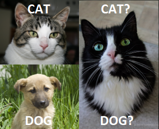
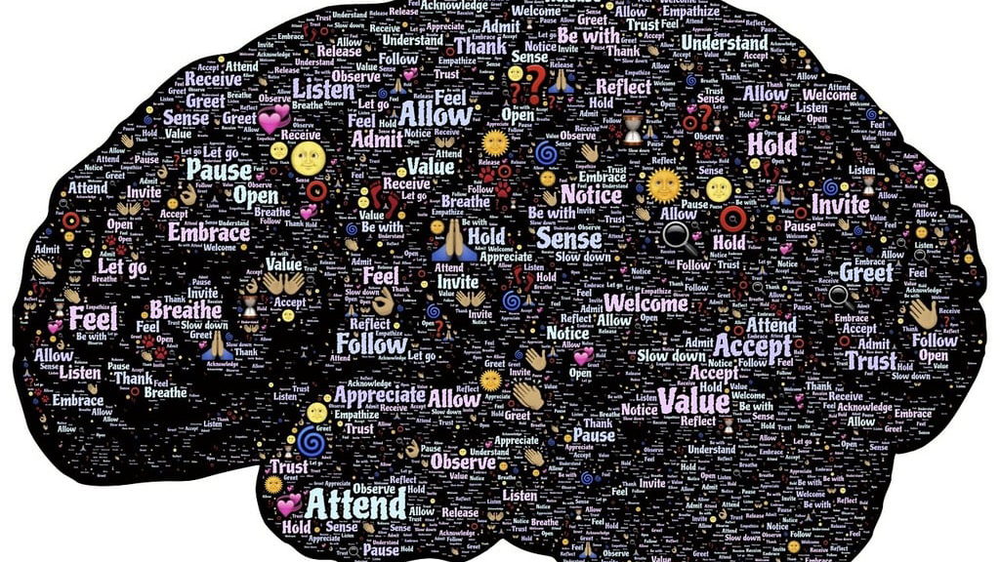
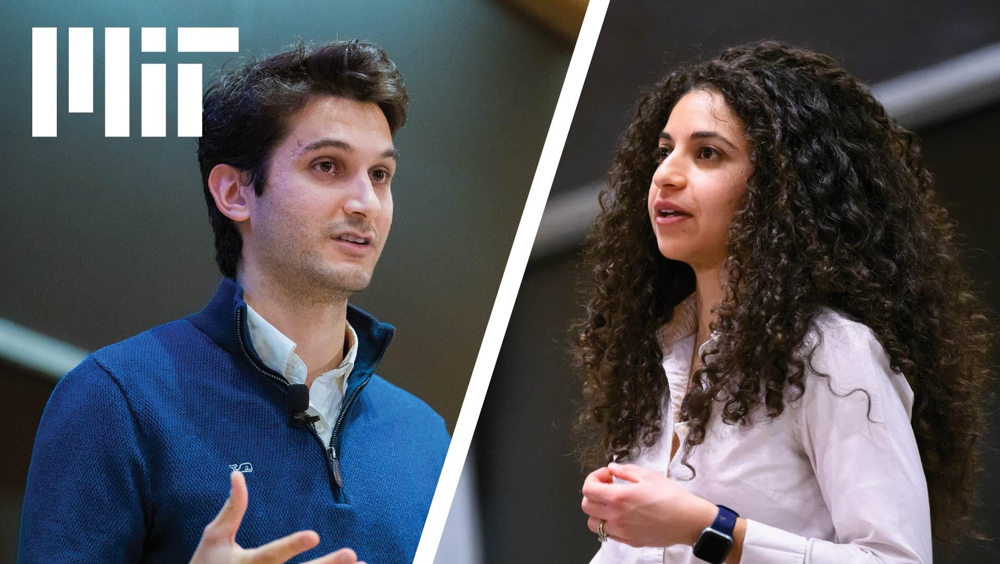
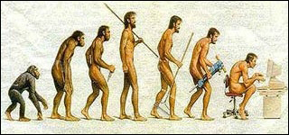

# 免费 AI 课程路线

学 AI 最容易犯的一个错，就是收藏一堆课程，过几天再看，发现每门课都像能学，但真点开时又不知道该上哪门。原因通常不在内容太少，而在顺序没排好。小白课、生成式 AI 导论、机器学习核心课、深度学习 bootcamp、经典 AI 本科课，前置知识差很多，硬混着看只会越看越乱。

这篇做一件事：把 6 门免费课程按难度和前置知识串起来。6 门课摆在一起之后，更容易看出谁适合完全零基础，谁需要一点 Python，谁默认你已经能跟上线代、微积分和算法。

## 6 门课与原始说明

下面这 6 条按原始参考的顺序保留，并补成可直接点开的课程页：

- [MIT AI 101](https://ocw.mit.edu/courses/res-6-013-ai-101-fall-2021/)：适合完全小白打底。
- [Foundation Models and Generative AI](https://ocw.mit.edu/courses/6-s087-foundation-models-and-generative-ai-january-iap-2024/)：解释 ChatGPT 等基础模型如何运作。
- [How to AI (Almost) Anything](https://ocw.mit.edu/courses/mas-s60-how-to-ai-almost-anything-spring-2025/)：侧重把 AI 用到音乐、艺术、系统设计等创意领域，需要一点 Python。
- [MIT Intro to Deep Learning](https://introtodeeplearning.com/)：动手实验多，需要初等微积分和线性代数。
- [Introduction to Machine Learning](https://ocw.mit.edu/courses/6-036-introduction-to-machine-learning-fall-2020/)：核心课，需要线性代数、概率统计、编程基础。
- [Artificial Intelligence](https://ocw.mit.edu/courses/6-034-artificial-intelligence-fall-2010/)：经典本科 AI 课，教知识表示、问题求解、搜索算法等传统 AI 方法论，需要编程经验、离散数学等 CS 基础。

## 1. MIT AI 101：给完全没进过门的人铺地板

### MIT AI 101
课程页：<https://ocw.mit.edu/courses/res-6-013-ai-101-fall-2021/>

这门课最适合拿来解决"我连术语都不熟"的问题。MIT OCW 的课程说明写得很明确：它面向 **little to no background** 的学习者，用 machine vision、data wrangling、reinforcement learning 这些词做入口，讲概念，再带一个互动练习，让参与者自己训练一个算法。

它的体量不大，本身就是一门入门 workshop，放在最前面用来建立基本词汇表很合适。

### 这门课会学到什么

按课程页和 supporting materials 的描述，重点在三件事：

- 常见 AI 术语
- 让你知道一个简单算法是怎么"被训练"的
- 收尾的总结和问答

它不追求系统数学推导，也不要求你先会写程序。

### 适合谁

- 完全没系统学过 AI 的人
- 只听过 ChatGPT、机器学习这些词，但解释不清的人
- 想用一门短课确认自己要不要继续往下学的人

### 前置知识

这门课基本可以按零门槛处理。真要说前置，只需要：

- 愿意看英文材料
- 对"算法训练"这件事有一点好奇心

如果你身边有人想知道 AI 到底在讲什么，从这门开始最稳。

## 2. Foundation Models and Generative AI：生成式 AI 基础

### Foundation Models and Generative AI
课程页：<https://ocw.mit.edu/courses/6-s087-foundation-models-and-generative-ai-january-iap-2024/>
官网：<https://www.futureofai.mit.edu/>

这门课的价值，在于它正面回答了很多人最近两年最常问的问题：ChatGPT、Copilot、CLIP、DALL-E、Stable Diffusion、AlphaFold，这些系统为什么突然一起冒出来？背后的共同逻辑是什么？

MIT OCW 的课程说明把定位写得很直白：这是一个 **non-technical series of lectures**。它会从 AI 简史开始，讲监督学习和强化学习缺了什么，再落到 foundation models、self-supervised learning，以及它们对科学和商业的影响。

如果你已经知道"现在大家都在讲大模型"，但总觉得概念一团糊，这门课很适合接在 AI 101 后面。

### 这门课会学到什么

从官方课程页和 `futureofai.mit.edu` 上的说明看，重点包括：

- AI 历史脉络
- 为什么这波突破集中出现在 foundation models 和 generative AI
- ChatGPT、Copilot、CLIP、DALL-E 这些系统背后的共同框架
- self-supervised learning 在里面扮演什么角色
- 这些技术落到科学和商业里的方式

它更偏"解释这场变化为什么发生"。想自己训练模型，还得往后走。

### 适合谁

- 已经用过生成式 AI，但想补系统解释的人
- 产品、内容、运营、设计背景，想理解大模型基本原理的人
- 需要和技术团队对话，但暂时还不准备直接啃公式的人

### 前置知识

官方页面强调 **All backgrounds are welcome**。所以这门课依然不把数学当门槛。更现实的前置要求是：

- 知道一些最基本的 AI 词汇
- 对生成式 AI 的应用场景有直觉

也就是说，学完 AI 101 再上这门，衔接最自然。

## 3. How to AI (Almost) Anything：适合想把 AI 带进创意和多模态场景的人

### How to AI (Almost) Anything
课程页：<https://ocw.mit.edu/courses/mas-s60-how-to-ai-almost-anything-spring-2025/>
GitHub：<https://github.com/MIT-MI/how2ai-course>

这门课和前两门的气质不太一样。它直接把问题换成：如果 AI 不只处理文字，还要碰视觉、音频、传感器、医疗数据、音乐、艺术，方法会怎么变？

MIT OCW 的课程说明写到，它会介绍 modern deep learning、foundation models，以及把 AI 用到新数据模态的方法；还会讲 multimodal AI，讨论 language 和 multimedia、music 和 art、sensing 和 actuation 怎么连起来。

这也是原始参考里提到"音乐、艺术、系统设计等创意方向"的依据。

### 这门课会学到什么

按 OCW 页面和课程站说明，内容重点包括：

- 不同数据模态下的 AI 思路
- modern deep learning 和 foundation models 在多模态场景里的用法
- multimodal AI 的基本概念
- 课程讨论、阅读和研究型作业

它已经进入"把 AI 带进具体创意或研究场景"的范围了。

### 适合谁

- 对音乐、艺术、媒体、设计、交互很感兴趣的人
- 已经不满足于只聊文本模型的人
- 想理解多模态 AI 会怎样进入真实应用的人

### 前置知识

原始参考里说"需要一点 Python"，这个方向和课程形态是对得上的。虽然 OCW 首页没有把 Python 明写成硬门槛，但它毕竟是 MIT Media Lab 风格的研究型课程，带阅读、讨论和项目，完全零编程基础会比较吃力。

前置知识是：

- 至少会一点 Python
- 知道深度学习和 foundation models 的基本名词
- 能接受课程里有研究阅读和项目思维

如果你的目标偏创意方向，这门课可以比深度学习核心课更早看；如果你想走技术实现路线，可以把它放在旁支阅读。

## 4. MIT Intro to Deep Learning：开始动手跑神经网络和实验

### MIT Intro to Deep Learning
课程页：<https://introtodeeplearning.com/>
GitHub：<https://github.com/MITDeepLearning/introtodeeplearning>

到这一步，课程强度就明显上来了。MIT 6.S191 是一个高强度 deep learning bootcamp。官方页面写得很清楚：它讲 vision、robotics、medicine、language、game play、art 等应用，也会覆盖 large language models 和 generative AI，还配了公开 slides、videos 和 labs。

这门课特别适合已经下定决心要动手的人，因为它不只讲，还让你跑 lab。

### 这门课会学到什么

从课程站和 GitHub 仓库说明页能确认的内容包括：

- 深度学习基础
- sequence modeling
- computer vision
- generative modeling
- reinforcement learning
- LLM fine-tuning
- 带代码的 software labs

仓库说明还写明了 labs 会在 Colab 上跑，通常需要切到 Python 3 和 GPU 环境。

### 适合谁

- 已经决定要做模型实验的人
- 想通过 lab 建立神经网络直觉的人
- 想从"会聊 AI"往"能做实验"走的人

### 前置知识

这门课的前置要求，官方页面直接给出来了：

- calculus
- linear algebra
- Python 最好会一点

课程站原话是：**Experience in Python is helpful but not necessary**，但真实学习体验里，完全不会 Python 会很难把 lab 跑顺。所以实操上最好把它理解成：

- 微积分和线代最好补过
- Python 至少会基础语法、函数、数组或 notebook 操作

如果你还没碰过矩阵乘法和导数，这门课不建议硬上。

## 5. Introduction to Machine Learning：把机器学习核心概念系统过一遍

### Introduction to Machine Learning
课程页：<https://ocw.mit.edu/courses/6-036-introduction-to-machine-learning-fall-2020/>
官网：<https://openlearninglibrary.mit.edu/courses/course-v1:MITx+6.036+1T2019/about>

6.S191 是高强度 deep learning bootcamp，6.036 则是机器学习主干课。MIT OCW 的课程说明里提到 modeling and prediction、representation、over-fitting、generalization，以及 supervised learning 和 reinforcement learning。

Open Learning Library 的课程页还补了学习形式：lectures、lecture notes、exercises、labs、homework problems 都有，长度 13 周，预计每周约 12 小时。

这门课的系统性更强，更适合作为系统补课的主线课程。

### 这门课会学到什么

从 OCW 和 Open Learning Library 的说明看，核心内容包括：

- 学习问题的建模
- 表示、过拟合、泛化
- 监督学习
- 强化学习
- 图像和时序数据上的应用
- 配套讲义、练习、实验和作业

它讲的是一整条机器学习主线，不只停在大模型热词上。

### 适合谁

- 想系统学机器学习，而不想只从大模型热词入手的人
- 准备继续读深度学习、推荐系统、强化学习的人
- 需要把概念、练习和作业连起来的人

### 前置知识

Open Learning Library 的课程页把推荐前置写得很直接：

- Computer programming (Python)
- Calculus
- Linear Algebra

原始参考里还提到概率统计。虽然课程页摘录里没有把 probability 单独写成同一行门槛，但实际学这门课时，没有概率直觉会比较吃力。所以更稳妥的准备是：

- Python 基础
- 微积分
- 线性代数
- 概率统计入门

这门课适合放在深度学习 bootcamp 前后搭配着学：如果你更看重理论顺序，可以 6.036 再 6.S191；如果你更需要动手反馈，也可以 6.S191 建直觉，再回 6.036 补系统框架。

## 6. Artificial Intelligence：回到经典 AI 方法论

### Artificial Intelligence
课程页：<https://ocw.mit.edu/courses/6-034-artificial-intelligence-fall-2010/>

6.034 很值得留到后面认真看。原因很简单：很多人现在学 AI，前面全是模型、训练、生成，但对传统 AI 里的问题表示、搜索、知识结构、推理方法反而没有系统概念。6.034 正好补这个缺口。

MIT OCW 的课程描述写的是：knowledge representation、problem solving、learning methods。学完以后，学生应该能把这些方法拼到具体 computational problems 上，也能理解 vision、language 和 human intelligence 在计算视角下怎么被看待。

### 这门课会学到什么

按课程页和 syllabus 的结构，这门课包括：

- knowledge representation
- problem solving
- learning methods
- lecture videos
- programming assignments
- exams
- tutorials

这是一门很典型的本科 AI 课程，方法论味道很重。

### 适合谁

- 想补"传统 AI"框架的人
- 学过一点机器学习后，想理解搜索、表示、推理的人
- CS 背景较强，准备往算法和智能系统方向继续走的人

### 前置知识

原始参考里说它需要编程经验、离散数学等 CS 基础，这个判断是合理的。课程 syllabus 页面还能确认 problem sets 以 Python 程序提交。

更稳妥的前置知识是：

- 编程经验
- 数据结构和基础算法
- 离散数学或逻辑基础
- 读英文课程材料的耐心

如果你完全是冲着大模型来学，这门课一开始可能会觉得"离当前热点有点远"；但真想把 AI 方法论补完整，6.034 很有价值。

## 两条路线怎么读

如果你想走一条尽量平滑的路线，可以按下面这个顺序：

1. **MIT AI 101**：补术语和基本直觉。
2. **Foundation Models and Generative AI**：把这波生成式 AI 讲清楚，知道 ChatGPT 一类系统大概怎么来的。
3. **How to AI (Almost) Anything**：如果你偏创意、多模态、媒体和设计方向，这里可以提前插进来。
4. **Introduction to Machine Learning**：开始系统学机器学习主线。
5. **MIT Intro to Deep Learning**：进入实验、神经网络和 lab。
6. **Artificial Intelligence**：回头补传统 AI 的知识表示、搜索、推理和方法论。

如果你走的是更偏技术的路线，主线看成：

- AI 101
- Foundation Models and Generative AI
- Introduction to Machine Learning
- MIT Intro to Deep Learning
- Artificial Intelligence

**How to AI (Almost) Anything** 更适合作为方向扩展课，尤其适合对音乐、艺术、系统设计、多模态应用感兴趣的人。这样排的好处很直接：前两门建立词汇和问题意识，中间两门补机器学习与深度学习主线，最后再回头看传统 AI，很多概念会更容易对上。
