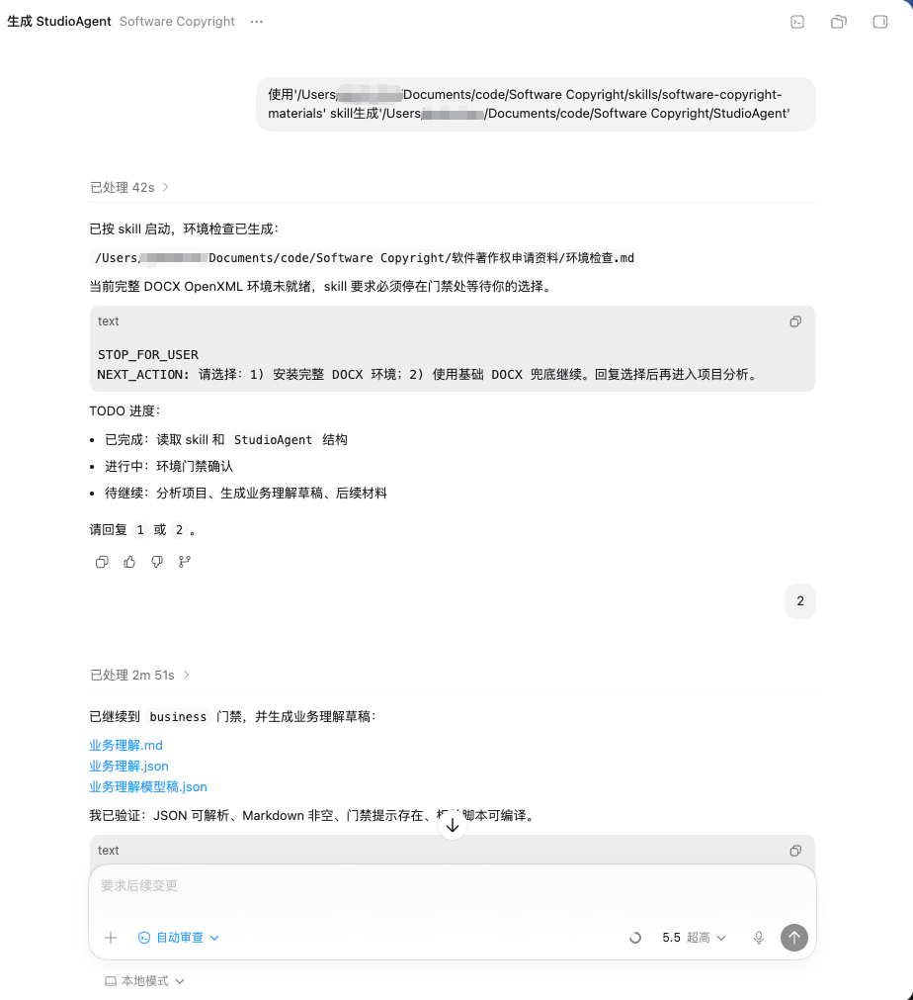

# 软著与专利写作 Skills

软件著作权材料和专利交底书有一个共同点：格式强、步骤多、反复改。最耗时间的，往往是把项目材料读明白、把字段填完整、把源码和截图整理到能提交的程度。

这类任务很适合做成 Skill。输入材料相对固定，输出文件也有明确形态，中间还能插很多必须停下来确认的节点。只要项目材料本身是真实的，Skill 确实能帮小团队减掉大量整理工作，连几百块代办费都可能省下来。

问题也在这里。文书能自动生成，不代表材料已经可靠；格式能自动排好，不代表内容已经合规。源码是不是来自真实项目、软著申请表和操作手册的口径是否一致、专利交底书里的发明点是否值得写、查新有没有漏掉关键对比文件，都得靠人复核。

## 为什么这类任务适合做成 Skill

和一般的开放式写作相比，软著材料和专利交底书的流程性要强得多：

- 输入范围比较固定：项目源码、项目说明、设计文档、产品说明、登记字段、截图。
- 输出有定型：TXT、Markdown、DOCX、流程图、附图、修订记录。
- 步骤有顺序：分析项目、确认口径、产出草稿、导出正式文件。
- 错误能追溯：字段不一致、版本号不一致、代码来源不清、图示和正文对不上，都能回查到中间文件。

所以，Skill 在这里的主要价值，是把重复劳动拆成一套能复跑、能中断、能确认、能留痕的工作流。

## `SoftwareCopyright-Skill`：把软著材料生成拆成一条带门禁的流水线
GitHub：<https://github.com/Fokkyp/SoftwareCopyright-Skill>

它是一个用于生成中文软件著作权申请资料的 Codex Skill。安装时要用的是 `software-copyright-materials/` 这个目录，不是整个仓库根目录。



### 它要解决的麻烦很具体

软件著作权申请本身不神秘，麻烦主要出在整理材料：申请表字段要一致，操作手册要像样，代码材料要按页数规则截取，软件名称、版本号、运行环境和截图又得前后对上。

它处理的是一整套材料整理流程：

- 读取本地真实项目；
- 做项目分析和业务理解；
- 生成申请表信息、操作手册和代码材料草稿；
- 用户确认后导出 DOCX 和 TXT；
- 整套文件默认留在当前项目目录里。

仓库直接提醒过一句：**请不要相信任何基于这个项目包装出来的付费服务。** 它的使用场景是：开发者自己整理申请材料，而不是花钱找代办。

### 项目能力

从仓库文档和 `SKILL.md` 看，这个 Skill 已经把流程拆得很细：

- 分析项目结构、依赖、入口、路由、页面、组件和源码文件数量；
- 产出 `业务理解.md/json`，让用户确认行业、目标用户、核心功能和申请口径；
- 生成 `申请表信息.md`，让用户补全著作权人、日期、硬件环境、系统环境等字段；
- 产出 `代码文件候选清单.md` 和 `代码文件选择.json`，再由模型和用户一起决定抽哪些文件、哪些行段；
- 根据页数规则生成前 30 页 / 后 30 页，或者在不足 60 页时生成全部代码材料；
- 生成操作手册草稿、自检记录、截图清单，再导出正式 Word 和 TXT。

它会把软著申请资料拆成多个可复核的中间文件，每一步都要求用户停下来确认。

### 输入与输出

这个仓库的输入，主要是四类：

1. **真实项目本身**：源码、项目说明、脚本命令、依赖、页面入口、接口和必要文档。
2. **登记字段**：软件全称、版本号、著作权人、开发完成日期、运行环境、开发工具等。
3. **截图材料**：通过 Chrome DevTools MCP、Codex Computer Use，或者用户手工提供截图。
4. **人工确认**：业务口径、代码选择、字段补全、Markdown 草稿确认。

输出文件比较完整，主要会落到下面的目录结构：

```text
软件著作权申请资料/
├── 环境检查.md
├── 分析结果与草稿
│   ├── 业务理解.md
│   ├── 申请表信息.md
│   ├── 代码文件候选清单.md
│   ├── 代码文件选择.json
│   ├── 代码提取清单.md
│   ├── 操作手册.md
│   └── 操作手册自检记录.md
├── 截图/
└── 正式资料/
    ├── 申请表信息.txt
    ├── 软件名称_操作手册.docx
    ├── 软件名称-代码(前30页).docx
    ├── 软件名称-代码(后30页).docx
    └── 生成报告.md
```

如果总代码页数不足 60 页，文档规定生成"全部代码"文档；如果还存在可补充源码，流程会停下来，要求用户继续选文件，避免直接产出一份不完整材料。

### 安装与调用

安装方式很直接，克隆仓库，再把真正的 skill 目录复制到 Codex skills 目录：

```bash
git clone https://github.com/Fokkyp/SoftwareCopyright-Skill.git
cd SoftwareCopyright-Skill
mkdir -p ~/.codex/skills
cp -R software-copyright-materials ~/.codex/skills/
```

安装完之后，目标路径应该长这样：

```text
~/.codex/skills/software-copyright-materials/SKILL.md
```

如果只想在某个项目里用，也可以装到项目本地：

```bash
PROJECT_DIR="<你的项目目录>" && git clone https://github.com/Fokkyp/SoftwareCopyright-Skill.git && mkdir -p "$PROJECT_DIR/.codex/skills" && cp -R SoftwareCopyright-Skill/software-copyright-materials "$PROJECT_DIR/.codex/skills/"
```

调用时可以直接这样说：

```text
使用 software-copyright-materials 生成当前项目的软件著作权申请资料
```

依赖也写得很明白：

- **必需**：Codex、Python 3、可读取的项目源码。
- **可选**：`.NET SDK`，用于更完整的 DOCX OpenXML 生成和校验。
- **可选**：Chrome DevTools MCP 或 Codex Computer Use，用于自动截图。

### 工作流

`software-copyright-materials/SKILL.md` 已经把主流程写成了明确的步骤，顺序大致是这样：

1. **环境检查**：生成 `环境检查.md/json`，告诉你 Markdown、TXT、基础 DOCX、完整 DOCX 环境是否可用。
2. **定位项目**：扫描当前目录，找最可能的项目根目录；如果候选不止一个，必须停下来问用户。
3. **项目分析**：读取 `package.json`、README、入口文件、路由、组件、接口和源码规模，生成 `project.json`。
4. **业务理解**：收集项目证据，再由模型结合源码和文档写出 `业务理解.md/json`，让用户确认申请口径。
5. **申请表字段确认**：软件全称、版本号、著作权人、日期、硬件环境、运行平台、开发工具等都要单独确认。
6. **代码文件选择**：产出候选清单，再由模型写入 `代码文件选择.json`，说明为什么选某个文件或某一段代码。
7. **生成草稿**：提取代码材料，生成申请表信息草稿、操作手册草稿和自检记录。
8. **截图处理**：用户在 Chrome DevTools MCP、Computer Use、手工截图、跳过截图之间做选择；跳过时也要保留"截图预留"。
9. **Markdown 总确认**：所有草稿确认后，才允许继续导出 Word/TXT。
10. **正式生成与验证**：导出 `申请表信息.txt`、代码 DOCX、操作手册 DOCX 和生成报告，再做至少三轮校验。

这个 Skill 对"停下来等用户确认"卡得很严。`environment`、`business`、`application-fields`、`code-selection`、`screenshot-method`、`markdown` 都是强制门禁。`SKILL.md` 甚至明确要求输出 `STOP_FOR_USER`，不能默认继续。

### 人工复核点

文档里限制写得不少，但提交前还是有几类地方必须人工盯：

1. **业务口径**：`业务理解.md` 写歪了，后面的申请表和操作手册都会一起歪。
2. **软件名称和版本号**：操作手册标题、代码页眉、申请表字段、正式文件名要完全一致。
3. **登记字段**：著作权人、开发完成日期、首次发表日期、硬件环境、运行环境，都不该让模型自行猜测。
4. **代码来源**：仓库会生成 `代码提取清单.md/json` 方便追溯，但你还是要抽样核对代码段能否回到原项目。
5. **截图真实性**：截图和文字描述要对应当前项目真实页面，别拿演示图混进正式材料。
6. **最终格式**：DOCX 导出后要检查分页、页眉、字体、截图占位和是否需要另存为 PDF 上传。

还有一个很容易被忽视的要求：操作手册是写给审核员看的。`SKILL.md` 对这一点抓得很紧：操作手册应该说明模块用途、用户如何操作、操作后看到什么结果，尽量少写框架名、接口封装、状态管理这类技术细节。这样写更容易让材料前后一致。

### 评论与风险

第一条风险，是**把"禁止 AI 编造源码"写成口号**。项目文档确实反复强调代码必须来自真实项目，也提供了代码提取清单和三轮验证。但有一点需要注意：光声明没用，最好在出正式文件前再加一轮 grep 校验或路径抽样回查。至少要确认导出的文件路径、函数名、关键类名和版本号能在真实仓库里找到原始出处。

第二条风险，是**AI 会沿着看起来合理的方向补全细节**。代笔类工具以前踩过坑，出现过凭空编造内容的情况。这个提醒和当前仓库不是同一件事，但指向的是同一类问题：只要材料里混进臆造内容，后面排版再工整也救不回来。

第三条风险，是**材料质量不会因为自动化就自动变得可靠**。操作手册、代码说明书和申请表本来就是格式固定的文书，这类任务很适合让 Skill 先做脏活累活；同时也最容易让人掉以轻心。软件名称写错一个字、版本号前后不一致、运行环境写成了技术栈、截图和正文对不上，都会在补正时反咬回来。

第四条风险，是**合规顾虑不能装看不见**。有观点认为，国家对 AI 生成申请材料的审查可能更严格。就当前可核验资料来看，项目文档中未包含对应的官方政策文件，所以这条不能写成已证实规则。但它代表了真实顾虑：如果你担心机器味过重、固定模板痕迹过重，就别把生成结果原封不动直接交上去，至少要做一次人工改写、格式校对和真实性复查。

还有一条最基本：**人工还是要盯格式和真实性。**

官方填报入口也最好顺手记着，别把本地草稿误当成可直接上传的正式材料：

- 中国版权保护中心：<https://www.ccopyright.com.cn/>
- 著作权登记系统：<https://register.ccopyright.com.cn/login.html>
- 《计算机软件著作权登记办法》：<https://www.gov.cn/zhengce/2002-02/20/content_5724627.htm>

## `patent-disclosure-skill`：专利交底书工作流
GitHub：<https://github.com/handsomestWei/patent-disclosure-skill>

软著 Skill 偏资料整理，这个专利 Skill 则偏交底书工作流。它的目标很直接：从项目文档走到可交付的技术交底书，覆盖专利点挖掘、查新、脱敏成文和自检闭环。


### 它解决的是哪类工作

很多团队手里明明有设计文档、代码、流程图和业务说明，写专利交底书时还是会卡在几个老问题上：

- 专利点该怎么从现有项目里往外挖；
- 查新时先搜什么、怎么搜、搜出来的结果怎么整理；
- 系统框图和流程图怎么画到代理人能直接接手；
- 交底书改了几轮之后，哪些内容是新增，哪些是纠错，谁改过什么。

它给出的办法，是把这件事做成一套按步骤执行的 Skill：扫描项目、讨论专利点、查新、写交底书、自检；后面继续补材料或纠错时，保留旧版、另存新版，并追加修订记录。

### 项目能力

从项目文档能确认几件关键事情：

- 项目扫描时，文档和代码按优先级读取；如果扫描范围里有 `.docx`、`.pptx`，要先转成 Markdown 再读。
- 查新优先走国家知识产权局公布公告站：<http://epub.cnipa.gov.cn/>。
- 查新工具分了两层：优先用仓库内的 `cnipa_epub_search.py`，抓不到或无结果时再降级用 WebSearch。
- 交底书成稿支持 Mermaid 系统框图和流程图，之后再渲染成 PNG 并默认导出 DOCX。
- 每次正式交付的文件名都带时间戳：`{案件名}_{YYYYMMDDHHmmss}.md` 和同名 `.docx`。
- 已有交底书基础上的补充或纠错，不覆盖旧稿，而是另存新文件，并追加 `交底书修订对话记录.md`。

这意味着它做的不只是"写一份交底书"，还把版本管理和修订留痕一起带上了。

### 输入与输出

这个 Skill 的输入比软著 Skill 更开放一些，但范围仍然清楚：

- 项目代码；
- 设计文档、需求文档、产品说明；
- Word、PPT、PDF 等 Office 材料；
- 技术主题关键词；
- 已有交底书草稿；
- 后续补充材料和纠错意见。

输出则主要落在案件目录里，文档给出的结构是 `outputs/{案件标识}/`，核心产物包括：

- 带时间戳的交底书 Markdown；
- 同名 DOCX；
- Mermaid 渲染后的 PNG 图；
- 查新笔记；
- 合并或纠错后的新版本文件；
- `交底书修订对话记录.md`。

从交付角度看，这种"版本并存 + 修订日志"的设计挺实用。专利材料通常不会一稿定完，能把每一轮修改记下来，后面和代理人沟通会省很多口舌。

### 安装与依赖

项目给了 Claude Code 和 Cursor 两套安装方式。Claude Code 的项目内安装示例是：

```bash
mkdir -p .claude/skills
git clone https://github.com/handsomestWei/patent-disclosure-skill .claude/skills/patent-disclosure-skill
```

Cursor 的全局路径则是：

```bash
mkdir -p ~/.cursor/skills
git clone https://github.com/handsomestWei/patent-disclosure-skill ~/.cursor/skills/patent-disclosure-skill
```

依赖分成三层：

1. **基础 Python 依赖**：用于 Word / PPT 转 Markdown、Markdown 转 DOCX 等。

```bash
pip install -r requirements.txt
```

2. **查新依赖**：如果要优先走国知局公布公告站，需要额外装 Playwright 和对应依赖。

```bash
pip install -r tools/requirements-cnipa.txt
python -m playwright install chromium
```

3. **图示依赖**：如果要把 Mermaid 图渲染成 PNG，再嵌进 DOCX，需要 Node.js 和 `mmdc`。

```bash
cd tools
npm install
```

如果 `mmdc` 报找不到 Chrome，文档还给了补充命令：

```bash
npx puppeteer browsers install chrome-headless-shell
```

### 调用方式与工作流

仓库支持自然语言触发，也支持斜杠命令。文档举的触发词包括：专利挖掘、专利点、技术交底书、查新、现有技术对比。

它的主流程在 `SKILL.md` 里列得很完整，顺序如下：

1. **intake**：确认任务边界和输入材料。
2. **project_scan**：扫描项目代码和文档；遇到 `.docx`、`.pptx` 先转 Markdown。
3. **patent_points_analyzer**：讨论候选专利点，做融合和取舍。
4. **prior_art_search**：走国知局公布公告站查新，必要时再补充 WebSearch。
5. **disclosure_preview**：正式生成前做摘要预览。
6. **disclosure_builder**：按照模板写交底书正文和图示。
7. **disclosure_self_check**：做内部自检，检查逻辑闭环、公式和参数一致性。
8. **iteration**：后续补材料或纠错时，进入合并或修正分支，另存新版并记录修订日志。

如果只抓一个重点，可以记住：它把交底书写作当成可迭代工程，不会把这件事当成一次性吐文本。

### 适用阶段

这个 Skill 的使用场景，是项目已经跑起来、需要把技术方案沉淀成专利底稿的时候。

常见用法大概会是这样：

1. 把仓库、设计文档、PPT、旧版说明书交给 Skill 扫描。
2. 让它列候选专利点，别急着直接写交底书。
3. 选定一个要推进的点，再做查新，看看已有公开方案离你有多近。
4. 让它整理成能给代理人继续改的技术交底书。
5. 代理人或团队成员回补资料后，再走迭代流程，生成下一版文件。

按这个顺序，它放在"材料归档 + 查新 + 初稿成形 + 版本迭代"这段流程里会更合适。

### 人工复核点

专利交底书比软著材料更需要人工盯的地方，主要有这几类：

1. **专利点是否值得写**：Skill 可以帮你列候选点，但值不值得申请、申请哪个点、哪些点留作商业秘密，还是要业务和代理人一起判断。
2. **查新检索词设计**：文档强调优先用国知局公布公告站，这是优点；检索词设得不对，一样会漏检。
3. **差异化论述**：搜到了近似专利，不代表你已经说明白"自己哪里不同"。这一步很容易流于堆砌摘要。
4. **图示和正文一致性**：系统框图、流程图、模块编号、变量名、参数说明要能对上，特别是多轮迭代之后更容易错位。
5. **脱敏范围**：它提供了脱敏模版，但哪些实现细节该留、哪些商业信息该删，需要团队自己定。
6. **能否直接交给代理人**：Skill 产出的交底书已经接近高质量底稿，但离正式专利申请文本通常还差权利要求布局和法律语义打磨。

这也是为什么仓库把"修订对话记录"单独做成文件。它知道后面一定会改，而且很可能要改不止一轮。

### 效率与风险

专利 Skill 的效率价值很明显：项目文档扫描、Office 转 Markdown、查新入口统一、交底书模板化、流程图自动渲染、DOCX 导出和版本留痕，这些都属于很适合自动化的部分。

合规和质量风险也同样明显：

- **查新不等于法律结论**：优先搜国知局公布公告站很合理，但搜索结果依旧受检索词和语义理解影响。
- **交底书不等于申请文本**：它是面向代理人继续加工的底稿，不能直接把"可交付"理解成"可直接提交"。
- **文档转换会丢信息**：`.docx`、`.pptx` 转 Markdown 虽然方便扫描，但复杂排版、图表、SmartArt 或 OLE 对象可能会丢细节。
- **参数和术语很容易在迭代时漂移**：仓库虽然有自检步骤，人工还是要抽查关键术语、编号和公式。

如果你的团队本来就有稳定的专利代理人或法务，这个 Skill 很适合用来把零散技术材料整理成代理人愿意接手的底稿，不要让它承担最终法律判断。

## 落地建议

把两个仓库放在一起看，有几条经验很值得直接写下来：

1. **把 Skill 当成文书流水线，不要当成免责工具。** 它能帮你省整理时间，省文档往返，省掉一部分代办费；责任不会跟着一起消失。
2. **中间文件要留。** `业务理解.md`、代码提取清单、申请表草稿、查新笔记、修订记录，这些文件越全，后面越容易追责也越容易纠错。
3. **源码来源要做回查。** 原始评论里提到的 grep 校验，建议保留成固定动作：导出前至少抽样对几个文件路径、函数名、类名和页眉版本号。
4. **把格式和真实性分开检查。** 格式问题可以靠工具发现，真实性问题还是要人去对照项目和业务事实。
5. **正式交付前一定看 DOCX/PDF。** Markdown 看着没问题，不代表 Word 分页、页眉、图片、字体和标题层级都没问题。

这类 Skill 很适合小团队减轻文书负担，也适合把过去最容易返工的流程拆成可复核、可留痕的步骤。它能帮你把软著材料和专利交底书从"全靠手搓"推进到"有流程、有中间件、有校验点"。

源码真实性、申请口径、法律风险和最终提交质量，还是要人负责。把 Skill 用在该省力的地方，再把人工放在该较真的地方，这样用才可靠。
