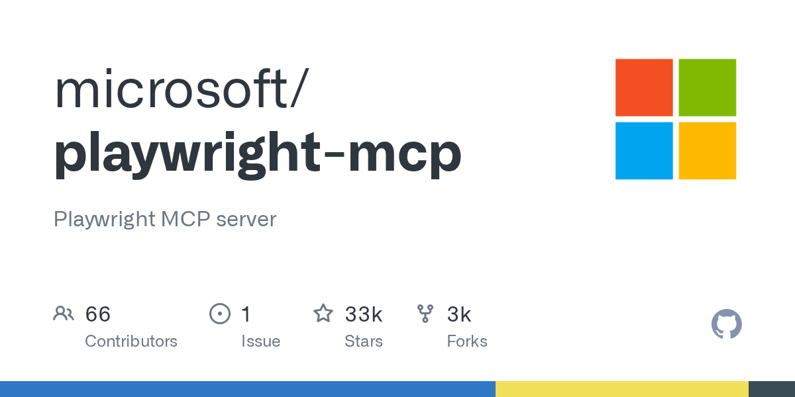
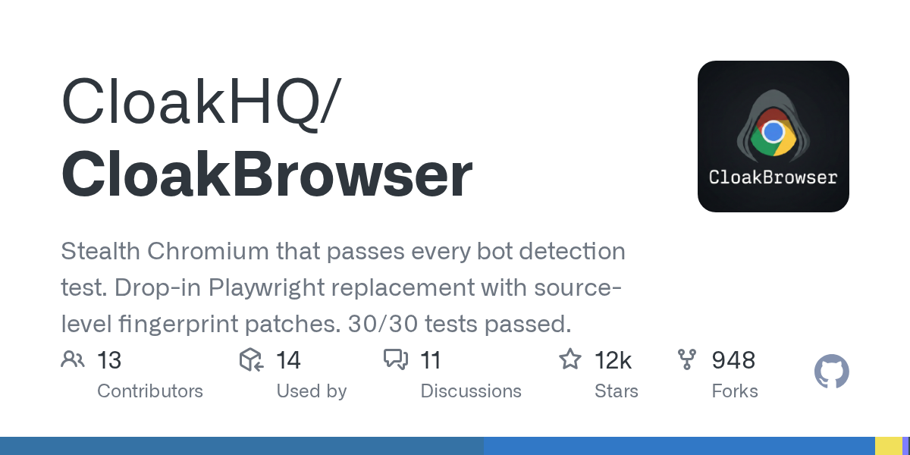
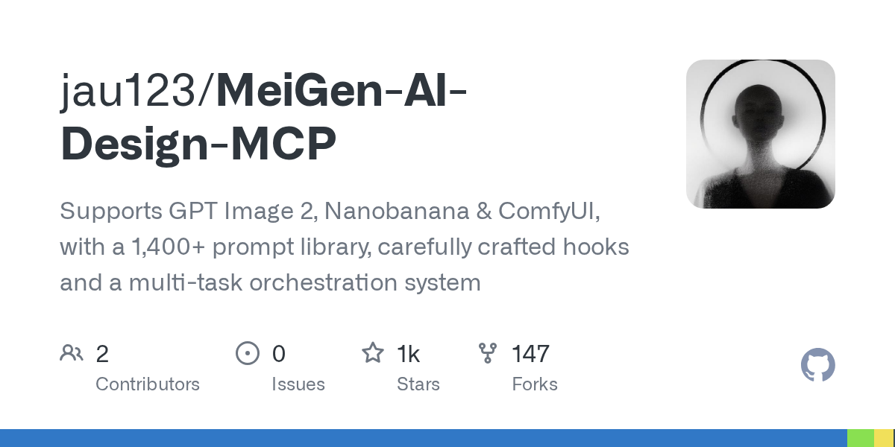

# MCP 工具箱

第 02 篇已经把 MCP 是什么讲过了。这一篇不再重复协议基础，直接补项目清单：查票、抓网页、点页面、联网搜索、找项目、做设计，这几类任务要装的工具本来就不是一回事。

这批项目里最容易混淆的有两组：

- **浏览器自动化** 负责进页面、点页面。**联网搜索** 负责找到入口和证据。
- **项目清单** 用来找路。**可直接安装的 MCP 服务器** 才是实际干活的工具。

这篇按场景来讲，不按仓库 star 数排队。

## 分类方式

### 第三方应用接入

这类项目把某个具体服务接给 Agent，重点是把现成业务能力做成 MCP 工具。

### 抓取 / 浏览器 / 网页读取

这类项目都和"读网页"有关，但分工差很多：有的偏抓取 API，有的偏真实浏览器交互，有的只做轻量读取，有的专门处理反爬和会话。

### 联网搜索

搜索类项目解决的是"找到网页和证据"。点页面、跑整站抓取，通常还得交给别的工具。

### 清单 / 导航

这一类本身是索引，适合在你不知道该装哪一个 MCP 时先查路标。

### 设计类 MCP

这类 MCP 负责把图片、视频、提示词、设计流程接给 Agent。

## 第三方应用接入

### 12306-mcp

GitHub：<https://github.com/Joooook/12306-mcp>

`12306-mcp` 代表的是另一条思路：别让 Agent 上网搜，再从一堆页面里扒车次；直接把 12306 查询能力做成 MCP 工具。

仓库当前列出的能力包括：

- 查询 12306 购票信息
- 过滤列车信息
- 过站查询
- 中转查询

可以把它看成一个"铁路票务查询适配层"。如果你的目标是让 Agent 帮你查余票、比中转方案、做行程草稿，这种项目比通用网页抓取稳定，也更省 token。

### 安装和接入

仓库给了最直接的启动方式：

```bash
npx -y 12306-mcp
```

如果你想把它挂到 MCP 客户端里，配置可以写成：

```json
{
  "mcpServers": {
    "12306-mcp": {
      "command": "npx",
      "args": [
        "-y",
        "12306-mcp"
      ]
    }
  }
}
```

它也支持 HTTP 方式启动：

```bash
npx -y 12306-mcp --port 8080
```

### 使用场景

- 查某天某地到某地的余票
- 让 Agent 做车次过滤，再给出备选路线
- 做出差行程草稿
- 给客服或内部助理工具补一个"铁路查询"能力

这一类项目的价值不在"会不会抓网页"，而在"把业务动作直接做成工具"。

## 抓取 / 浏览器 / 网页读取

### firecrawl-mcp-server

GitHub：<https://github.com/firecrawl/firecrawl-mcp-server>
官网：<https://docs.firecrawl.dev/mcp>

Firecrawl 的定位一直很清楚：把网页变成 Agent 更容易消费的内容。它把搜索、抓取、结构化提取、批量处理和云端浏览器会话打包到了一套接口里。

官方当前列出的能力包括：

- 搜索网页并返回完整页面内容
- 抓取任意 URL，转成干净的结构化数据
- 和页面交互，支持点击、导航、操作
- 深度研究流程
- 云端浏览器会话
- 自动重试、限流
- 支持云端 API，也支持自托管

如果你要处理的是"公开网页很多、格式不统一、还要转 Markdown 或 JSON"的任务，Firecrawl 很顺手。

### 安装和使用方式

最短命令是：

```bash
env FIRECRAWL_API_KEY=fc-YOUR_API_KEY npx -y firecrawl-mcp
```

放进 MCP 客户端时，常见配置长这样：

```json
{
  "mcpServers": {
    "firecrawl-mcp": {
      "command": "npx",
      "args": ["-y", "firecrawl-mcp"],
      "env": {
        "FIRECRAWL_API_KEY": "YOUR-API-KEY"
      }
    }
  }
}
```

如果你是自托管 Firecrawl，也保留了 `FIRECRAWL_API_URL` 这种入口，不一定非走官方云。

### 它和普通 fetch 的差别

Firecrawl 在下面这些任务里更顺手：

- 已知一批网址，要批量拉正文
- 要把网页内容转成 Markdown 或结构化 JSON
- 需要搜索、抓取、交互放在同一条链路里
- 希望 Agent 少处理网页噪音，多处理正文

如果只是读一两个简单页面，它会显得偏重；一旦进入批量采集、研究整理、网页交互混合链路，它就进入生产工具范畴了。

### playwright-mcp

GitHub：<https://github.com/microsoft/playwright-mcp>
官网：<https://playwright.dev/docs/getting-started-mcp>

`playwright-mcp` 是 Microsoft 官方出的浏览器自动化 MCP。它的强项是让 Agent 像人在浏览器里那样操作页面。

官方文档强调了几件事：

- 它基于 **accessibility tree** 工作，不依赖截图和视觉模型
- 可以点按钮、填表单、切标签页、截图、看网络请求
- 可以保存和恢复浏览器状态
- 默认支持持久化 profile

这意味着它特别适合有交互的网站：登录后台、点分页、开弹窗、验证表单、检查前端行为。

### 安装和使用方式

最标准的配置是：

```json
{
  "mcpServers": {
    "playwright": {
      "command": "npx",
      "args": [
        "@playwright/mcp@latest"
      ]
    }
  }
}
```

Claude Code 里也可以直接这样加：

```bash
claude mcp add playwright npx @playwright/mcp@latest
```

如果你要单独起 HTTP 服务，官方文档给的是：

```bash
npx @playwright/mcp@latest --port 8931
```

### 登录态、权限和误操作风险

这一类工具一定要单独说风险，因为它真的会"动页面"。

Playwright MCP 官方文档写明了三种 profile 模式，其中默认是 **persistent**。也就是说，登录态、cookie、本地存储会被保留下来。文档里还给了默认缓存目录和 `--user-data-dir` 覆盖方式。

这有两个直接影响：

1. **好处**：登录一次后，Agent 后面还能继续用这个会话。
2. **风险**：你实际给出去的是"带登录态的浏览器操作能力"。

另外，官方文档还明确提示 `browser_run_code_unsafe` 这类能力等价于执行任意 Playwright 代码，属于高风险配置。真要开，前提应该是你信任当前 MCP 客户端和当前任务。

### 使用场景

- 登录后台后抓数据
- 做带交互的页面调试
- 让 Agent 复现前端问题
- 需要保留登录态的长流程操作
- 自动填表、点击、多标签页检查

如果你的任务是"真实浏览器操作"，这一类比抓取类 MCP 更对路。



### fetch-mcp

GitHub：<https://github.com/zcaceres/fetch-mcp>

`fetch-mcp` 就轻得多。它不追求完整浏览器控制，也不想把整套抓取平台都搬进来。它做的是一件更朴素的事：把网页内容按不同格式取回来。

列出的工具包括：

- `fetch_html`
- `fetch_markdown`
- `fetch_txt`
- `fetch_json`
- `fetch_readable`
- `fetch_youtube_transcript`

这组能力很实用，因为很多 Agent 的真实需求只是"把这篇文章读干净"。`fetch_readable` 这类接口就是干这个的。

### 安装和使用方式

MCP 配置很简单：

```json
{
  "mcpServers": {
    "fetch": {
      "command": "npx",
      "args": ["mcp-fetch-server"]
    }
  }
}
```

它也支持直接当 CLI 用：

```bash
npx mcp-fetch markdown https://example.com
npx mcp-fetch readable https://example.com/blog/post
npx mcp-fetch youtube https://www.youtube.com/watch?v=dQw4w9WgXcQ --lang es
```

### 使用场景

- 读单篇文章或文档页
- 拉 API 返回的 JSON
- 去掉广告和导航，只保留正文
- 顺手取一段 YouTube 字幕

如果说 Firecrawl 是一整套采集工具，`fetch-mcp` 就像桌边的小扳手。

### Scrapling

GitHub：<https://github.com/D4Vinci/Scrapling>
官网：<https://scrapling.readthedocs.io/en/latest/ai/mcp-server/>

Scrapling 本体是一个抓取框架，但它已经把 MCP 模式写进官方文档了。它把普通请求、动态抓取、隐身抓取、并发抓取、会话复用放进了同一个体系。

官方 MCP 文档列出的工具很完整：

- `get` / `bulk_get`
- `fetch` / `bulk_fetch`
- `stealthy_fetch` / `bulk_stealthy_fetch`
- `open_session` / `close_session` / `list_sessions`
- `screenshot`

Scrapling 很强调 **CSS selector**。网页元素选得越窄，后续 Agent 处理通常就越省 token。

### 安装和使用方式

官方文档里的安装步骤是：

```bash
pip install "scrapling[ai]"
scrapling install
```

跑 MCP 服务器时：

```bash
scrapling mcp
```

如果你要改成 HTTP 传输：

```bash
scrapling mcp --http --host 127.0.0.1 --port 8000
```

### 使用场景

- 目标站点很多，字段还比较固定
- 想用 CSS selector 先裁掉无关内容
- 同时需要普通请求、动态页面和带防护页面
- 要批量抓取，还要保留会话

### 还有两个细节

Scrapling 官方文档里有两个细节值得保留：

1. **Prompt injection protection**：它会在默认主内容提取路径里清理隐藏元素、注释、零宽字符等内容。
2. **Legal and Ethical Considerations**：官方文档单独提醒了 robots.txt、站点条款、版权和隐私问题。

它自己就没有把"能抓"写成"随便抓"。

### CloakBrowser

GitHub：<https://github.com/CloakHQ/CloakBrowser>
官网：<https://cloakbrowser.dev/>

CloakBrowser 严格说不算独立的 MCP 服务器，它相当于给 Playwright、Puppeteer、Agent 浏览器栈换一层"浏览器底座"。把它放进这篇工具箱里，主要是因为很多浏览器类 MCP 迟早都要面对同一个问题：目标站点会不会把自动化流量直接拦掉。

它的官方材料里，核心卖点有三条：

- 号称通过 Chromium 源码级补丁处理指纹，而不是只在 JS 层做伪装
- 兼容 Playwright / Puppeteer 的常见 API
- 首次运行自动下载定制浏览器二进制

文档里还提供了 Python、Node.js、Docker 三种入口，以及一个 Browser Profile Manager。

### 安装和使用方式

最短安装命令是：

```bash
pip install cloakbrowser
```

或者：

```bash
npm install cloakbrowser playwright-core
```

跑 profile manager 的方式是：

```bash
docker run -p 8080:8080 -v cloakprofiles:/data cloakhq/cloakbrowser-manager
```

### 该怎么理解它的定位

CloakBrowser 更常见的用法是：

- 你已经在用 Playwright、Scrapling 或其他浏览器自动化链路
- 普通浏览器内核经常被目标站点风控
- 你愿意自己管理代理、会话、环境和合规问题

它不是"装上就万无一失"。项目自述里的通过率、检测站测试、reCAPTCHA 分数等说法，都可能随着目标站点、时间和代理质量变化。写得稳一点，可以把它理解成**偏隐身和指纹伪装的浏览器运行层**。



## 联网搜索

### free-web-search-ultimate（仓库当前名为 zero-api-key-web-search）

GitHub：<https://github.com/wd041216-bit/zero-api-key-web-search>
官网：<https://pypi.org/project/zero-api-key-web-search/>

free-web-search-ultimate 现已对应到 zero-api-key-web-search。这个项目主要解决的是 **给 Agent 补一条可验证的联网搜索链路**。

它不只提供搜索，还有：

- `zero-context`：整理可引用的上下文
- `zero-browse`：读页面
- `zero-verify`：验证说法
- `zero-report`：输出证据报告
- `zero-mcp`：直接起 MCP 服务

这让它和"普通 search tool"不太一样。它更强调 **证据归并** 和 **可引用结果**。

### 安装和使用方式

30 秒上手命令是：

```bash
pip install zero-api-key-web-search
zero-search "Python 3.13 release" --json
zero-context "Python 3.13 stable release" --goggles docs-first
zero-browse "https://docs.python.org/3/whatsnew/" --json
zero-verify "Python 3.13 is the latest stable release" --deep --json
```

作为 MCP 服务器时，配置可以写成：

```json
{
  "mcpServers": {
    "zero-api-key-web-search": {
      "command": "zero-mcp"
    }
  }
}
```

### 使用场景

- 搜，再把证据交给 Agent 写答案
- 给新闻、法规、版本信息做快速交叉核验
- 需要 citation-ready 的上下文，而不只是几条搜索结果

它在整条链路里承担的是"外网检索层"。浏览器执行通常还得交给别的工具。

## 清单 / 导航

### Awesome-MCP-ZH

GitHub：<https://github.com/yzfly/Awesome-MCP-ZH>

`Awesome-MCP-ZH` 不是可执行服务器，就是一份给中文用户找项目用的路标。

这个仓库里不只收服务器，还收：

- MCP 基础文章
- 客户端
- 服务器分类清单
- 社区入口
- 相关课程和扩展资源

如果你已经知道自己要"抓网页"或者"连数据库"，当然可以直接搜具体项目；但如果你只是知道自己要给 Agent 补能力，还没想清楚该装哪类工具，翻这份清单更省时间。

### 使用场景

- 想找中文资料入口
- 想看某个场景有没有成熟替代品
- 想比较不同客户端和服务器
- 想扫一遍生态，再决定后面深挖谁

这类项目的作用是缩短"找工具"的时间。真要动手，还是要回到具体工具。

## 设计类 MCP

### MeiGen-AI-Design-MCP

GitHub：<https://github.com/jau123/MeiGen-AI-Design-MCP>
官网：<https://docs.meigen.ai/en/mcp/overview>

MeiGen 这类项目和前面几组完全不同。它负责把图片和视频生成、设计提示词、灵感检索、工作流管理接给 Agent。

官方文档和仓库当前能对上的重点包括：

- 提供 8 个 MCP 工具
- 内置 1,446 条策展过的提示词
- 支持图片和视频生成
- 后端可接 MeiGen Cloud、OpenAI 兼容接口、本地 ComfyUI
- 支持 Claude Code、Cursor、Codex、Windsurf、Roo Code、OpenClaw、Hermes Agent 等宿主

它的定位就是"设计助理服务器"。

### 安装和使用方式

如果是装到 Cursor、VS Code、Windsurf、Roo Code，仓库提供的是一套统一命令：

```bash
npx meigen init cursor
npx meigen init vscode
npx meigen init windsurf
npx meigen init roo
```

如果你只是想直接用 CLI 出图：

```bash
export MEIGEN_API_TOKEN=meigen_sk_...
npx meigen gen --prompt "a calico cat in a sunlit kitchen"
npx meigen gen -p "tech logo" -m midjourney-v8.1 -r 1:1
```

通用 MCP 配置也可以直接手写：

```json
{
  "mcpServers": {
    "meigen": {
      "command": "npx",
      "args": ["-y", "meigen@1.3.1"],
      "env": {
        "MEIGEN_API_TOKEN": "meigen_sk_..."
      }
    }
  }
}
```

### 使用场景

- 让 Agent 做 logo、海报、产品图、短视频样片
- 用 prompt 库找参考方向
- 设计协作时批量出多个版本
- 本地有 ComfyUI，想把生成流程也挂进 Agent

### 隐私和数据处理

MeiGen 这一类项目最好把数据处理方式写清楚。

官方隐私说明当前写的是：

- **ComfyUI 本地模式**：处理留在本机
- **MeiGen Cloud**：提示词和参考图会发送到 `api.meigen.ai`
- **OpenAI-compatible**：数据会发送到你配置的上游接口
- **参考图上传**：默认经由 `gen.meigen.ai` / Cloudflare R2，官方写的是临时存储 24 小时
- **提示词检索和增强**：有一部分功能可以本地运行

别把它默认理解成本地工具。你用哪条后端，数据路径就跟着变。



## 这一批项目怎么配合用

如果把这 9 个项目放到同一张桌上，会更容易看出它们的分层：

- **12306-mcp**：接具体业务服务
- **Firecrawl / Fetch / Scrapling**：读网页、提正文、做抓取
- **Playwright**：处理真实浏览器交互
- **CloakBrowser**：给浏览器自动化补隐身底座
- **zero-api-key-web-search**：补外网搜索和证据验证
- **Awesome-MCP-ZH**：找项目和找替代方案
- **MeiGen**：做设计和多媒体生成

一条常见链路大概是这样：

- 搜索入口：`zero-search`
- 正文读取：Firecrawl / Fetch
- 交互页面：Playwright
- 高风控站点：CloakBrowser
- 设计任务：MeiGen

工具装得越多，越需要想清楚任务类型。这样比"看见一个 MCP 就先加进配置"实用得多。
