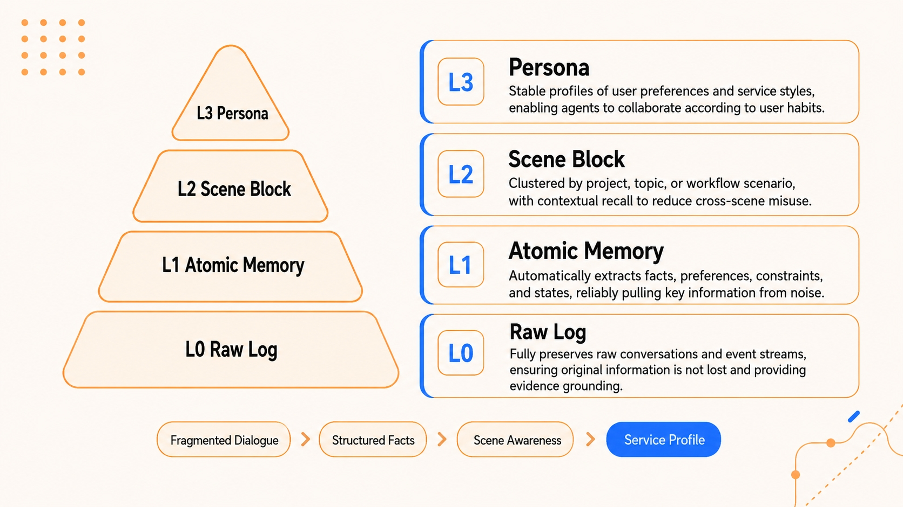
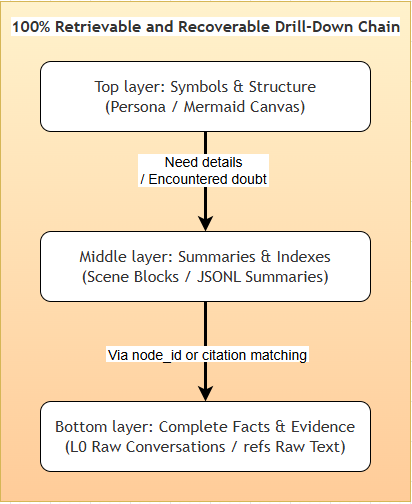
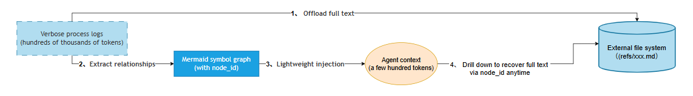

# TencentDB Agent Memory

很多人第一次做 Agent 记忆，会直接把聊天历史越塞越长：上一轮对话带着，工具日志带着，报错也带着，能想到的上下文全带着。短任务还勉强能跑，长任务一拉起来就容易出三个问题：Token 开销一路涨，模型注意力被过程噪声拖散，真正要追溯细节时又很难从一大段摘要里找到原文。

TencentDB Agent Memory 的处理思路，是把“保存”拆成几层：底层保留原文和证据，中层做结构化提取和场景整理，高层只留足够轻的画像或任务图。这样做更看重三件事：查得回来、用得出去、错了能修。

## 项目背景

GitHub：<https://github.com/Tencent/TencentDB-Agent-Memory>
官网：<https://cloud.tencent.com/product/agm>

TencentDB Agent Memory 是腾讯云数据库团队开源的一套 Agent 记忆系统，MIT 协议，当前同时面向两类接入形态：

- 作为 OpenClaw 插件使用；
- 作为 Hermes Gateway 适配层使用；
- 本地默认后端是 `SQLite + sqlite-vec`，也支持切到 Tencent Cloud VectorDB。

仓库把它的目标写得很明确：一条线解决单次长任务里的上下文过载，另一条线解决跨会话的长期记忆沉淀。腾讯云产品页和开发者社区文章给的口径也一致，强调的是四层渐进式记忆架构、混合召回，以及长周期任务里的 Token 与完成率收益。

## 目标、依赖和使用场景

GitHub：<https://github.com/Tencent/TencentDB-Agent-Memory>
官网：<https://cloud.tencent.com/developer/article/2668918>

依赖和前提先说清楚，免得把它想成“装上就什么都有”。

### 运行依赖

从 `package.json` 和仓库说明可以核对到：

- Node.js 要求 `>= 22.16.0`；
- OpenClaw 侧的兼容版本是 `openclaw >= 2026.3.7`，插件 API / Gateway 兼容标到 `>= 2026.3.13`；
- 默认本地存储依赖 `sqlite-vec`；
- 如果启用远程向量检索，需要额外配置 embedding 服务；
- 如果切到云端数据库后端，需要配置 Tencent Cloud VectorDB 连接信息。

`package.json` 里能看到几个关键依赖：`sqlite-vec`、`@node-rs/jieba`、`@tencentdb-agent-memory/tcvdb-text`、`@ai-sdk/openai`、`js-tiktoken`。对应到能力上，就是本地向量索引、中文分词、云向量数据库、OpenAI-compatible LLM 调用和 token 预算。

### 使用场景

按仓库和官方文章里的表述，这套系统的使用场景主要有下面几类：

- 长周期编程任务：同一 session 连续跑多个问题，工具日志很多；
- 跨会话助手：下一次对话需要接上前一次的偏好、约束和项目上下文；
- 需要回查证据的场景：模型给出记忆后，开发者还想一路追到原始对话和原始工具输出；
- 既要本地先跑通，又要能切换到云端存储的团队。

如果你的需求只是“把上一轮对话摘要一下，下轮接着聊”，这套系统会显得偏重；如果你关心长任务恢复、上下文压缩和记忆可审计性，它就有意义了。

## 它怎么组织短期、长期、检索和数据库记忆

GitHub：<https://github.com/Tencent/TencentDB-Agent-Memory>
官网：<https://cloud.tencent.com/product/agm>

### 四层长期记忆：L0 到 L3

仓库给出的长期记忆结构是一个四层金字塔：



- **L0 Raw Log / Conversation**：原始对话和事件流，保留完整证据；
- **L1 Atomic Memory / Atom**：从对话里提取出的事实、偏好、约束、阶段结论；
- **L2 Scene Block / Scenario**：按项目、主题或工作流场景聚合；
- **L3 Persona**：稳定的用户画像、服务风格和长期偏好。

这四层的好处很实在。你问“用户平时喜欢什么写法”，先查 `persona.md`；你问“这个偏好是在哪个项目里形成的”，往下看对应 scene；你再怀疑内容有误，就继续追到 L1 和记忆原文。

### 短期记忆：把厚日志卸到外面，当前上下文只留结构

短期记忆被拆成三层：

- 底层：`refs/*.md` 这类原始工具输出；
- 中层：`jsonl` 摘要或节点索引；
- 上层：Mermaid 任务画布。

这里的做法很直接：Agent 当前回合先读 Mermaid 里的任务结构，需要细节时，再通过 `node_id` 或 `result_ref` 去找原文。



这和很多“压成一段摘要就结束”的做法区别很大。这里的压缩带着索引关系，后面还能展开。

### 检索记忆：关键词、向量或混合召回

`openclaw.plugin.json` 把召回策略写得很清楚：

- `keyword`
- `embedding`
- `hybrid`

默认是 `hybrid`。进一步说明里写得很清楚，它是 **BM25 + vector + RRF** 的组合，也就是关键词匹配、向量相似度和融合排序一起用。对应的默认参数还有：

- `recall.maxResults = 5`
- `recall.scoreThreshold = 0.3`
- `recall.timeoutMs = 5000`

源码里的 `auto-recall.ts` 也能对上这个行为：它会按当前用户输入检索 L1 记忆，再读取 `persona.md`，再装配 L2 scene navigation，最后把记忆工具调用指南附到系统上下文里。

### 数据库记忆：本地 SQLite 起步，必要时切到 TCVDB

默认后端是本地 `sqlite`，直接写成 `SQLite + sqlite-vec`。这对单机试用很友好，装完就能跑，不需要先配云服务。

如果要切云端，配置项是 `storeBackend = "tcvdb"`，并补齐：

- `tcvdb.url`
- `tcvdb.username`
- `tcvdb.apiKey`
- `tcvdb.database`
- 可选的 `alias`、`embeddingModel`、`caPemPath`

运维文档里还有一个很实用的回退入口：

```bash
memory-tencentdb-ctl config vdb-off --restart
memory-tencentdb-ctl config vdb-off --purge-creds --restart
```

前者把后端退回本地 SQLite，但保留云端凭据；后者连 `memory.tcvdb` 段一起清掉。这个设计很适合排障：先回本地跑通，再决定是否重新启用云端存储。

## 安装和运行

GitHub：<https://github.com/Tencent/TencentDB-Agent-Memory>
官网：<https://www.npmjs.com/package/@tencentdb-agent-memory/memory-tencentdb>

### OpenClaw 插件模式

GitHub：<https://github.com/Tencent/TencentDB-Agent-Memory>
官网：<https://www.npmjs.com/package/@tencentdb-agent-memory/memory-tencentdb>

最短路径是：

```bash
openclaw plugins install @tencentdb-agent-memory/memory-tencentdb
openclaw gateway restart
```

然后在 `~/.openclaw/openclaw.json` 里启用插件：

```jsonc
{
  "memory-tencentdb": {
    "enabled": true
  }
}
```

如果你只想先验证长期记忆，这一步就够了。启用后，插件会自动完成：对话采集、记忆提取、场景归纳、画像生成、下一轮召回。

### 开短期压缩：还要加 slot 和 patch

短期上下文压缩默认关闭。开启方式是：

```jsonc
{
  "memory-tencentdb": {
    "config": {
      "offload": {
        "enabled": true
      }
    }
  }
}
```

同时还要补两步：

1. 在插件配置里注册 `contextEngine` slot；
2. 跑一次 `openclaw-after-tool-call-messages.patch.sh`。

配置和命令如下：

```jsonc
{
  "plugins": {
    "slots": {
      "contextEngine": "openclaw-context-offload"
    }
  }
}
```

```bash
bash scripts/openclaw-after-tool-call-messages.patch.sh
```

这个 patch 的作用写得很直接：把 `after-tool-call` 消息钩进去，让工具调用结果能被正确卸载和恢复。

### Hermes 模式：一体化镜像和运维脚本都给了

GitHub：<https://github.com/Tencent/TencentDB-Agent-Memory>
官网：<https://hermes-agent.nousresearch.com/docs/>

仓库里的说明、`docker/opensource/README-hermes.md` 和 `Dockerfile.hermes` 给了两条路径。

第一条是直接用 Docker 方式：

```bash
MODEL_API_KEY="your-api-key"
MODEL_BASE_URL="https://api.lkeap.cloud.tencent.com/v1"
MODEL_NAME="deepseek-v3.2"
MODEL_PROVIDER="custom"

docker build -f Dockerfile.hermes -t hermes-memory .

docker run -d \
  --name hermes-memory \
  --restart unless-stopped \
  -p 8420:8420 \
  -e MODEL_API_KEY="your-api-key" \
  -e MODEL_BASE_URL="https://api.lkeap.cloud.tencent.com/v1" \
  -e MODEL_NAME="deepseek-v3.2" \
  -e MODEL_PROVIDER="custom" \
  -v hermes_data:/opt/data \
  hermes-memory

curl http://localhost:8420/health
docker exec -it hermes-memory hermes
```

第二条是用 npm 包里的运维脚本 `memory-tencentdb-ctl.sh`。这组脚本把独立模式和 Hermes 模式分开了，能管理：

- Gateway 启停和健康检查；
- LLM、Embedding、VDB 配置写入；
- `config vdb-off` 回退；
- Hermes 侧 `memory.provider` 启用。

如果你要长期运维，而不只是跑一遍 demo，这条路径更合适。

## 一个完整流程：写入、检索、更新、用于回答

GitHub：<https://github.com/Tencent/TencentDB-Agent-Memory>
官网：<https://cloud.tencent.com/product/agm>

### 1. 写入记忆：L0 收集与分层入库

源码里的 `auto-capture.ts` 写得很清楚，流程从 L0 开始：

1. 对当前 session 的消息做原子化记录；
2. 把 L0 原文写入本地记录；
3. 如果向量存储可用，再补 L0 索引；
4. 通知 pipeline manager 决定是否触发 L1、L2、L3。

这里有两个细节值得记：

- 它不会每来一条消息就立刻做全套提取，调度时机由 `pipeline.everyNConversations`、`l1IdleTimeoutSeconds`、`enableWarmup` 这类参数控制；
- 向量写入分成同步和后台两种路径，本地 SQLite 风格的存储允许先写元数据、后补 embedding，避免每轮对话都被 embedding 调用拖慢。

### 2. 检索记忆：分层召回顺序

`auto-recall.ts` 的装配顺序是：

1. 用当前用户输入搜索 L1；
2. 读取 `persona.md`；
3. 读取 scene index，生成 scene navigation；
4. 把记忆工具调用指南附到上下文。

如果注入的片段还不够，Agent 还能主动调用两把工具：

- `tdai_memory_search`：查结构化记忆；
- `tdai_conversation_search`：查原始对话。

源码里还专门限制了调用次数：单轮对话内两者合计最多 3 次。这个限制很有必要，不然 Agent 很容易在记忆工具上来回打转。

### 3. 更新记忆：场景块和 Persona 是可增量更新的

L3 更新也不会每次都重写全部内容。`persona-generator.ts` 里能看到它会：

- 读取现有 `persona.md`；
- 对照 checkpoint 找出上次之后变更过的 scene；
- 只把变化场景送给 LLM 重点分析；
- 先做备份，再写回新的 `persona.md`；
- 写完后再附带 scene navigation。

对应配置里也有备份数量参数：

- `persona.backupCount = 3`
- `persona.sceneBackupCount = 10`

可以把它理解成一次带增量范围和备份策略的更新，避免直接整份覆盖。

### 4. 用于回答：上层负责方向，下层负责证据

这里有一张很实用的对照表，可以概括成一句话：

- 问长期偏好、服务风格、目标，先查 L3 / L2；
- 问具体事实、日期、项目细节，继续往 L1 / L0 下钻；
- 问长任务当前进度，先查 Mermaid 画布；
- 需要原始证据，就按 `node_id` 和 `result_ref` 追到原文。

短期压缩链路本身也是这样工作的：



所以回答阶段真正进入上下文的，优先是画像、场景导航、相关记忆片段和任务结构；原始大文本留在外部，按需再取。

## 隐私、权限、过期和错误记忆修正

GitHub：<https://github.com/Tencent/TencentDB-Agent-Memory>
官网：<https://cloud.tencent.com/product/agm>

这一部分不能只看宣传页，最好对照配置和运维文档。

### 数据默认放在哪里

OpenClaw 侧的分层记忆产物默认放在 `~/.openclaw/memory-tdai/`。Hermes 一体化镜像文档里，则把数据卷落在 `/opt/data/tdai-memory/`，其中包括：

- `memories.sqlite`
- `scene_blocks/`
- `persona.md`
- `checkpoint.json`

如果你在做本地试用，这些路径要先看清楚。很多“记忆错了”的问题，最后都得直接打开这些文件定位。

### 过期和保留天数怎么配

`openclaw.plugin.json` 里有明确参数：

- `capture.l0l1RetentionDays`
- `capture.allowAggressiveCleanup`
- `capture.cleanTime`

默认 `l0l1RetentionDays = 0`，也就是不自动清理。若要清理，文档要求一般至少 3 天；1 或 2 天属于高风险设置，需要显式打开 `allowAggressiveCleanup`。这说明作者默认更看重可追溯性，不鼓励把底层证据清得太快。

### 错误记忆怎么修

这套系统给出的修正路径分三层：

1. **回查**：从 `persona.md` 或 Mermaid 画布一路追到 scene、L1、L0，确认错误是抽取错、聚合错，还是原始信息就有歧义；
2. **覆盖或回退**：`persona-generator.ts` 会在写新画像前先做备份；运维层还有 `config vdb-off`、`--purge-creds` 这种回退入口；
3. **用工具补查原文**：`tdai_memory_search` 和 `tdai_conversation_search` 分开查结构化记忆与原始对话，便于交叉核对。

另一个容易忽视的点是 `extraction.enableDedup = true`。配置文件把它定义成 L1 去重和冲突检测开关，说明作者默认已经把“同一事实重复写入”当成常见问题处理了。

### 权限和凭据处理

运维文档里明确写到 `tdai-gateway.json` 权限是 `0600`，LLM / Embedding / VDB 凭据统一落在这个配置文件或 Hermes 的专用 env 文件里。对团队部署来说，这比把 Key 散落在一堆 shell 历史里要稳。

但这仍然只是“有收口”，不等于“自动安全”。如果要上团队环境，至少还得自己补三件事：

- 限制谁能读记忆目录和配置目录；
- 决定哪些 session 允许被长期保留；
- 把导出诊断包、备份目录和日志目录纳入运维审计范围。

## 和后续记忆主题怎么衔接

这篇更接近“把一套现成 Agent 记忆系统拆开看结构”。如果你下一步关心的是记忆在多 Agent 或更复杂架构里的编排方式，可以接着看第 30、38 篇相关主题；那两篇更适合拿来比较不同记忆策略、不同调度方式各自的代价。

TencentDB Agent Memory 这篇先回答一个更基础的问题：当你说“Agent 要有记忆”时，底层到底要不要保留证据、召回要不要分层、错了以后能不能回到原文。这几件事没想清楚，后面的记忆增强通常也会越做越重。
