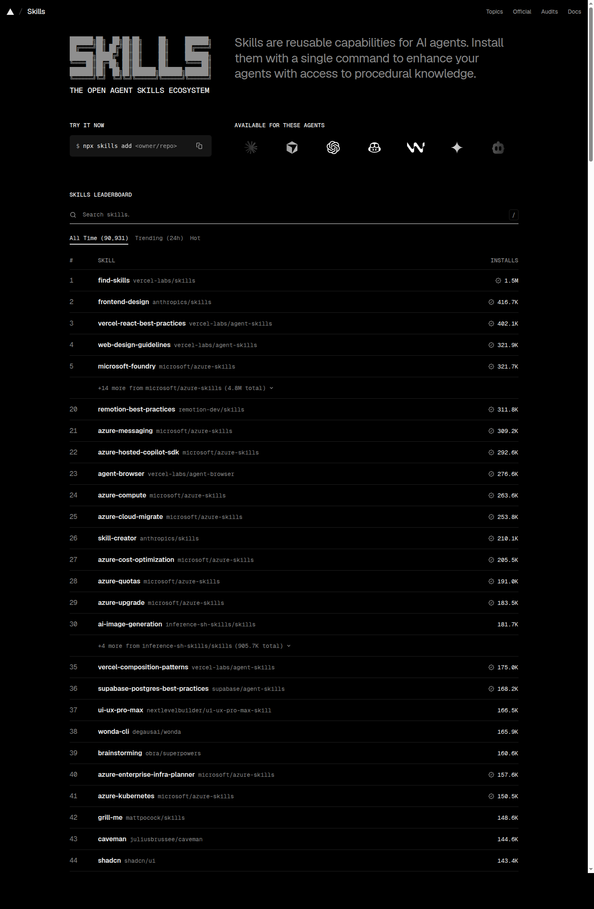
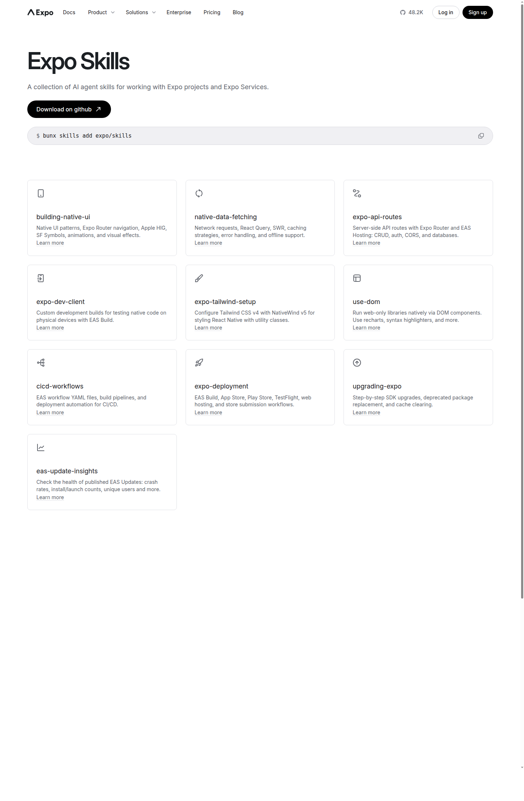
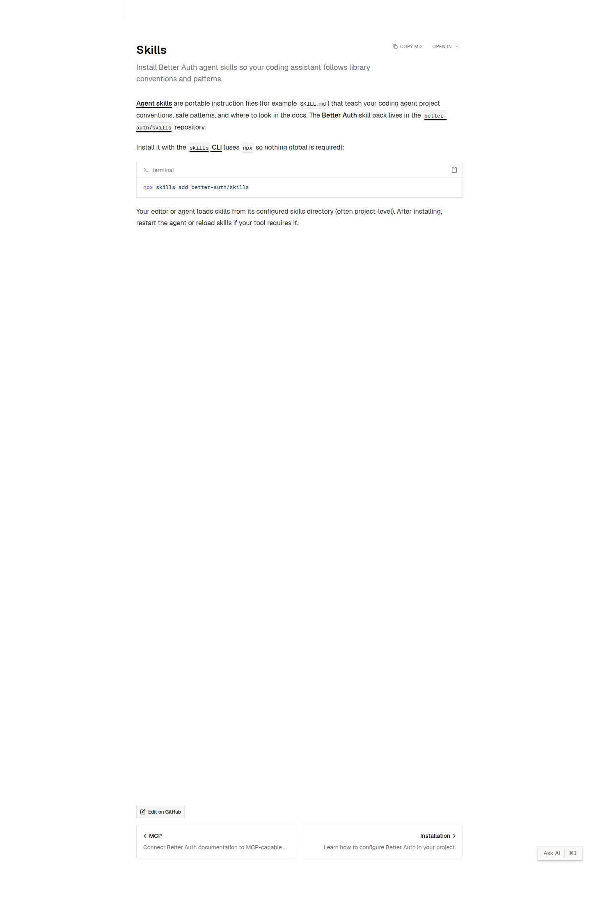

# Vibe Coding 常用 Skills

本文由 `docs/ai/mcp-skills-guide.md` 拆出，只讲 Skills；MCP 见第 02 篇《Vibe Coding 常用 MCP》。如果你现在最头疼的是“AI 明明会写代码，但每次做法都不一样”，把高频工作流沉淀成 Skill，往往比换模型更管用。

MCP 负责把模型接到外部数据和工具上，Skills 负责固定高频工作流。对 VibeCoding 来说，后者通常更快见效：你不用重新训练模型，也不用维护一长串全局系统提示词，只要把稳定流程、判断标准、脚本和参考资料装进 Skill 目录，AI 的出手就会稳很多。

## Skills 是一整个小工作流

Anthropic 的示例仓库对 Skill 的定义很明确：每个 Skill 都是一个自包含目录，核心文件是 `SKILL.md`。Vercel 的 `agent-skills` 文档也把结构写得很清楚：一个 Skill 至少有 `SKILL.md`，可选再带上 `scripts/`、`references/`、`assets/`。

一个常见的 Skill 目录，大概长这样：

```text
my-skill/
├── SKILL.md
├── scripts/
├── references/
└── assets/
```

这四层各干什么，可以拆开看：

### `SKILL.md`：写范围、流程和触发条件

`SKILL.md` 是 Skill 的骨架。它通常包含两部分：

1. 顶部 YAML frontmatter，例如 `name`、`description`
2. 正文指令，例如什么时候用、怎么用、哪些步骤不能跳

像 Anthropic 的示例仓库、Expo 的 `upgrading-expo`、Better Auth 的 `better-auth-best-practices`，都在 `description` 里直接写明“什么时候该触发这个 Skill”。这一步很关键，因为范围越清楚，触发越稳定。

### `scripts/`：把稳定动作交给脚本，不占模型上下文

很多 Skill 的核心价值在脚本层。Vercel 文档直接把 `scripts/` 定义为可选的 helper scripts；`ui-ux-pro-max` 还带搜索脚本、模板和数据文件，让 AI 能查设计系统、找灵感、生成一致方案。

这也是 Skills 比“超长 Prompt”更划算的原因之一：脚本执行时，进入模型上下文的是结果，不会把整段脚本源码一并塞进去。

### `references/`：把官方资料、约束文档、反例一起打包

`references/` 是很多人第一次做 Skill 时最容易漏掉的地方。Svelte 那个 Skills 仓库写得很清楚：它采用 progressive disclosure，也就是先给快速参考，需要时再展开到详细文档。Expo 的 `building-native-ui` 甚至在 `references/` 里按主题拆了动画、控件、路由结构、原生标签页、视觉效果等专题文档。

这样一来，Skill 不只是在帮 AI 记结论，也把“去哪里翻资料”固定下来了。AI 遇到不确定的地方，可以按你指定的参考路径去找答案。

### `assets/`：模板、示意图、素材都可以跟着 Skill 走

有些 Skill 面向设计、演示、内容生成，这时 `assets/` 就很有用：你可以把模板、截图、配色卡、组件示例甚至品牌素材直接跟 Skill 放在一起。`ui-ux-pro-max` 这类工具链，就是把设计知识和设计素材一起打包。

## Skills 与上下文控制

母文里提过 Skills 的“渐进式披露”，这个机制值得单独讲清楚。

它大致分三层：

1. **元数据层**：启动时只读 `name` 和 `description` 这类轻量信息。
2. **指令层**：只有当用户意图匹配时，才加载 `SKILL.md` 主体内容。
3. **资源层**：只有执行到某一步时，才去读 `references/` 或调用 `scripts/`。

Svelte 的 Skills 文档直接把这件事写成一句话：先给 quick references，再按需展开 detailed documentation。对日常 VibeCoding 来说，这个机制比“把所有规范塞进全局规则”更实用：

- 全局规则只保留最硬的底线
- 技术栈规范交给对应 Skill
- 某个任务不相关的资料，默认不进上下文

Skill 连上下文怎么装配，都提前规定好了。

## Skills 商店：发现、安装与阅读 `SKILL.md`

现在最常见的入口是 [skills.sh](https://skills.sh/)。它本身是一个开放目录，首页列出 Claude Code、Cursor、Codex、Windsurf、Cline、Gemini 等常见 Agent / IDE，说明 Skill 正在变成跨 Agent 的通用分发格式。



在本机实际运行 `npx skills --help` 时，当前 CLI 版本会显示 `add`、`remove`、`list`、`find`、`update` 等命令。母文里提到的四条高频命令，仍然是最值得先记住的一组。

### `npx skills find <query>`：发现入口

```bash
npx skills find vercel
npx skills find expo
npx skills find better-auth
npx skills find design
```

这条命令适合三个场景：

- 你只知道需求，不知道仓库名
- 你知道仓库，但不知道里面具体有哪些 Skill
- 你想先确认生态里有没有现成方案，再决定要不要自建

实际跑出来的结果里，像 `vercel-labs/skills@find-skills`、`anthropics/skills@frontend-design`、`expo/skills@building-native-ui`、`better-auth/skills@better-auth-best-practices` 都能直接搜到。`find` 很适合放在选型第一步。

### `npx skills add <package>`：装整包，或者装单个 Skill

```bash
npx skills add vercel-labs/agent-skills
npx skills add better-auth/skills
npx skills add expo/skills@upgrading-expo
```

`add` 是安装入口，但它不只会装整个仓库。按 CLI 帮助，常见变体还有：

```bash
npx skills add vercel-labs/agent-skills --skill web-design-guidelines
npx skills add antfu/skills --skill='*' -g
npx skills add vercel-labs/agent-skills --agent codex cursor
```

什么时候该装整包，什么时候只装一个？经验很简单：

- **技术栈仓库**：先装整包，例如 Vue、Expo、Anthony Fu 的技能集
- **目标明确的单点需求**：只装单个 Skill，例如 `upgrading-expo`、`better-auth-best-practices`
- **多 Agent 共用**：考虑 `-g` 或指定 `--agent`

### `npx skills check`：扫描更新，适合做体检

```bash
npx skills check
```

这里有个细节值得记一下：当前 `skills --help` 顶层帮助更强调 `update`，但 `check` 这条命令仍然能跑。实际执行时，它会逐个扫描已安装 Skills，告诉你哪些有更新、哪些已经最新。

`check` 主要对应下面这些场景：

- 你装了一堆长期使用的 Skill，想先体检一遍
- 你不确定升级会不会影响团队工作流，先确认更新面板
- 你只想知道有没有变化，不想立刻动版本

### `npx skills update`：真正执行升级

```bash
npx skills update
npx skills update -g
npx skills update antfu
```

`check` 像体检，`update` 才是动手升级。它主要用在：

- 某个 Skill 已经确认有新版本
- 官方文档、框架 API 近期有变更
- 你想把团队里的 Skill 更新到同一代

在日常工作流里，一个很稳的顺序是：

```bash
npx skills find <query>
npx skills add <owner/repo@skill>
npx skills check
npx skills update
```

先发现，再安装，再看是否需要升级。这样做的好处是少装错，也少装一堆以后不用的东西。

## 开发类 Skills

这类 Skill 的共同点是：它们不会代替你写业务决策，但会把 AI 拉回某个技术栈已经验证过的路径。

### 1. Vercel：从 React 最佳实践一路管到 Web 设计审查

仓库：[`vercel-labs/agent-skills`](https://github.com/vercel-labs/agent-skills)

安装：

```bash
npx skills add vercel-labs/agent-skills
```

Vercel 这个仓库可以看成“前端工程审稿人集合”。它不是给一份笼统规范就结束，而是拆成多个可触发 Skill。`web-design-guidelines` 写得尤其具体：它会按 100+ 条规则审查 UI 代码，覆盖可访问性、焦点状态、表单、动画、排版、图片、性能、导航状态、暗色模式、触控交互和国际化。

这类 Skill 常见于下面这些场景：

- 你已经有了页面或组件
- 你怀疑 AI 生成的界面太糙、太像模板
- 你需要一个系统化的 UI 审查清单

Vercel 文档里还有一个很实用的点：它把 React Native / Expo 也纳进来了。这个仓库不只是在教 AI 写 React，也在教 AI **怎么遵守现代前端和跨端项目的约束**。

### 2. Vue：让 AI 按 Vue 的语法习惯做事

仓库：[`vuejs-ai/skills`](https://github.com/vuejs-ai/skills)

安装：

```bash
npx skills add vuejs-ai/skills
```

如果你常遇到“AI 明明会写前端，但总是把 Vue 写成 React 的影子”，那 Vue Skill 很适合先装上。

Vue 这一组技能把场景拆得很细：`vue-best-practices`、`vue-router-best-practices`、`vue-pinia-best-practices`、`vue-testing-best-practices`、`vue-debug-guides` 等都分开了。它会明确告诉 AI：

- Vue 3 + Composition API 应该怎么组织状态
- Router 的导航守卫、参数和组件生命周期怎么处理
- Pinia 怎么写更安全
- Vue 测试和 React 测试不是一回事

文档里还有一个实战味很重的细节：为了更稳定触发，它建议在提示词里直接说 `Use vue skill`。这提醒了一个常见误区：**有 Skill 不代表一定会触发，写清技术栈意图仍然很重要。**

### 3. Svelte：把“我记不住 runes 和 load 细节”这件事制度化解决

仓库：[`spences10/svelte-claude-skills`](https://github.com/spences10/svelte-claude-skills)

安装方式采用 clone / symlink 方案：

```bash
# 全局或项目级链接到技能目录
ln -s /path/to/svelte-claude-skills/.claude/skills/svelte5-runes ~/.claude/skills/
```

Svelte 这一组技能最打动人的地方，是它没有装成“万能 Svelte 专家”，而是围绕几个最容易犯错的主题拆开：

- `svelte5-runes`
- `sveltekit-data-flow`
- `sveltekit-structure`

文档还把验证状态写出来了，甚至标了最近一次核验日期和准确率。它特别强调 progressive disclosure：先给快速参考，需要时再展开详细文档。这很适合 Svelte 这种“概念不多，但每个细节都很容易踩坑”的框架。

如果你的 Agent 常把 `load`、`redirect()`、`error()`、布局分组这些概念写混，Svelte Skills 的作用很直接：它会减少那些已经有标准答案的错误。

### 4. Anthony Fu：把个人偏好、现代前端和官方文档混成一套可复用肌肉记忆

仓库：[`antfu/skills`](https://github.com/antfu/skills)

安装：

```bash
pnpx skills add antfu/skills --skill='*' -g
```

Anthony Fu 这个仓库很有代表性，因为它把两类东西放在了一起：

1. 他自己手工维护、带明确偏好的 Skill
2. 基于官方文档生成，再由他调过的 Skill

项目说明写得很坦白：这是一个偏 Vite / Nuxt / Vue 现代前端栈的一站式合集。你会同时看到 `antfu`、`vue`、`nuxt`、`pinia`、`vite`、`vitepress`、`pnpm`、`web-design-guidelines` 这些条目。

它的好处在于把一个现代前端工作流里的多个局部约束拼接起来。当你不想给 AI 写十几条分散的规则时，装一套成熟的技能集，通常比东拼西凑更稳。

### 5. Expo：把移动端细节提前写清楚

官方页面：[`expo.dev/expo-skills`](https://expo.dev/expo-skills)

仓库：[`expo/skills`](https://github.com/expo/skills)

这组 Skill 很适合移动端团队，因为 Expo 把“AI 最容易胡来的地方”直接做成了显式规范。

安装和发现可以从这几步开始：

```bash
npx skills find expo
npx skills add expo/skills@building-native-ui
npx skills add expo/skills@upgrading-expo
```

实际搜索时，`building-native-ui`、`native-data-fetching`、`expo-tailwind-setup`、`upgrading-expo` 都能直接搜到。



这两个条目最常被拿来直接上手：

#### `building-native-ui`

这个 Skill 的正文很长，但中心思想很明确：**先按 Expo 原生能力做，再决定要不要自定义原生构建。**

它甚至在开头写了一个很工程化的提醒：

- 优先用 Expo Go 跑
- 只有真的需要本地模块、Apple targets 或第三方原生模块时，再跑 `npx expo run:ios/android` 或 `eas build`

这就是典型的 Skill 价值：它会提醒 AI 哪些时候不该提前复杂化。

#### `upgrading-expo`

这个 Skill 则把升级流程做成了 SOP。它会提醒你：

- 查看官方 release notes 和 SDK 迁移说明
- 再跑 `npx expo install expo@latest`
- 再跑 `npx expo install --fix`
- 然后用 `npx expo-doctor` 查问题
- 再按需要清缓存、预构建、检查 breaking changes

这类 Skill 在团队里很有复用价值，因为升级工作本来就是高风险、低容错、步骤稳定的任务。

### 6. Better Auth：把认证集成写成可检查流程

官方页面：[`better-auth.com/docs/ai-resources/skills`](https://better-auth.com/docs/ai-resources/skills)

仓库：[`better-auth/skills`](https://github.com/better-auth/skills)

安装时可以装整包，也可以只装单个技能：

```bash
npx skills add better-auth/skills
npx skills add better-auth/skills@better-auth-best-practices
```

实际搜索结果里，除了 `better-auth-best-practices`，还会看到 `create-auth-skill`、`email-and-password-best-practices`、`organization-best-practices`、`two-factor-authentication-best-practices` 等条目。



`better-auth-best-practices` 这条 Skill 的写法很像一份认证接入清单：

1. 装包
2. 配 `BETTER_AUTH_SECRET` 和 `BETTER_AUTH_URL`
3. 建 `auth.ts`
4. 配路由处理器
5. 跑迁移命令
6. 用 `GET /api/auth/ok` 验证

它还会明确告诉 AI：

- CLI 会去哪些目录找 `auth.ts`
- 哪些配置项应该优先从环境变量读取
- 加插件后要重新跑迁移或生成步骤
- Prisma / Drizzle / MongoDB 适配器的用法不要混

这种 Skill 的价值，在于把认证集成里最容易漏的步骤前置成一份固定流程。

## 设计与产品表达类 Skills

很多人第一次接触 Skill，会先想到技术栈。在 VibeCoding 里，设计类 Skill 同样重要。很多“AI 味”不出在代码能不能跑，而是出在页面像模板、排版像拼接、交互动效没有克制。

### 1. `ui-ux-pro-max`：一整套设计辅助工具链

仓库：[`nextlevelbuilder/ui-ux-pro-max-skill`](https://github.com/nextlevelbuilder/ui-ux-pro-max-skill)

安装方式和常见 skills.sh 仓库不太一样，它既支持 Claude Code marketplace，也有自己的 CLI：

```bash
/plugin marketplace add nextlevelbuilder/ui-ux-pro-max-skill
/plugin install ui-ux-pro-max@ui-ux-pro-max-skill

npm install -g uipro-cli
uipro init --ai codex
```

它和普通 Skill 最大的区别，是不只给你一份 `SKILL.md`。项目里还能看到搜索脚本、模板、数据文件和多平台安装入口，甚至能把设计系统搜索结果持久化。

它会给 AI 一个稳定的设计参照物来源。如果你的任务是做 Landing Page、Dashboard、定价页、品牌视觉统一，它比一句“做得更高级一点”有用得多。

### 2. `frontend-design`：把“不要写出 AI 审美”这件事写成约束

来源：[`anthropics/skills`](https://github.com/anthropics/skills) 仓库 + `skills.sh` 中的 `anthropics/skills@frontend-design`

在设计类 Skill 里，`frontend-design` 基本已经是最常被提到的那一个。它代表的是另一种约束方式：给“前端界面的整体质感”写清楚要求。

在实际工作流里，这种 Skill 适合接在需求之后、编码之前：

- 让 AI 先给出页面信息层级
- 再让 `frontend-design` 约束布局、密度、留白、字体、配色和组件节奏
- 再进技术栈级 Skill 去落实现

如果少了这一步，很多页面即使代码正确，也会停留在“能看但不想上线”的阶段。

### 3. `web-design-guidelines`：把 UI 审查从主观吐槽改成规则审计

来源：[`vercel-labs/agent-skills`](https://github.com/vercel-labs/agent-skills)

虽然它已经在 Vercel 那节提过，但放到设计语境下还得再说一次，因为它最有用的场景在“审代码”这一步。

这条 Skill 的强项，是把很多平时会在评审会上散落出现的问题，收束成明确检查项：

- 语义化 HTML 和 aria
- 键盘可访问性
- 表单自动完成和错误提示
- `prefers-reduced-motion`
- 图片尺寸与懒加载
- 深色模式和主题色
- URL 是否反映界面状态

所以它特别适合在这几种场景里出手：

- 你已经有页面了，准备上线前做一轮 AI 审查
- 设计稿没问题，但落地实现质量不稳定
- 团队里前端水平参差不齐，需要一套统一检查表

把 `frontend-design` 和 `web-design-guidelines` 配合起来用，效果通常比只装其中一个好：前者更偏“生成时的审美约束”，后者更偏“实现后的规则审计”。

## 怎么判断一个 Skill 值不值得做

> 来源：https://x.com/ianneo_ai/status/2054890888766373926
>
> 定制 Skill，一上来就在写 prompt？大错特错！其实真正该问的是这 6 件事：它解决哪个场景？处理流程怎么跑？输入输出是什么？要调用哪些工具？怎样算合格？它凭什么跑得比通用 AI 好？Skill 不是一句你是专家，而是一套可复用的小工作流。范围定清，流程写顺，数据喂准，工具接上，验收摆出来，再加一点你的判断和品味，这才像给自己雇了一个稳定同事。定 Skill 先问场景流程，别急着写 prompt。这 6 件事问完，Skill 才算有灵魂。最后那句“加一点你的判断和品味”太真实了，通用 AI 缺的往往就是这点主观判断。重复性高的工作都适合做成 Skill。

这六问可以直接拿来当筛选器：

### 1. 它解决哪个场景？

场景要具体到“谁在什么时候，反复遇到什么问题”。

- “做前端”太大
- “升级 Expo SDK 时总漏 breaking changes”就够具体
- “Better Auth 接入时总忘记验证 `/api/auth/ok`”也够具体

### 2. 处理流程怎么跑？

如果一件事每次顺序都不同，它通常还不适合做 Skill。

能做成 Skill 的工作，往往有稳定步骤，比如：搜文档 → 读参考 → 改配置 → 跑命令 → 做验证。Expo 升级、认证集成、UI 审查都属于这一类。

### 3. 输入输出是什么？

没有明确的输入输出，Skill 很容易失控。

比如 `web-design-guidelines` 的输入是现有 UI 代码，输出是审查意见；`upgrading-expo` 的输入是一个待升级项目，输出是升级步骤、风险点和验证清单。输入输出写清以后，AI 才不会把任务越做越散。

### 4. 要调用哪些工具？

如果工作流里一定要跑命令、读文件、查参考，那就别假装它只是 Prompt 问题。把命令、脚本、参考路径一起写进 Skill，复用价值才会出来。

### 5. 怎样算合格？

这是很多 Skill 最缺的一步。没有验收标准，Skill 只是“感觉更专业了”。

合格标准可以很朴素：

- 命令执行通过
- 页面无明显无障碍错误
- 升级后测试通过
- 接口返回指定结果
- 输出格式符合团队模板

### 6. 它凭什么比通用 AI 好？

这是最狠的一问。

如果一个任务只靠一句话就能让通用 AI 做得不错，那它未必值得专门做成 Skill。真正值得做的 Skill，通常至少满足下面一条：

- 你有一套私有判断标准
- 你有固定参考资料来源
- 你有稳定脚本或模板
- 你有明确验收口径
- 你不想让 AI 每次都重新猜

Skill 的价值，主要在于把团队判断固化下来。

## 落地路径：先装现成 Skill，再写团队 Skill

如果你今天就想开始，不用一上来就自己造一整套生态。可以按这个顺序动手：

### 第一步：用 `find` 找现成方案

```bash
npx skills find vue
npx skills find expo
npx skills find auth
npx skills find design
```

### 第二步：为高频场景安装代表 Skill

比如：

- Vue 项目先装 `vuejs-ai/skills`
- Expo 项目先装 `expo/skills@building-native-ui`
- 认证项目先装 `better-auth/skills@better-auth-best-practices`
- 设计审查先装 `vercel-labs/agent-skills@web-design-guidelines`

### 第三步：强制自己读一遍 `SKILL.md`

别把 Skill 当黑盒。至少要知道：

- 它什么时候触发
- 它会看哪些 references
- 它假设你已经装了哪些依赖
- 它会不会修改文件或执行命令

### 第四步：把复用率最高的团队流程自己写成 Skill

当前 CLI 帮助里已经有 `init`：

```bash
npx skills init my-team-skill
```

再结合 Anthropic 仓库里的模板思路，你就可以先做一个最小可用版本：

```markdown
---
name: release-checklist
description: 发布前检查构建、环境变量、回滚方案和验证链接。
---

# Release Checklist

## Steps
- 检查构建命令
- 检查环境变量
- 检查数据库迁移
- 检查回滚路径
- 输出验证清单
```

让它先管住一个窄场景，再逐步补 `references/`、`scripts/`、`assets/`。成熟的团队 Skill，往往就是从一个你每周都要重复做两三次的流程里长出来的。

## Skill 的长期价值

可以把 Skill 当成团队的可复用工作说明书，只是这次执行说明书的人换成了 Agent。

一个流程如果已经稳定到适合交给同事，通常也适合写成 Skill。
