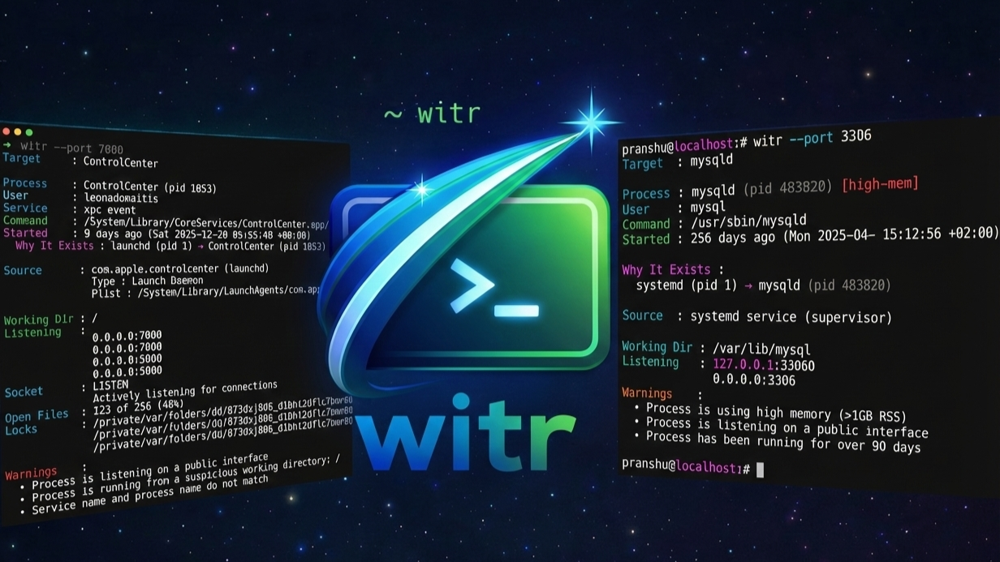

# witr 进程溯源

> 终端工具用了 20 年，一直没人搞懂进程为什么在跑。

这句话并不夸张。我们平时查进程，手上其实已经有一堆工具：`ps`、`top`、`lsof`、`ss`、`systemctl`、`docker ps`。难点不在"看不到进程"，而在这些工具通常只告诉你 **现在有什么**，不会顺手把"它为什么会在这里"解释完。线上接手一台陌生机器时，这种断层特别明显：你能看到 5432 端口有人监听，能看到某个 `node` 或 `python` 在跑，但它是 systemd 拉起来的、pm2 托管的、Docker 容器里的，还是某个 shell 临时起的，往往还得再补一轮手工排查。

witr 的目标就一个，仓库首页也直接写在第一行：**Why is this running?** 它想交代的是这个进程从哪里来、谁把它拉起来、现在又是谁在维持它继续存在。

## 仓库背景与定位
GitHub：<https://github.com/pranshuparmar/witr>

witr 是 `Pranshu Parmar` 的开源项目，仓库简介只有一句话：`Why is this running?` 这句话展开后，意思也很清楚：当系统里有某个进程、服务或监听端口时，背后总会有一条因果链。这条链可能经过 supervisor、container、service manager、shell，会分散在多个系统层上。现有工具擅长展示状态，witr 则把因果关系直接讲出来。

官方资料里列出的目标有几条，基本决定了它适合什么场景：

- 解释 **why a process exists**，而不只是列出进程表；
- 尽量减少你来回切多个工具的次数；
- 零配置开箱即用；
- 保持只读，不做自动修复；
- 在故障压力下也能看懂输出。

它不管监控、性能分析和自动修复，只做追因果链这件事。

按 GitHub API 在 2026-05-16 的实时返回，`pranshuparmar/witr` 当时是 **16,734 stars**。

## 它到底在补什么空白

官方 `Purpose` 段讲得很清楚：现有工具通常告诉你"是什么在跑"，但还需要你自己把多份输出拼起来，推断"为什么在跑"。witr 把这一步收成一个统一输出。

它默认会尝试回答四个问题：

1. 现在跑的是什么；
2. 它是怎么启动的；
3. 谁在维持它继续运行；
4. 它属于什么上下文。

把这四个问题压成一条输出后，日常排查会省掉不少来回跳转。比如你在 `ss -lntp` 里看见 5001 端口被占，witr 希望你不用再自己串 `lsof`、`ps -fp`、`systemctl status`、`pwdx`、`docker inspect` 这些命令，直接就能看到：目标进程是谁、父链路怎么走、主来源是什么、工作目录在哪里、是不是某个 Git 仓库、是不是绑在公网地址上。

## 支持平台：四个平台都支持，但能力不完全一样

平台支持矩阵写得很明确：

- **Linux**（x86_64、arm64）：基于 `/proc`，功能最完整；
- **macOS**（x86_64、arm64）：主要依赖 `ps`、`lsof`、`sysctl`、`pgrep`；
- **Windows**（x86_64、arm64）：主要依赖 `Get-CimInstance`、`tasklist`、`netstat`；
- **FreeBSD**（x86_64、arm64）：主要依赖 `procstat`、`ps`、`lsof`。

平台矩阵里还有一些细节：

- 按 **进程名、PID、端口** 查询，这四个平台都支持；
- 按 **文件路径** 查询，Windows 不支持，其余三者支持；
- **环境变量** 输出在 Linux、FreeBSD 最完整，macOS 因 SIP 只有部分支持，Windows 不支持；
- **service manager** 解析四个平台都有：Linux 看 systemd，macOS 看 launchd，Windows 看 Services，FreeBSD 看 rc.d；
- **schedule detection** 只有 Linux 和 macOS 有，Windows 和 FreeBSD 没有；
- **TUI 里的进程动作** 在 Windows 上不可用，其余三者可用。

所以正文里说"支持 Linux、macOS、Windows、FreeBSD"没问题，但如果要再细一点，就得按矩阵来写，不能把 Linux 上的全部细节都投射到别的平台上。

## 安装方式：四个平台都给了官方路径

安装路径给得很全。快速脚本、包管理器、源码安装和手动安装都保留了。

### Linux、macOS、FreeBSD

官方 Unix 快速安装命令是：

```bash
curl -fsSL https://raw.githubusercontent.com/pranshuparmar/witr/main/install.sh | bash
```

这个脚本会做几件事：

- 识别操作系统，只接受 `linux`、`darwin`、`freebsd`；
- 识别 `amd64` 或 `arm64`；
- 从 GitHub Releases 下载最新二进制和 man page；
- 默认安装到 `/usr/local/bin/witr`；
- man page 默认放到 `/usr/local/share/man/man1/witr.1`；
- 如果目标目录不可写，会尝试使用 `sudo`、`doas` 或 `run0`。

如果你不想装到系统目录，脚本也支持改前缀：

```bash
INSTALL_PREFIX="$HOME/.local" bash install.sh
```

此外，常见包管理器入口也给全了：

- Homebrew：`brew install witr`
- Conda / Mamba / Pixi：`conda install -c conda-forge witr`
- Arch Linux AUR：`yay -S witr-bin`
- FreeBSD：`pkg install witr` 或 Ports 构建
- 还有 AOSC、Guix、Uniget、Aqua、Brioche 等社区渠道

Linux 用户如果想直接装原生包，也能从 release 页面下 `.deb`、`.rpm`、`.apk`。

### Windows

Windows 的快速安装命令是：

```powershell
irm https://raw.githubusercontent.com/pranshuparmar/witr/main/install.ps1 | iex
```

这个 PowerShell 脚本会下载最新 release zip、校验 checksum、把 `witr.exe` 解压到 `%LocalAppData%\witr\bin`，并把这个目录加进当前用户的 `PATH`。

如果你更习惯包管理器，Windows 还可以走：

```powershell
winget install -e --id PranshuParmar.witr
```

或者：

```powershell
choco install witr
scoop install main/witr
```

### 手动安装与源码安装

如果你想完全手动控安装过程，文档里也保留了分平台步骤，包括：下载 release 二进制、校验 `SHA256SUMS`、手动移动到目标目录。

另一个更工程师向的入口是：

```bash
go install github.com/pranshuparmar/witr/cmd/witr@latest
```

这条路线适合已经有 Go 环境、想直接装源码版本的人。

## 它能查什么：进程名、PID、端口、文件路径

witr 最实用的一点，是入口不只一种。CLI 文档明确写了四类目标：

- **进程名**：直接把名字当位置参数传进去；
- **PID**：`--pid`；
- **端口**：`--port`；
- **文件路径**：`--file`。

最常见的几种命令是：

```bash
witr nginx
witr --pid 1234
witr --port 5432
witr --file /var/lib/dpkg/lock
```

默认按名字查时，witr 用的是 substring matching，也就是模糊匹配。如果你只想精确匹配某个进程名，可以加：

```bash
witr bun --exact
```

这些目标还可以混用，而且是可重复的。比如：

```bash
witr nginx --port 5432 --pid 1234
```

结果会按照你输入的顺序依次显示，并加上分隔标题。这点对复杂排查很有用，你可以一次把几个怀疑对象都查掉，而不是来回敲命令。

## 输出里最值得看的几段

witr 的价值主要在输出结构。标准输出分成几个部分，其中最重要的是下面几块。

### 1. Target

你查的目标是什么：名字、PID、端口还是文件。

### 2. Process

这里会显示可执行文件、PID、用户、命令行、启动时间、重启次数。

### 3. Why It Exists

这是核心。官方把它叫做 **causal ancestry chain**，也就是一条"谁启动了谁"的链。

示例里给的是：

```text
systemd (pid 1) → pm2 (pid 5034) → node (pid 14233)
```

这时候你知道的就不只是 `node` 在跑，还能看出：它最终是 systemd 拉起来的，中间经过了 pm2。

### 4. Source

witr 还会从整条祖先链里选一个主来源。文档里的原话是 **Only one primary source is selected**。这个来源可能是：

- systemd unit
- launchd service
- Windows service
- rc.d service
- docker container
- pm2
- cron
- SSH session
- interactive shell
- Snap / Flatpak sandbox

这也是正文里能比较稳地写"systemd unit 来路"的依据。这里没有什么神秘推理，只是把主负责系统显式挑出来。

### 5. Context

这块讲的是"它属于什么上下文"。文档列出的信息包括：

- Working directory
- Git repo name and branch
- Container name / image
- Public vs private bind

如果你接手的是一个陌生目录下的线上进程，这几项会很省时间。

### 6. Warnings

文档里有可核对的 warning 规则，包括：

- 进程以 root 身份运行；
- Linux 上非 root 进程带危险 capabilities；
- 监听公网地址 `0.0.0.0` 或 `::`；
- 重启次数过多；
- 内存占用过高，阈值写的是 **RSS > 1GB**；
- 运行时间超过 **90 天**；
- deleted binary；
- `LD_PRELOAD`、`DYLD_*` 这类 library injection 指标。

两个细节：第一，文档里没有"静默跑几个月"这种模糊词，而是直接写成 `over 90 days`。第二，warning 是 **non-blocking observations**，它们只是提示你可能有风险，不代表一定异常。

## "kernel 来路"怎么更准确地理解

有人用"从 kernel 到 systemd unit"这种说法。这个说法抓住了感觉，但换成更准确的表述会更严谨。

witr 并不是给你画一张"从 kernel 层开始的完整溯源码图"。它做的事，可以理解成：

- 从 **名字 / PID / 端口 / 文件路径** 先锁定进程；
- 再沿着 **父进程链、service manager、container、shell、SSH session、scheduler** 去追它的直接来源；
- 再把这条因果链压成一段人能读懂的解释。

源码里能看到一些和内核层细节相关的实现，比如 Linux / macOS / FreeBSD 上会处理 command 名被 kernel comm field 截断的问题，Windows 代码里也直接调用了 `kernel32.dll`。但这些都属于实现细节，不适合被写成"能展示 kernel provenance"。正文保守写法就是：它从系统事实往上追责任链。

## TUI 仪表盘：另一种入口

TUI 在官方资料里是单独列出来的一节。只要你不带参数直接运行 `witr`，或者显式加 `-i`，就会进入交互式模式。

```bash
witr
# 或
witr -i
```

官方对 TUI 的描述有几项：

- **Live Process List**：实时进程列表，可排序、可过滤；
- **Port View**：直接从端口视图看谁占着端口；
- **Process Details**：下钻某个进程，看完整 ancestry、child processes、environment variables、working directory；
- **Process Actions**：在 UI 里直接发 Kill、Terminate、Pause、Resume、Renice；
- **Mouse Support**：可以用鼠标排序列、点行。

如果你平时更习惯在终端里巡检，而不是每次都手搓参数，这个入口会比较顺手。尤其是接手陌生服务器时，你常常想大概扫一眼：有什么长跑进程、哪些端口对外开放、哪些进程吃内存高。TUI 比单条命令更适合做总览。



## 实际排查流程：按端口追最直观

如果把 witr 放进真实排查流程，我更推荐从端口开始，因为这通常是最接近问题现场的入口。

### 第一步：发现端口

比如你发现 5432、5001、8080 这类端口被监听，直接查：

```bash
witr --port 5432
```

这一步能把端口占用者映射到具体 PID，并继续给出祖先链。

### 第二步：看来源链

如果输出里告诉你：

```text
systemd → pm2 → node
```

那你后续就知道该去看 systemd unit、pm2 配置或对应工作目录，不用继续在进程表里瞎翻。

### 第三步：判断来源有没有问题

这时主要看三块：

- `Source`：是 systemd、launchd、Windows service、rc.d，还是 interactive shell、SSH session；
- `Context`：工作目录、Git 分支、容器名、绑定地址；
- `Warnings`：公网监听、高内存、90 天长跑、deleted binary、可疑环境变量。

如果一个进程是通过 SSH session 拉起来、绑在 `0.0.0.0`、工作目录又不在你熟悉的项目里，那就很值得继续追。

### 第四步：必要时再切其他查询入口

如果你拿到 PID，就继续：

```bash
witr --pid 1234 --tree
```

如果你怀疑它卡着某个锁文件，就直接：

```bash
witr --file /var/lib/dpkg/lock
```

这一层的意义在于：你不用一开始就猜对入口。端口、PID、文件路径、名字都能互相切换。

## 它适合哪些场景

把官方目标和上面的查询方式对起来，witr 最适合三类场景。

### 1. 接手陌生服务器

你不熟悉这台机器，也不知道哪些进程是业务、哪些是临时脚本、哪些是 supervisor 拉起来的。witr 能把"谁启动了谁"快速讲清。

### 2. 线上故障排查

端口冲突、服务误起、某个进程一直被拉起、容器外又有一层 supervisor，这类问题最烦的就是链路分散。witr 把它压回一段可读输出，适合在压力场景下快速定位。

### 3. 安全巡检

warning 规则本身就带一点巡检味道：公网监听、长期运行、高内存、危险 capabilities、library injection 指标。它当然不是完整的安全产品，但拿来做日常发现异常，很顺手。

## 把责任链讲清楚，比多背几条命令更有用

witr 最有用的地方，在于它把"为什么在跑"这个长期靠经验和命令组合才能回答的问题，压成了一个统一入口。

如果你平时就熟练使用 `ps`、`lsof`、`ss`、`systemctl`，witr 不会替代这些工具；但在陌生环境、线上故障和安全巡检里，它能帮你少走很多来回拼图的弯路。尤其是当你面对的不只是"一个 PID"，而是一整条启动链时，这类工具确实比死记命令参数更有用。
