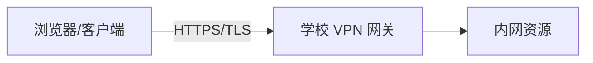
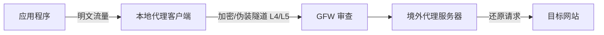
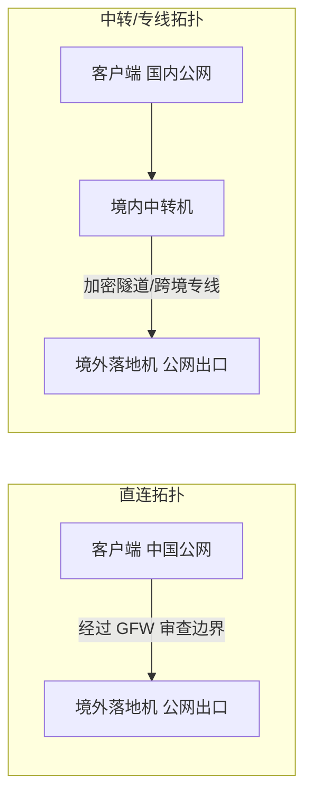
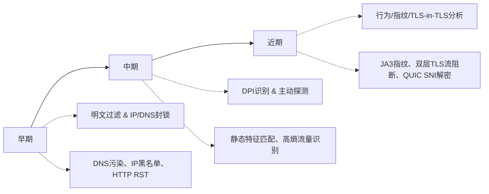
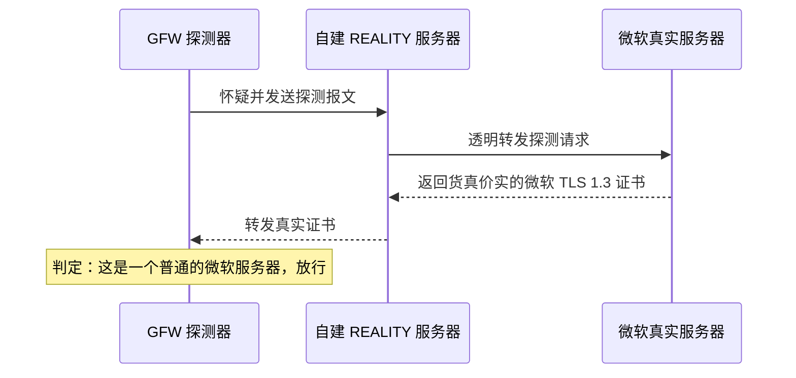
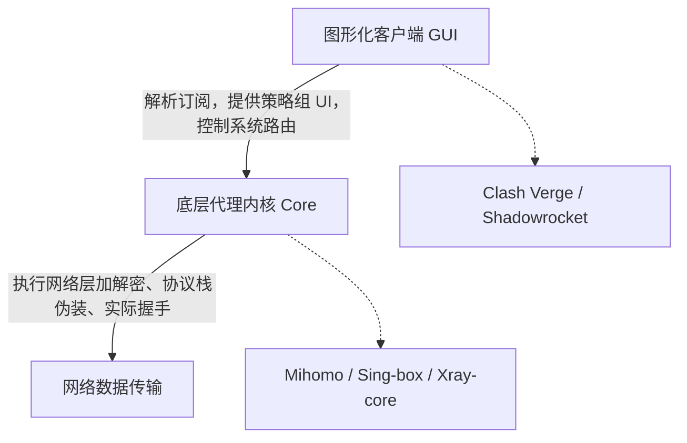
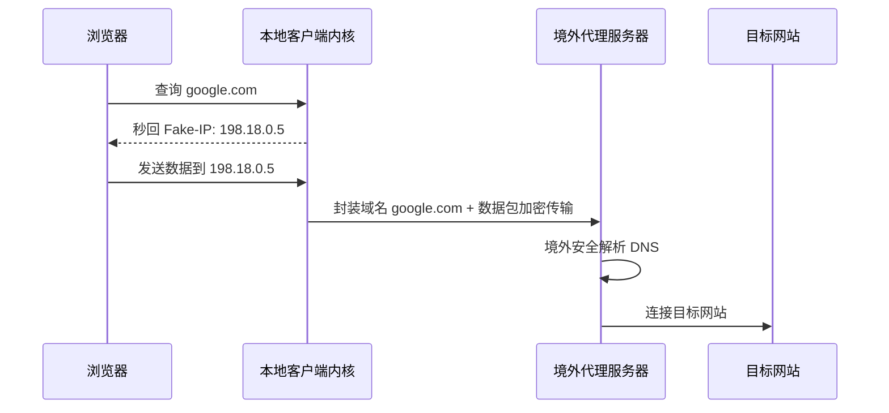

# 网络代理技术原理、协议演进与合规实践

**免责声明与警示**：本讲义内容仅用于计算机网络、信息安全领域的学术研究、技术讨论与教学演示。请自学人员严格遵守《网络安全法》、《计算机信息网络国际联网管理暂行规定》等所在地法律法规，严禁利用相关技术从事任何违法违规活动。

## 1. VPN、代理与线路

在日常语境中，"VPN" 常被泛指为所有的网络翻墙工具。然而，从计算机网络体系结构（OSI 七层模型 / TCP/IP 四层模型）的角度来看，传统的 VPN、安全代理、跨境专线以及商业 VPN 在运行层级、封装机制和安全设计上存在本质区别。

<svg xmlns="http://www.w3.org/2000/svg" viewBox="0 0 860 460" font-family="-apple-system,BlinkMacSystemFont,'Segoe UI',Roboto,'Noto Sans SC','Microsoft YaHei',sans-serif">
  <rect x="10" y="10" width="200" height="75" rx="8" fill="#4f46e5" stroke="#312e81" stroke-width="2"/>
  <text x="110" y="55" text-anchor="middle" font-size="18px" font-weight="700" fill="#ffffff">L7 应用层</text>
  <rect x="220" y="10" width="630" height="75" rx="8" fill="#e0e7ff" stroke="#818cf8" stroke-width="2"/>
  <text x="535" y="55" text-anchor="middle" font-size="15px" font-weight="600" fill="#312e81">SOCKS5 · VMess · VLESS · Trojan · Shadowsocks</text>
  <rect x="10" y="100" width="200" height="75" rx="8" fill="#7c3aed" stroke="#4c1d95" stroke-width="2"/>
  <text x="110" y="145" text-anchor="middle" font-size="18px" font-weight="700" fill="#ffffff">L4 传输层</text>
  <rect x="220" y="100" width="630" height="75" rx="8" fill="#ede9fe" stroke="#a78bfa" stroke-width="2"/>
  <text x="535" y="145" text-anchor="middle" font-size="15px" font-weight="600" fill="#4c1d95">OpenVPN · WireGuard · Hysteria 2 · TUIC</text>
  <rect x="10" y="190" width="200" height="75" rx="8" fill="#9333ea" stroke="#581c87" stroke-width="2"/>
  <text x="110" y="235" text-anchor="middle" font-size="18px" font-weight="700" fill="#ffffff">L3 网络层</text>
  <rect x="220" y="190" width="630" height="75" rx="8" fill="#f3e8ff" stroke="#c084fc" stroke-width="2"/>
  <text x="535" y="235" text-anchor="middle" font-size="15px" font-weight="600" fill="#581c87">IPsec VPN · TUN/TAP 虚拟网卡</text>
  <rect x="10" y="280" width="200" height="75" rx="8" fill="#a855f7" stroke="#6b21a8" stroke-width="2"/>
  <text x="110" y="325" text-anchor="middle" font-size="18px" font-weight="700" fill="#ffffff">L2 数据链路层</text>
  <rect x="220" y="280" width="630" height="75" rx="8" fill="#faf5ff" stroke="#d8b4fe" stroke-width="2"/>
  <text x="535" y="325" text-anchor="middle" font-size="15px" font-weight="600" fill="#6b21a8">IEPL 国际以太网专线</text>
  <rect x="10" y="370" width="200" height="75" rx="8" fill="#c084fc" stroke="#7e22ce" stroke-width="2"/>
  <text x="110" y="415" text-anchor="middle" font-size="18px" font-weight="700" fill="#ffffff">L1 物理层</text>
  <rect x="220" y="370" width="630" height="75" rx="8" fill="#faf5ff" stroke="#e9d5ff" stroke-width="2"/>
  <text x="535" y="415" text-anchor="middle" font-size="15px" font-weight="600" fill="#7e22ce">IPLC 国际私有租用线路</text>
</svg>


### 1.1 虚拟专用网络 (VPN, Virtual Private Network)

- **技术本质**：工作在 **OSI 模型的网络层（Layer 3）**，通过在公共网络上建立临时的、安全的隧道（Tunnel），将远程主机虚拟接入企业或学校的内网。
- **实现协议**：IPsec、OpenVPN、WireGuard、L2TP/IPsec。
- **工作机制**：通常在操作系统中创建虚拟网卡（如 `TUN/TAP` 设备）。所有发往特定网段（或全局）的数据包，在 Layer 3 被完整加密，并封装进新的外层 IP 首部中。采用 "IP in IP" 的隧道封装模式：
  $$IP_{\text{outer}} \parallel \text{Header}_{\text{crypto}} \parallel E_k(IP_{\text{inner}} \parallel \text{Payload})$$
- **抗审查特征**：**极差**。由于设计初衷是"安全加密"而非"抗审查伪装"，其握手特征（如 OpenVPN 的明文协商、WireGuard 固定的握手包大小和行为特征）极为明显。高熵的加密载荷加上规律性的协议头，使其极易被深度包检测（DPI）静态识别并封锁。

#### 1.1.1 高校/企业常见 VPN（EasyConnect / aTrust、WebVPN）

- **技术本质**：主要工作在 **OSI 模型的应用层（Layer 7）**，属于 **SSL VPN**（基于 HTTPS/TLS）类型。
- **代表产品**：
    - **EasyConnect / aTrust**（深信服 Sangfor）：国内高校、企业广泛使用的 SSL VPN 客户端，后期品牌升级为 aTrust。
    - **WebVPN**（如 Cisco、华为等设备的 Web 方式接入）：无需安装客户端，通过浏览器直接访问。
    - 部分学校升级为 **MotionPro** / **Array VPN** 等其他方案。
- **工作机制**：通过浏览器或专用客户端，使用标准的 HTTPS（443 端口）建立连接。早期多为 Web 代理模式（仅代理浏览器流量），现在多数支持客户端全隧道模式（创建虚拟网卡），但**核心仍基于应用层 SSL/TLS**。



> **提示**：以上方案均为合规的校园网络接入方式，仅能访问学校已购买的海外学术数据库（如 IEEE、ACM、Springer 等），无法代理通用的境外互联网流量。对于 GitHub、HuggingFace 等开源平台的访问需求，仍需使用本讲义后续介绍的加密代理方案。

#### 1.1.2 商业VPN (Commercial VPNs)

- **技术本质**：大多工作在 **OSI 模型的网络层（Layer 3）**，通过创建虚拟网卡（TUN）对 IP 数据包进行加密封装，提供全流量或分流路由。部分产品支持应用层/混合模式。
- **适用人群**：主要面向海外隐私用户或在无严格审查国家保护公共 Wi-Fi 安全。
- **总体特点**：
    - **主流商业 VPN**（Proton、Express 等）核心仍是 **Layer 3**：创建虚拟网卡（TUN），对 IP 数据包进行加密封装，工作方式与 OpenVPN / WireGuard 一致。
    - **部分移动端/轻量 VPN**（如部分 Panda、Turbo）可能默认使用**应用层代理**（类似 Shadowsocks）来提升速度和兼容性，用户可切换到完整 VPN（L3）模式。
- **抗审查特征**：**较差**。服务器 IP 范围公开、协议特征明显，在中国大陆环境下普遍较弱，敏感时期容易被封，需要配合混淆/Stealth 协议使用，不适合作为国内长期研究的稳定手段。

| 商业 VPN              | 主要协议                                 | 备注                                               |
| :------------------ | :----------------------------------- | :----------------------------------------------- |
| **ProtonVPN**       | WireGuard（默认）、OpenVPN、Stealth        | 支持多种 L3 隧道协议，Stealth 模式增加伪装                      |
| **ExpressVPN**      | Lightway（基于 WireGuard）、OpenVPN、IKEv2 | Lightway 是其自研高效 L3 协议                            |
| **NordVPN**         | NordLynx（基于 WireGuard）、OpenVPN、IKEv2 | NordLynx 为自研变种，性能优秀                              |
| **Surfshark**       | WireGuard、OpenVPN、IKEv2              | 支持无限设备同时连接                                       |
| **Cloudflare WARP** | WireGuard + MASQUE/QUIC              | 底层用 WireGuard（L3），结合 Cloudflare 全球网络，部分场景表现为高效代理 |
| **PandaVPN**        | WireGuard、OpenVPN、Shadowsocks        | 支持 L3 隧道，也提供代理模式（类似应用层）                          |
| **Turbo VPN**       | OpenVPN / 自定义协议 / Shadowsocks        | 移动端偏向轻量代理 + L3 切换                                |

#### 1.1.3 网络层 VPN 与多设备组网（OpenVPN / WireGuard / Tailscale / ZeroTier）

- **技术本质**：工作在 **OSI 模型的网络层（Layer 3）**，通过 TUN 虚拟网卡实现完整 IP 包隧道。
- **工作机制**：与 1.1 主节描述一致（IP in IP 隧道封装）。
- **抗审查特征**：**较差**。WireGuard 握手特征固定（Noise 协议握手、固定包大小），Tailscale/ZeroTier 的协调服务器也容易被封。

| 维度         | OpenVPN            | WireGuard                  | Tailscale (基于 WG)      | ZeroTier               |
| :--------- | :----------------- | :------------------------- | :--------------------- | :--------------------- |
| **类型**     | 传统 VPN 协议          | 现代轻量 VPN 协议，代码量仅约 4000 行   | 零配置 Mesh VPN 服务        | L2 虚拟网络 overlay 服务     |
| **易用性**    | 低（配置复杂）            | 中低（手动密钥+路由）                | **极高**（SSO 登录，几秒加入）    | 高（网络 ID 加入，手动授权）       |
| **NAT 穿透** | 一般（需端口转发或 TCP 443） | 差（需公网 IP 或端口转发）            | **优秀**（DERP 中继+ICE）    | **优秀**（根服务器中继）         |
| **网络模型**   | 中心化（Client-Server） | 点对点（需手动配置）                 | Mesh L3（设备直连优先）        | **虚拟 L2 以太网**（支持广播/多播） |
| **性能**     | 一般（开销大）            | **最高**（内核态，轻量，ChaCha20 加密） | 很高（接近原生 WG，中继时略降）      | 高（略低于 WG）              |
| **安全性**    | 成熟，可高度自定义          | 现代加密，代码审计友好                | 强（WG + ACL + SSO/MFA）  | 强（自定义协议 + 规则引擎）        |
| **开源/自托管** | 完全开源               | 完全开源                       | 客户端开源，Headscale 自托管控制面 | 核心 + Controller 完全开源   |
| **免费限制**   | 无                  | 无                          | 个人免费（~100 设备）          | 免费 25 节点左右             |
| **典型场景**   | 传统远程访问、企业          | 高性能点对点、自建                  | **个人/小团队设备互联**         | 需要 L2 功能（如 mDNS、IoT）   |

**性能排序**：**WireGuard > Tailscale > ZeroTier > OpenVPN**。直连时 Tailscale/ZeroTier 接近 WireGuard，中继时有损耗但仍优于传统 VPN。

#### 校园网隔离环境下的多设备访问实践

高校校园网通常存在 **VLAN 隔离**、**ARP 隔离**、**ACL 策略**，宿舍与实验室不在同一二层域，居家访问更需穿越公网 + 运营商。以下针对两种典型场景进行对比：

- **宿舍 → 实验室**：同校园网内，不同 VLAN/子网，需穿透校园隔离策略。
- **居家 → 实验室**：公网 + 运营商 CGNAT/端口限制，需强 NAT 穿透能力。

| 方案 | 宿舍→实验室（校园内） | 居家→实验室（跨公网） | 连接方式 | 备注 |
| :--- | :--- | :--- | :--- | :--- |
| **OpenVPN** | 中等，~80-150 Mbps / 15-40ms | 较低，~30-80 Mbps / 50-120ms | 中心化（Server 中转为主） | 配置复杂，穿透隔离一般 |
| **WireGuard** | **最高**，~200-500+ Mbps / 8-20ms | 中高（需端口转发），~100-300 Mbps / 30-80ms | **纯点对点**（需手动端口转发或公网 IP） | 性能最佳，但 NAT 穿透弱 |
| **Tailscale** | **高**，~150-400 Mbps / 10-25ms | **高**，~80-250 Mbps / 40-90ms | **Mesh 优先直连**（DERP 中继兜底） | **最推荐**，自动穿透校园隔离 + CGNAT |
| **ZeroTier** | 高，~120-350 Mbps / 12-30ms | 高，~70-220 Mbps / 45-100ms | **Mesh 优先直连**（根服务器/Moon 中继） | 适合需要 L2 广播的场景 |

> **连接方式说明**：
> - **直连**：设备间直接建立隧道，最低延迟、最快速度。Tailscale/ZeroTier/WireGuard 支持。
> - **中转（Relay）**：通过协调服务器或中继节点转发，稳定性高但增加延迟。OpenVPN 默认中转；Tailscale 用 DERP；ZeroTier 用根服务器/Moon。

**校园场景选择建议**：

1. **优先 Tailscale**：宿舍/居家多设备访问实验室最方便。安装客户端 → 登录账号 → 授权设备 → 即可互访。支持子网路由（把整个实验室网段路由过来）。
2. **需 L2 功能**（打印机/文件共享发现、特定本地服务）：选 **ZeroTier**。
3. **极致性能**（大文件传输、远程桌面）：实验室主机固定 IP 或端口转发时，用纯 **WireGuard** 主力，Tailscale 做备用。
4. **混合方案**（推荐）：WireGuard/Tailscale 主力 + ZeroTier 作为 L2 补充。居家场景可额外部署轻量 VPS 做自定义 DERP/Moon 中继，进一步降低延迟。

> **实操提示**：
> - 宿舍内优先测试 P2P 直连成功率；居家关注中继节点地理位置（选国内/学校附近节点延迟更低）。
> - 安全：结合 ACL 策略，仅允许特定 IP/端口访问实验室电脑，避免全网暴露。
> - 合规：以上均为内网访问方案，遵守学校网络管理规定，仅用于合法学术/研究用途。

### 1.2 加密代理 (Encrypted Proxy)

- **技术本质**：工作在 **应用层/传输层（Layer 4/5）**，通过代理协议转发特定应用程序的流量，不修改系统路由表（除非开启 TUN 模式转发）。
- **传统协议**：SOCKS5、HTTP Proxy。
- **抗审查代理协议**：Shadowsocks (SS)、VLESS、Trojan、Hysteria。
- **工作机制**：代理客户端在本地监听一个端口（例如 SOCKS5 协议的 `1080`），应用程序将流量发送至该端口，客户端将应用载荷按特定协议进行加密和混淆，再通过 TCP/UDP 发送给境外代理服务器，服务器解密后代为发起请求。
- **抗审查特征**：**极强**。专门为对抗深度包检测（DPI）、主动探测和统计学分析而设计，核心思想是"去特征化"与"高度伪装"。



### 1.3 跨境线路 (Censorship-bypassing Routing)

跨境网络质量不仅取决于协议，还极大程度上取决于底层的物理路由和网络传输介质。

1. **直连公网 (Direct Connection over Public Transit)**
    - 流量直接经过三大运营商（电信、联通、移动）的跨境公网出口（如 AS4134/163网、AS4809/CN2、AS9929、AS58453/CMNET）。
    - **缺点**：受 GFW 阻断、干扰严重，在晚高峰期链路丢包率极高，QoS 限速严重。

2. **国内中转/隧道 (Relay / Tunneling)**
    - **架构**：用户 → 国内高带宽入口服务器 → 加密隧道（如 Gost, Ehco 等） → 境外落地服务器 → 目标网络。
    - **优点**：国内入口对用户延迟低；中转服务器之间可以使用特定的高端口优化或多路复用，避开直接跨境的审查和丢包。

3. **专线 (IEPL/IPLC, International Private Leased Circuit)**
    - **技术本质**：国际私有租用线路（IPLC）或国际以太网专线（IEPL）。在两端点之间提供端到端的物理/链路层专有通道，**不经过公网出口，因而完全绕过了 GFW 的物理审查设备**。
    - **优点**：零丢包、极低延迟，完全不受 GFW 协议封锁影响。
    - **缺点**：物理带宽极为昂贵，通常由大型中转机场提供入口。



> 直连极其依赖 Reality 等高强度抗封锁协议；中转由专线和加密隧道过墙，抗封锁压力主要由中转机承担。

### 1.4 技术方案综合对比

| 方案类型            | 核心优势             | 主要劣势             | 适用人群                     |
| :-------------- | :--------------- | :--------------- | :----------------------- |
| **商业VPN**       | 开箱即用，操作简单，有客户支持  | 协议更新不及时，敏感时期易受影响 | 对技术不了解的初级用户、临时需求者        |
| **加密代理(自建/机场)** | 协议先进，抗封锁能力强，灵活性高 | 需要一定技术知识进行配置和维护  | 开发者、技术爱好者、对稳定性和速度有高要求的用户 |
| **跨境专线**        | 极致的稳定性、安全性和低延迟   | 价格极其昂贵，通常按带宽计费   | 对网络质量要求严苛的企业、外贸团队、金融机构   |

---

## 2. "非法翻墙"与底线要求

作为计算机及相关专业的学生与研究人员，获取前沿学术资源（如 HuggingFace 模型权重、GitHub 源码、arXiv 论文、Google Gemini/ChatGPT API 接口调用）是日常学术工作的重要组成部分。然而，在进行上述操作时，必须建立清晰的法律红线与安全规范。

### 2.1 法律法规与"非法翻墙"的界限

根据《中华人民共和国计算机信息网络国际联网管理暂行规定》：

- **第六条**：_"计算机信息网络直接进行国际联网，必须使用邮电部国家公用电信网提供的国际出入口信道。任何单位和个人不得自行建立或者使用其他信道进行国际联网。"_
- **第十四条**：违反第六条规定的，由公安机关责令停止联网，给予警告，可以并处15000元以下的罚款；有违法所得的，没收违法所得。

**合规定义**：通过非国家批准的物理信道或非法的海外代理节点（如非合规购买、私设境外卫星接收器、绕过海关网关等物理手段）建立联网，被视为行政违规行为。对于高校学生，私自搭建代理、售卖代理节点或传播翻墙教程，极易触犯法律。

### 2.2 行为边界与分类

- **合法合规场景（白区）**：
    - 使用学校提供的官方 WebVPN / SSL VPN 访问购买的海外学术数据库。
    - 通过合法合规的企业专线访问跨国公司内网。

- **灰色地带（科研研发刚需，通常被默许但不受法律保护）**：
    - 出于编程、科研目的，使用代理工具访问 GitHub、HuggingFace、学术论文网站、官方技术文档。

- **绝对红线（违法行为）**：
    - **传播与盈利**：搭建代理节点并向他人提供服务（无论是否收费），极易被司法机关以"提供侵入、非法控制计算机信息系统程序、工具罪"提起公诉。
    - **涉政涉暴**：访问、浏览、传播境外非法政治、宗教、暴力等违禁内容。
    - **黑客攻击**：利用代理隐匿身份，对国内外计算机系统发起网络攻击。


### 2.3 科研学术访问的底线要求与"三不原则"

1. **三不原则（核心底线）**：
    - **不涉政**：严禁浏览、点赞、传播、发表任何涉及政治敏感、宗教极端、国家安全或歪曲事实的境外言论。
    - **不传播**：绝不在国内社交平台（微信、QQ、知乎、B站等）或学校内网分享任何翻墙工具、机场链接、自建教程或敏感的技术配置文件。
    - **不牟利**：严禁搭建代理服务供他人使用，严禁合伙合租、倒卖节点。

2. **安全隔离原则**：
    - **避免身份交叉**：在连接代理状态下，严禁登录绑定了国内实名手机号的境外账号（如 X/Twitter, Telegram 等），严禁在境外平台暴露个人真实姓名、学校、IP地址。
    - **警惕钓鱼节点**：使用未知、免费的"公益机场"存在极高的数据泄露风险（中间人攻击 MITM）。学术敏感数据（如未发表的论文草稿、商业机密代码）在通过此类网络传输时，必须确保全程使用端到端加密（如强密码的 HTTPS 或 SSH）。

3. **内网安全守则**：
    - **严禁"内网跳板"**：切勿在部署了代理的实验室服务器上开放公网端口，防止境外黑客利用代理通道反向渗透学校内网或重点实验室核心网络。
    - **严禁涉密混用**：在高校科研实验室中，严禁在连接了涉密局域网、高校内部机密科研项目的计算机上配置或启用任何网络代理。
    - **提倡合规申报**：若实验室有高强度的出海 API 调用或学术检索需求，应当积极向学校信息化部门提出合规跨境网络申请。

### 2.4 刑事责任红线

1. **提供侵入、非法控制计算机信息系统程序、工具罪**：私自出售、传播、分发"翻墙"软件和订阅链接，一旦达到一定用户量或获利金额，将直接触犯刑法。
2. **非法经营罪**：在未取得电信增值业务经营许可证的情况下，私自搭建、运营代理服务器并以此牟利。

---

## 3. 加密代理协议、加密类型与网络协议

代理协议的发展史，本质上是与 GFW（深度包检测、主动探测、流量重放、机器学习分类模型）的持续对抗史。其演进路线经历了"追求加解密效率 → 追求配置多样化 → 追求指纹混淆与反主动探测"的跨代升级。

### 3.1 GFW 审查技术演进

GFW（Great Firewall）是全球最复杂的动态流量审查系统。其技术演进与反审查协议构成了一场经典的**网络安全军备竞赛**。



#### 阶段 1：静态及明文阻断（早期）

- **DNS 污染**：向用户返回错误的 DNS 解析 IP（如将谷歌域名解析为不存在的 IP 地址）。
- **IP 黑名单**：直接在骨干网路由器上丢弃发往特定目的 IP 地址的报文。
- **关键字阻断**：对明文 HTTP 协议流量进行内容扫描，匹配到敏感字时伪造 TCP RST 包双向断开连接。

#### 阶段 2：深度包检测（DPI）与主动探测（中期）

- **深度包检测 (DPI)**：识别协议静态头部。当早期 Shadowsocks 的随机混淆特征被总结后，DPI 可以通过分析报文前几个字节的熵值（Entropy）、首包长度、响应包时序来识别其是否为"未知加密流量"。
- **主动探测 (Active Probing)**：当 GFW 怀疑某个 IP 的特定端口是代理服务器时，GFW 的探测机（通常使用伪装的国内普通 IP）会主动向该端口发送伪造的代理握手包（如 SOCKS5、Shadowsocks 握手）。若服务器正确做出了代理应答，则立刻判定其为代理服务器并封锁其 IP。

#### 阶段 3：指纹识别与启发式分类（近期）

- **TLS 指纹识别 (JA3/uTLS)**：将流量包裹在标准 TLS（HTTPS）内曾是极佳的伪装手段（如 Trojan 协议）。但 GFW 开始分析 TLS 握手中的 `Client Hello` 报文，提取其密码套件列表、扩展项等字段，生成 **JA3 指纹**。如果发现该 TLS 握手指纹与常见的 Chrome、Firefox 等浏览器不匹配，则将其判定为代理流量并予以阻断。
- **TLS-in-TLS（双层 TLS）检测**：
    - **机制**：当使用 VLESS over TLS 或 Trojan 代理访问一个 HTTPS 网站时，外层是代理的 TLS 隧道，内层是用户访问真实网站的 TLS 流量。
    - **学术实证**：在 **USENIX Security 2024** 的论文中实证，尽管外部流量完全加密，但内部 TLS 握手过程会在外层隧道的载荷长度、往返时序、报文方向序列中留下高度可识别的**时空指纹特征**。标准配置下的双层 TLS 检出率高达 **70% 以上**。

#### 阶段 4：白名单机制与 QUIC/UDP 深度分析（最新）

- **基于"豁免规则"的启发式阻断**：GFW 开始采取"非白即黑"或更激进的灰名单机制。不属于常见知名协议、不可识别且高熵的加密流量，经过短期大流量传输后会被直接掐断。
- **针对 QUIC/UDP 的深度解密**：
    - **学术实证**：**USENIX Security 2025** 论文证实，自 2024 年 4 月起，GFW 部署了全球首个国家级 **QUIC 首包解密与审查机制**。由于标准 QUIC 的握手首包使用公开的盐（Salt）进行加密，GFW 能够在线实时计算出密钥，解密首包并提取其中的 SNI 域名，从而对特定域名实施精准的 UDP 封锁。

### 3.2 协议对抗的数学基础：信息熵与关联分析

网络审查系统识别代理流量的核心武器是**统计分类与机器学习**。

- **信息熵 (Information Entropy)**：原始 HTTP 流量中，由于包含大量明文 ASCII 字符，信息熵较低。而经过简单对称加密后，数据流表现出接近随机分布的高信息熵特征：

  $$H(X) = -\sum_{i=1}^{n} P(x_i) \log_2 P(x_i) \approx 8 \text{ bits/byte}$$

  GFW 通过在骨干网节点计算数据包前几十个字节的熵值，即可高度怀疑该 TCP 链接为加密代理流量。

- **包长与时序关联分析 (Packet Length & Timing Analysis)**：即使协议对内容进行完全加密，TCP 握手阶段的报文长度序列仍具有强指纹特征。GFW 通过收集并训练这些时序与包长序列分类器，实现对特定代理协议的精准识别。

### 3.3 代理协议技术深度剖析与横向对比

#### 阶段 1：无加密/明文时代（2012 年前）

- **代表技术**：Socks5, HTTP Proxy。
- **特点与缺陷**：数据包完全明文传输。防火墙只需基于简单的关键词过滤或 DPI 特征匹配即可实现精确阻断。

#### 阶段 2：高熵对称加密（2012 - 2015 年）

- **代表技术**：早期的 Shadowsocks (SS)。
- **技术原理**：引入对称加密算法（如 AES-256-CFB），将传输数据全部加密，使数据包在网络中呈现出"全随机"的高熵特征。
- **加密数学模型**：

  $$\text{Ciphertext} \parallel \text{Tag} = \text{Encrypt}_{k}(\text{Plaintext}, \text{Nonce}, \text{AssociatedData})$$

  其中 Tag（通常为 16 字节）用于验证密文的完整性，防止重放攻击。

- **遭遇的技术瓶颈**：
    1. **统计学特征暴露**：正常互联网流量存在固定的协议头部（有规律的低熵结构），而纯随机的 Shadowsocks 流量在统计学上显得过于反常。
    2. **主动探测（Active Probing）**：GFW 会模拟客户端向可疑端口发送含有微小扰动的非法报文。如果服务端由于解密校验失败直接断开连接或返回特定 TCP Reset，GFW 就能确认该端口为代理服务并实施封锁。

#### 阶段 3：伪装与混淆（2015 - 2018 年）

- **代表技术**：ShadowsocksR (SSR), 早期 VMess (V2Ray)。
- **技术原理**：通过引入混淆（obfs）插件，将代理流量伪装成正常的 HTTP 请求或看似普通的 TLS 握手。
- **遭遇的技术瓶颈**：此类混淆仅仅是"形似"而"神不似"。防火墙的 DPI 系统通过严格解析 TLS 握手状态机，发现这些伪造的 TLS 握手不符合 RFC 规范，特征被精准抓取。SSR 现已被主流客户端彻底废弃。

#### 阶段 4：真实 TLS 伪装（2018 - 2022 年）

- **代表技术**：Trojan-GFW, VLESS + TLS。
- **技术原理**：放弃"伪造 TLS"，直接使用"真实 TLS"。用户自购域名、申请合规 CA 证书。
    - **回落（Fallback）机制**：当客户端发起连接时，代理服务端验证其密码。若密码正确，则建立代理隧道；若密码错误或无密码（如防火墙的主动探测器），服务端会将该连接"回落"到预设的正常网站，使探测器只能看到标准的 HTTPS 页面。
- **遭遇的技术瓶颈**：
    1. **"TLS 套 TLS" 指纹识别**：嵌套 TLS 流量会产生明显的被动检出特征，被动检出率超过 70%。
    2. **证书所有权关联**：需要购买并维护独立域名，防火墙可通过检测域名的注册时效、流量规模与服务器 IP 的归属关系进行综合研判。

**Trojan 工作流程**：客户端向 Trojan 服务端发起 TLS 握手。握手成功后，发送 Trojan 请求。如果校验密码正确，服务端将其视作代理并转发流量；如果校验失败，Trojan 服务端会将其重定向至一个真实的、预先配置好的 HTTP 网页，完美欺骗探测器。

#### 阶段 5：无状态轻量级协议（2020 - 2022 年）

- **代表技术**：VLESS (V2Ray Next Gen)。
- **本质创新**：VLESS 是一个无状态（Stateless）的轻量级传输协议。它去除了 VMess 的时间戳校验和二次加密环节，转而将加密安全完全托管给底层的 TLS 隧道。
- **工作机制**：
    1. 客户端与服务端通过标准 TLS 建立安全信道。
    2. 在 TLS 隧道内，客户端直接发送 VLESS 帧，头部仅包含用户 UUID（16 字节）用于鉴权：

       $$\text{Frame} = \text{UUID} (16\text{B}) \parallel \text{Command} (1\text{B}) \parallel \text{Port} (2\text{B}) \parallel \text{Address} \parallel \text{Payload}$$

    3. 这种设计将协议自身的特征压缩到极限，所有的安全性均取决于 TLS 的抗检测能力。

**VMess 对比**：VMess 是 V2Ray 平台的原创核心协议，使用 `UUID` 作用户凭证，每次请求附带动态时间戳（验证误差要求在 90 秒内，防止重放攻击）：

$$\text{AuthHeader} = HMAC_{k}(\text{Timestamp} \parallel \text{RandomBytes})$$

其设计较为冗重，内部自带多层加密，已被 VLESS 取代。

#### 阶段 6：证书借用与主动反探测（2023 年至今，当前主流）

- **代表技术**：**VLESS + XTLS-Vision + REALITY**。
- **核心痛点**：传统的 Trojan/VLESS+TLS 需要用户自备域名、申请合规 TLS 证书。一旦证书泄露，GFW 可通过查询证书吊销列表或主动探测直接锁定节点。

**REALITY 运行机制**：

1. **借壳上市**：REALITY 服务端**不需要**自己的域名和证书。它直接"借用"一个境外真实存在、绝对可信的知名大站（如 `microsoft.com`、`apple.com`）的身份。
2. **透明转发对抗探测**：当 GFW 的探测器向该节点发起连接尝试时，REALITY 服务端会扮演中继，**将该请求完美、透明地转发给真正的微软/苹果服务器**。探测器拿到的是货真价实的真站证书与完美的 TLS 1.3 握手响应。
3. **合法客户端认证**：只有真正的客户端连接并在握手中携带了正确的预共享密钥（Pre-shared Key）时，服务端才会截获连接，并建立加密代理通道。



**XTLS-Vision 技术**：
- 专门用于解决前述的 **TLS-in-TLS（双层 TLS）特征泄露**问题。
- **原理**：在检测到内部发生 TLS 握手时，XTLS-Vision 会进行**内握手填充与随机分包分片**。它打乱了报文的大小与时序，使原本具有高识别率的双层 TLS 特征在统计学上坍缩，融入到普通 HTTPS 网页浏览流量的分布之中。
- **数学表达**：对每个外发的数据包大小 $L_{\text{raw}}$，根据动态混淆函数 $f(x)$ 附加随机字节长度 $\delta$：

  $$L_{\text{out}} = L_{\text{raw}} + \delta, \quad \text{where } \delta = f(\text{Random}, \text{TrafficState})$$

**后量子密码学 (PQC)**：由于对抗已经深入到密码学前沿，Xray-core 自 v25.9.5 起，已为 VLESS 引入了基于 **ML-KEM-768** 的后量子密钥封装机制，并为 REALITY 引入了 **ML-DSA-65** 后量子签名算法，旨在对抗未来量子计算机对网络监听数据的追溯性解密。

#### 阶段 7：基于 UDP/QUIC 的弱网优化（2022 年至今）

由于公网跨境丢包严重，TCP 协议的"慢启动"和"拥塞避免"算法在丢包时会主动降低窗口大小（乘性减），导致网速腰斩。基于 UDP 的协议随之诞生。

**Hysteria 2 (基于 QUIC 模改)**：
- **核心基石：QUIC 协议**。QUIC 运行在 UDP 之上，内置 TLS 1.3，将传输层与表示层合并。相比 TCP，它解决了多路复用下的队头阻塞（Head-of-Line Blocking）问题。
- **Brutal 拥塞控制**：抛弃了传统的公平拥塞控制机制。用户需要主动在客户端声明本地的最大下行/上行带宽，Hysteria 2 会**以极具侵略性的固定速率强行发包**。即使出现 30% 以上的物理丢包，它也绝不主动降速，而是通过前向纠错（FEC）或快速重传强行榨干物理链路。
- **Salamander 混淆**：由于 GFW 已具备解密 QUIC 首包提取 SNI 的能力，Hysteria 2 引入了 Salamander 混淆机制，将 QUIC 首包加密并彻底去特征化，使 GFW 无法识别其为 QUIC 连接。
- **端口跳跃 (Port Hopping)**：允许在客户端配置一个动态的物理端口范围，在通信过程中根据算法在不同的 UDP 端口之间瞬时切换，使 GFW 的流量画像难以持续跟踪。
- **2026 现状局限**：由于 UDP 经常被用于 DDoS 攻击，中国三大运营商（尤其是电信）在晚高峰会对跨境 UDP 大流量进行 **QoS（服务质量）限速**，导致其在晚高峰时段的稳定性打折扣。

**TUIC v5**：
- 同样基于 QUIC（Layer 4 UDP）。
- 相比 Hysteria，它属于**温和型方案**，不采用激进的拥塞控制，对物理链路更友好。重点优化了 **0-RTT 连接建立**，并且支持 **Full Cone NAT**，在手机移动网络换网时能做到瞬时无感重连。

#### 其他现代方案

**NaiveProxy**：
- **技术本质**：直接基于 **Chromium 浏览器网络栈** 构建。
- **原理**：NaiveProxy 把完整的 Chrome 网络层代码拿来做转发引擎，使得它的 TLS 指纹、拥塞控制行为、HTTP/2 多路复用机制在比特流级别上与一台真正的 Chrome 浏览器发起标准 HTTPS 访问完全一致。

**AnyTLS**：
- 随机报文分片 + 随机填充 + 会话复用，有效抵抗 TLS 指纹识别，是直连机场的新秀方案。

**uTLS 与 TLS 指纹对抗（JA3/JA4）**：
- **JA3 指纹原理**：TLS ClientHello 报文中，客户端会声明其支持的密码套件、TLS 扩展、椭圆曲线等。将这些字段的值拼接并进行 MD5 哈希，就得到了该客户端唯一的 JA3 字符串。
- **Go 语言的困境**：Xray、Sing-box 等核心主要由 Go 语言编写。Go 官方 `crypto/tls` 库发送的 ClientHello 具有非常固定且小众的 JA3 指纹，与 Chrome、Firefox 等大众浏览器完全不同。
- **uTLS 的应对机制**：代理核心集成 `uTLS` 库，在发起 TLS 握手前，将 ClientHello 内部的 Cipher Suites、ALPN、Extensions 顺序完全重组，**完美模拟 Chrome、Firefox 或 Edge 浏览器的 TLS 指纹**。

### 3.4 核心代理协议速查表

| 协议组合                         | 传输层        | 核心抗封锁手段                                | 传输效率与速度            | 推荐度与适用场景                                               |
| :--------------------------- | :--------- | :------------------------------------- | :----------------- | :----------------------------------------------------- |
| **VLESS + Vision + REALITY** | TCP / TLS  | 借用大站证书 + 无证书免域名配置 + XTLS 双层 TLS 消除     | **极高**（低握手开销）      | ⭐⭐⭐⭐⭐ **首选**。抗封锁最强，自建和直连节点标准答案。                        |
| **Hysteria 2**               | UDP / QUIC | Salamander 混淆 + Brutal 强力拥塞控制 + 动态端口跳跃 | **极速**（弱网环境下提速最明显） | ⭐⭐⭐⭐ **大带宽/弱网首选**。看视频、下模型表现最佳，但需防运营商 QoS。              |
| **AnyTLS**                   | TCP / TLS  | 随机报文分片 + 随机填充 + 会话复用解套娃 TLS            | **中等**             | ⭐⭐⭐⭐ **直连机场新秀**。有效抵抗 TLS 指纹。                           |
| **NaiveProxy**               | TCP / TLS  | 完美继承真实 Chrome 浏览器网络栈指纹                 | **中等**（CPU 开销大）    | ⭐⭐⭐ **极高抗指纹需求**。维护成本高（需紧随 Chrome 内核升级）。                |
| **TUIC v5**                  | UDP / QUIC | 标准 QUIC + 0-RTT 快速通道                   | **高**              | ⭐⭐⭐ **移动端高频切网场景**。不带混淆，强审查地区需配合外层隧道。                   |
| **Trojan**                   | TCP / TLS  | HTTPS 伪装 + 错误应答回落至伪装网站                 | **中等**             | ⭐⭐ **逐渐退场**。上一代技术，易受双层 TLS 指纹分析影响。                     |
| **SS-2022**                  | TCP / UDP  | 强化 AEAD 加密，抗重放攻击                       | **极快**（开销极低）       | ⭐⭐⭐ **专线/中转落地首选**。裸连极易被封，必须在 IPLC 专线或 ShadowTLS 隧道内运行。 |
| **SSR / 裸 VMess**            | TCP / WS   | 简单静态混淆 / 纯对称加密                         | **低**              | ❌ **已弃用**。静态特征极明显，基本已被 GFW 精确秒封。                       |

---

## 4. 客户端

代理协议的落地需要依赖高效的**底层的网络转发引擎（内核 Core）**，再由图形化客户端（GUI）封装路由规则提供给最终用户。



### 4.1 主流底层代理内核 (Cores)

#### Xray-core

- **地位**：XTLS 技术的官方发源地，VLESS 与 REALITY 协议的开创者。由 V2Ray 社区的分支（Fork）演进而来。
- **特点**：技术迭代极快，专注于加密性能和最前沿的密码学技术（如后量子加密 PQC），是高性能自建节点的首选底层。配置文件使用 JSON，功能重度自定义。
- **性能**：路由配置能力极其强大，支持高度复杂的自定义分流。相比原 V2Ray，Xray 在吞吐量和延迟优化上显著提升，尤其在 REALITY + XTLS-Vision 配置下表现优秀。但代码体积较大，内存与 CPU 占用相对偏高，在移动端和低资源设备上不如轻量级核心。
- **安全性**：支持先进的 TLS 指纹伪装（uTLS）、REALITY（借用真实网站证书规避主动探测）和单层加密优化，抗 DPI 和主动探测能力强。历史包袱较重，偶尔会有依赖库的安全修复需求，但整体社区活跃，加密实现成熟。
- **加密支持**：领先，支持 VLESS + REALITY、XTLS 等前沿方案，避免双重加密开销，同时兼容传统 VMess 等。适合追求极致隐蔽性和自定义加密的用户。
- **总体**：适合硬核用户和高性能自建场景，但配置复杂，资源占用是短板。

#### Sing-box

- **地位**：新一代大一统的轻量级通用代理平台，被公认为 2025-2026 年最顶级的通用代理核心。
- **特点**：使用 Go 语言从零编写，内存分配极低、运行效率极高。完全兼容 VLESS, REALITY, Hysteria 2, ShadowTLS, Tuic, Shadowsocks 等几乎所有主流协议。
- **性能**：在移动端（iOS / Android）及嵌入式路由设备上，Sing-box 的电池消耗和内存开销比 Xray 降低了 30%～50%。内置强大的独立 DNS 解析器，完美解决 DNS 泄漏与污染问题。整体架构更现代，混合负载下延迟稳定，适合长期运行。
- **安全性**：代码简洁、审计友好，Go 语言内存安全特性较好。协议实现统一，减少了历史遗留漏洞风险。支持现代反探测技术。
- **加密支持**：高度统一且全面，不仅支持 VLESS-Reality，还完美支持 Hysteria 2、TUIC v5、NaiveProxy 以及 WireGuard 等。配置语法简洁。
- **总体**：跨平台一致性强，是大多数用户的首选，尤其适合移动和资源受限环境。

#### Mihomo (原 Clash Meta)

- **背景**：2023 年 11 月，原老牌代理内核 Clash 因受到未知压力，其作者被迫清空 GitHub 代码库跑路（史称"Clash 宇宙大崩溃"）。开源社区在原有成熟的分支 Clash.Meta 基础上接管维护，并重命名为 **Mihomo**。
- **特点**：继承了原 Clash 极其强大的多分流路由引擎、动态健康检测策略组（Policy Group）和全局拦截规则。全面支持了 REALITY 与 Hysteria 等现代协议，是目前机场订阅生态的事实标准核心。
- **性能**：规则引擎强大，复杂分流场景下表现优秀（策略组切换、自动测速等）。但相比 Sing-box，内存和 CPU 开销通常更高，尤其在 TUN 模式全局代理大量连接时。
- **安全性**：规则系统成熟，便于精细化流量控制。但原 Clash 时期及早期版本存在较多安全问题，部分客户端在 TUN/系统权限模式下曾曝出本地提权漏洞。Mihomo 社区积极修复依赖库 CVE，但用户需注意：**以管理员/root 权限运行客户端或 TUN 模式时，潜在本地攻击面较大**，建议使用最小权限并及时更新。
- **加密支持**：兼容性好，支持主流协议的加密（如 Shadowsocks AEAD、Trojan、VLESS + TLS/REALITY），但在最前沿的密码学优化（如 Xray 的 XTLS 特定增强）上稍逊于 Xray 系。
- **总体**：规则分流能力无敌，适合"机场订阅 + 复杂策略"用户。但安全性需警惕本地提权风险，性能在轻量场景下不是最优。

**三大内核快速对比**：

| 维度 | Xray-core | Sing-box | Mihomo |
| :--- | :--- | :--- | :--- |
| **性能** | 加密优化好，吞吐高，但体积/内存较大 | **最佳**，轻量、高效、移动友好 | 规则强但资源占用较高 |
| **安全性** | 协议伪装前沿，社区修复及时 | 代码简洁，内存安全好 | 规则控制强，但本地提权漏洞历史较多 |
| **加密支持** | 前沿（REALITY、XTLS）领先 | **最全统一**，支持最新协议 | 主流协议全面，兼容性佳 |
| **适用场景** | 高隐蔽自建节点 | **通用首选**，跨平台 | 订阅分流、日常图形化使用 |

> **安全使用建议**（所有核心通用）：
> - 优先使用非 root/TUN 模式测试，必要时再开启全局。
> - 保持客户端和内核最新版本，关注 GitHub releases 中的安全修复。
> - Mihomo 用户尤其注意权限管理和来源可信的构建。

### 4.2 跨平台图形化客户端（GUI）推荐

现代代理客户端分为两大生态：**Clash / Mihomo 系**（偏图形化、规则分流）和 **V2Ray / Xray / sing-box 系**（偏协议核心、节点管理）。计算机专业学生应优先选择开源、活跃维护的客户端。

#### Clash / Mihomo 系客户端

| 客户端                 | 平台                                | 特点                                                |
| :------------------ | :-------------------------------- | :------------------------------------------------ |
| **Clash Verge Rev** | Windows / macOS / Linux           | 桌面三端首选，基于 Tauri 构建，UI 极佳，支持 Mihomo / Sing-box 双内核 |
| **Clash Nyanpasu**  | Windows / macOS / Linux           | Material Design 3 风格 GUI，颜值高                      |
| **Clash Mac**       | macOS                             | macOS 原生体验，专为 Mac 打造                              |
| **Mihomo（Android）** | Android                           | 安卓端主流选择，原名 Clash Meta for Android                 |
| **FlClash**         | Windows / macOS / Linux / Android | 基于 Flutter，Material You 设计，跨平台覆盖最广                |
| **Clash Party**     | Windows / macOS / Linux           | 现代化界面，文档完善                                        |
| **Sparkle**         | Windows / macOS / Linux           | 新兴 Mihomo GUI，持续开发中                               |

#### V2Ray / Xray / sing-box 系客户端

| 客户端              | 平台                      | 特点                                                         |
| :--------------- | :---------------------- | :--------------------------------------------------------- |
| **v2rayN**       | Windows / macOS / Linux | 经典桌面客户端，支持 Xray、sing-box 等多核心，适合硬核用户                       |
| **v2rayNG**      | Android                 | 安卓端经典，支持 Xray / v2fly 核心                                   |
| **v2rayA**       | Linux                   | Web GUI，适合 Linux 服务器/无桌面环境，支持 VMess/VLESS/SS/Trojan/TUIC 等 |
| **Shadowrocket** | iOS                     | 俗称"小火箭"，iOS 首选，更新频繁，几乎支持所有现代协议                             |
| **Stash**        | iOS                     | 规则增强型 iOS 客户端，性能优秀                                         |

### 4.3 客户端代理工作模式

在图形客户端中，通常会提供以下两种网络劫持模式：

- **系统代理模式 (System Proxy)**：
    - 在操作系统的网络设置中注册代理服务器地址（通常为本地 `127.0.0.1:7890`），并修改系统的环境变量（如 `http_proxy`、`https_proxy`）。
    - **局限性**：仅对主动读取系统代理设置的应用（如浏览器、部分 HTTP 工具）生效。对于没有读取该设置的底层命令行工具（如 C++ Socket 编程、部分 Python 脚本、Docker 容器以及绝大多数网络游戏），流量不会走代理。

- **TUN 网卡模式 (Virtual TUN Interface)**：
    - 在操作系统内核中创建一个虚拟的 **L3 层 TUN 网络适配器**。
    - 所有出站的物理 IP 报文均会被系统路由重定向至该虚拟网卡，客户端内核在此处充当了一个**用户态 TCP/IP 协议栈**（基于 gVisor 或 lwIP），拦截并解包报文后将其重新打包成代理协议发送。
    - **优势**：实现真正的**全局流量托管**，无需对特定软件单独设置代理，对开发测试（命令行环境、容器环境、游戏加速）友好。

> **提示**：如果需要在终端中使用 `pip install`、`docker pull`、`git clone` 等命令访问境外资源，建议开启 **TUN 模式**，而非仅设置系统代理。

**客户端启用系统代理和 TUN 模式示意**：

v2rayN 启用系统代理和 TUN 模式：


Clash Verge 启用系统代理和 TUN 模式：


### 4.4 路由和规则设置

#### 模式说明

Clash 和 v2rayN 均提供以下工作模式：

| 模式                  | 含义                  | 流量处理方式                  | 适用场景        |
| :------------------ | :------------------ | :---------------------- | :---------- |
| **全局 (Global)**     | 所有流量都走代理            | 全部强制走代理（Proxy）          | 简单粗暴，快速翻墙   |
| **规则 (Rule)**       | 根据预设规则智能分流（**最推荐**） | 按域名/IP/进程等规则分别处理        | **日常主力模式**  |
| **直连 (Direct)**     | 完全不走代理              | 全部走真实网络（绕过代理）           | 访问国内网站速度最快  |
| **黑名单 (Blacklist)** | 只有黑名单里的网站走代理        | 黑名单 → Proxy，其余 → Direct | 想少走代理、节省流量时 |

**为什么一般推荐使用「规则模式」？**

- **速度**：国内网站直连，国外网站走代理，速度和体验最佳。
- **节省流量**：不把所有流量都绕地球一圈。
- **隐蔽性**：更难被检测（全局模式特征明显）。
- **灵活性**：可以针对 AI、视频、游戏、银行等做精细化分流。

**推荐的分流策略（规则模式下）**：

1. **国内网站** → **直连**（DIRECT）
2. **广告/恶意网站** → **阻止**（REJECT / BLOCK）
3. **国外主流网站 / AI / 媒体** → **走代理**（Proxy）
4. **没匹配到的**（漏网之鱼） → **自动选择** 或 **手动节点选择**

#### v2rayN 的路由规则设置（Xray 内核）

v2rayN 使用 **Xray-core** 的路由（Routing）配置，主要通过 **规则列表（Rules）** 实现。

**操作步骤**：打开 v2rayN → 右键托盘图标 → **设置** → **Xray 设置** → **路由设置**，选择或添加一个规则集，然后点添加规则。


规则类型可对 Routing 和 DNS 单独设定规则，ALL 则都生效。outboundTag 可填写配置别名，如 direct（直连）、proxy（代理）、block（阻止）。


#### Clash / Mihomo 的规则设置（全局扩展覆写）

Clash 的核心优势是**强大灵活的 Rules**，支持 **Rule Providers**（在线规则集）和 **Policy Group**。

在 Clash Verge 客户端中，点击订阅，右键全局扩展覆写配置，编辑：

```javascript
// Clash Verge 全局扩展脚本示例
// 功能：对指定网站实现 direct / proxy / block

function main(config, profileName) {
    const customRules = [
        // Block（阻止访问）
        { type: "DOMAIN-SUFFIX", value: "ads.example.com", outbound: "REJECT" },
        { type: "DOMAIN-KEYWORD", value: "ad-", outbound: "REJECT" },

        // Direct（直连）
        { type: "DOMAIN-SUFFIX", value: "baidu.com", outbound: "DIRECT" },
        { type: "DOMAIN-SUFFIX", value: "taobao.com", outbound: "DIRECT" },
        { type: "GEOIP", value: "CN", outbound: "DIRECT" },

        // Proxy（走代理）
        { type: "DOMAIN-SUFFIX", value: "chat.openai.com", outbound: "🌐 Proxy" },
        { type: "DOMAIN-SUFFIX", value: "github.com", outbound: "🌐 Proxy" },
        { type: "DOMAIN-SUFFIX", value: "youtube.com", outbound: "🌐 Proxy" },
        { type: "DOMAIN-SUFFIX", value: "googleapis.com", outbound: "🌐 Proxy" },
    ];

    if (!config.rules) config.rules = [];
    customRules.forEach(rule => {
        config.rules.unshift(`${rule.type},${rule.value},${rule.outbound}`);
    });

    config["profile"] = config["profile"] || {};
    config["profile"]["store-selected"] = true;
    return config;
}
```

> **关键**：把 `🌐 Proxy` 改成你**实际的策略组名称**。支持 `DOMAIN-SUFFIX`、`DOMAIN`、`DOMAIN-KEYWORD`、`IP-CIDR` 等规则类型。保存后重启 Clash 或重新加载配置。


#### GeoIP / GeoSite 分流机制

现代代理客户端不建议开启"全局模式（Global）"，这不仅会导致国内网站（如百度、淘宝）访问变慢、学校内网（VPN、教务系统、知网等）无法打开，还会造成宝贵的代理流量浪费。规则模式下，客户端通过以下机制实现智能分流：

- **GeoIP (地理IP分流)**：当目的 IP 属于中国大陆（`CN`）时，直接直连（`DIRECT`）；属于境外时走代理通道（`PROXY`）。
- **GeoSite (域名分类分流)**：当目的域名属于国内大型互联网公司、学术机构（如 `.edu.cn`）时走 `DIRECT`；属于被封锁的列表（如 Google、GitHub、Gemini）时自动路由至 `PROXY`。
- **Final 规则**：所有不匹配上述规则的兜底流量默认走 `DIRECT` 或 `PROXY`。

以下为 Clash Verge (Mihomo 内核) 的一个经典工程分流配置片段：

```yaml
# 典型 Mihomo/Clash 规则分流配置 (clash.yaml)
port: 7890
socks-port: 7891
allow-lan: false
mode: rule  # 必须设置为规则分流模式，切忌选择 Global 全局模式
log-level: info

dns:
  enable: true
  enhanced-mode: fake-ip  # 开启 Fake-IP 模式，优化 DNS 响应速度
  nameserver:
    - 223.5.5.5      # 阿里公共DNS（直连解析）
    - 119.29.29.29    # 腾讯公共DNS
  fallback:
    - https://dns.cloudflare.com/dns-query  # 境外加密DNS，防止污染
    - https://dns.google/dns-query

proxies:
  - name: "VLESS-Reality"
    type: vless
    server: 203.0.113.1
    port: 443
    uuid: "your-uuid-here"
    cipher: auto
    tls: true
    servername: www.apple.com
    network: tcp
    reality-opts:
      public-key: "your-public-key"
      short-id: "your-short-id"
    client-fingerprint: chrome  # 开启 uTLS 伪装 Chrome 浏览器

proxy-groups:
  - name: "节点选择"
    type: select
    proxies:
      - VLESS-Reality
      - DIRECT

rules:
  # 1. 实验室/学校内网段必须直连（防泄密红线）
  - IP-CIDR,10.0.0.0/8,DIRECT,no-resolve
  - IP-CIDR,172.16.0.0/12,DIRECT,no-resolve
  - IP-CIDR,192.168.0.0/16,DIRECT,no-resolve
  - IP-CIDR,127.0.0.0/8,DIRECT,no-resolve

  # 2. 国内学术期刊、政府及主流商业网站直连
  - GEOSITE,cn,DIRECT
  - GEOIP,cn,DIRECT

  # 3. 拦截常见广告与隐私追踪
  - GEOSITE,category-ads-all,REJECT

  # 4. 剩余所有流量走代理节点
  - MATCH,节点选择
```


---

## 5. 订阅

日常使用时，节点和配置通常由服务商（俗称"机场"）以"订阅链接"的形式提供。如何安全地管理订阅、实现智能分流并保护本地网络流量不泄露，是网络管理员和高阶用户的必修课。

### 5.1 订阅机制工作原理

1. **分发与请求**：客户端向订阅链接发送 HTTP `GET` 请求。
2. **内容编码**：订阅服务器通常返回一段经过 **Base64 编码** 的纯文本，或一个完整的 **YAML / JSON 配置文件**。
3. **本地解析**：客户端解码后，将其中的 `vless://`、`hysteria2://`、`ss://` 等单节点信息，注入到本地的路由配置文件中，形成节点列表。
4. **自动更新**：客户端可定期从链接更新，确保节点信息始终可用。

```
vless://uuid@server:port?security=reality&sni=www.apple.com&pbk=pubkey...#NodeName
hysteria2://password@server:port?insecure=1&upmbps=20&downmbps=100#NodeName
```

### 5.2 订阅选购

**推荐的订阅查看链接**：[https://ladders.ctelspecu.hxcn.top/#/recommend](https://ladders.ctelspecu.hxcn.top/#/recommend)

#### 价格与选购

线路优、宽带大、延时低的机场价格往往更贵。

- **按月购买**：适合日常重度使用。如果追求 IP 纯净（如注册 ChatGPT、TikTok 运营）可能价格较贵。很多便宜机场流量很大，但是 IP 很脏、宽带也小。
- **按流量购买**：适合不使用代理下载较大文件、日常偶尔使用的场景。

#### IP 类型解析

机场节点的 IP 来源类型直接影响解锁能力、风控严格度、速度和价格。

- **家庭 IP（Residential IP / 住宅IP）**

  - 最推荐

  - 来源：真实家庭宽带用户

  - 解锁能力：★★★★★

  - 风控严格度：最低

  - 速度：中等

  - 价格：最贵

  - 伪装度最高，网站很难分辨是代理

  - AI 工具（GPT、Claude）、银行、金融、购物网站、TikTok 等风控严格的平台最容易通过

  - **适用场景**：用 ChatGPT、Claude、Gemini；注册账号、做任务、绕风控；看 Netflix、Disney+

  - **节点命名**：带 Residential、Resi、家庭、住宅


- **机场 IP（Datacenter IP / 数据中心IP）**
  - 最常见的便宜节点
  - 来源：云服务器、VPS 数据中心
  - 解锁能力：★★☆☆☆
  - 风控严格度：最高
  - 速度：最快
  - 价格：最便宜
  - 最容易被封，GPT、OpenAI、Claude 等 AI 公司会大量封杀数据中心 IP
  - 普通浏览还行，敏感操作容易触发验证
  - **适用场景**：日常刷 YouTube、下载；游戏加速
  - **节点命名**：没标注或带 AWS、GCP、Oracle 等

- **移动 IP（Mobile IP / 蜂窝IP）**
  - 来源：真实手机卡的 4G/5G 流量
  - 解锁能力：★★★★☆
  - 风控严格度：较低
  - 速度：中等
  - 价格：较贵
  - 伪装度比数据中心好很多，很多平台对移动 IP 更友好
  - 速度和稳定性一般较差，流量通常有上限
  - **适用场景**：注册账号、做任务、绕风控
  - **节点命名**：带 Mobile、蜂窝、移动


#### IP 纯净度检测

可以通过以下工具检测当前节点的 IP 纯净度、是否为原生 IP、风控等级等关键信息：

- [**https://ping0.cc**](https://ping0.cc) — 检测 IP 类型（家庭宽带/IDC机房）、风控值、原生 IP、共享人数、适用场景（TikTok/跨境电商/社媒/AI）等。
- [**https://www.iptoushi.com**](https://www.iptoushi.com) — 上网环境纯净度透视报告，检测 VPN/代理/Tor/机房风险、DNS 与 WebRTC 泄漏、时区一致性、应用访问情况和分流情况。

#### 避坑指南

选择订阅服务时，应注意以下几点：

- **避免万人骑 IP**：廉价机场的节点 IP 被大量用户共享，容易被 GFW 识别并批量封锁。
- **避免低价 IP**：过低的价格通常意味着服务器超售、线路质量差或存在数据安全隐患。
- **避免商业 VPN**：如前所述，商业 VPN 在国内的连通率极低。
- **避免不安全的协议**：选择支持 VLESS+REALITY、Hysteria 2 等现代协议的服务商。

### 5.3 如何导入订阅和选择节点

#### 导入订阅

**Clash 系客户端（Clash Verge Rev）**：

1. 打开「订阅」页面。
2. 点击粘贴小按钮（📋），粘贴订阅链接后导入。
3. 选择导入的订阅后，点击「代理」可查看订阅的节点。


4. 右键订阅条目可编辑信息，修改订阅名、URL、自动更新时间（推荐 40–60 分钟）、更新是否通过代理等。

**V2RayN**：

1. 打开「订阅分组」→「订阅分组设置」。
2. 点击「添加」，输入别名（订阅名）、URL、自动更新时间（推荐 40–60 分钟）。

#### 如何选择节点

机场订阅通常会提供几十甚至上千个节点，快速挑选好用的节点非常重要。

##### 核心选择原则（优先级从高到低）

| 优先级 | 指标            | 推荐标准                               | 说明           |
| --- | ------------- | ---------------------------------- | ------------ |
| 1   | **延迟 (Ping)** | < 150ms 最佳，< 250ms 可用              | 越低越好，影响体感最明显 |
| 2   | **实测速度**      | 下载速度 > 50 MB/s                     | 看实际下载/视频流畅度  |
| 3   | **稳定性**       | 丢包率 < 1%，长时间不掉线                    | 游戏、视频会议关键    |
| 4   | **地区/线路**     | 日本、香港、新加坡、美国西海岸                    | 解锁能力强、延迟低    |
| 5   | **协议类型**      | Reality / Hysteria2 / TUIC / VLESS | 更稳、更抗封锁      |
| 6   | **倍率**        | 0.5–1.0 倍优先                        | 省流量          |

##### Clash Verge Rev 中测速选节点

1. 打开「代理」页面，推荐策略组配置：
   - **自动选择**（URLTest）：最推荐新手使用，自动挑最快的节点。
   - **节点选择**（Selector）：手动挑选节点。
   - **漏网之鱼**：兜底组。
1. 点击右上角的 **测试** 按钮（测速或者闪电图标）。
   
2. 选择 **URL Test**
3. 测试完成后按**延迟从低到高排序**（点击延迟列标题）。

##### V2RayN 中测速选节点

1. 使用 `Ctrl` 或 `Shift` 多选想要测试的节点。
2. 右键分别点击「测试真连接延迟 (多选)」「测试速度 (多选)」。
3. 选速度快、延时低的节点（不可兼得则根据使用场景取舍）。


##### 节点地区选择

- **香港**
  - 延迟 ★★★★★（最低）| 解锁 中低
  - AI 工具（GPT、Claude、Gemini）封锁最严重，很多国际服务主动对中国+香港 IP 进行限制
  - 适合纯速度需求，不适合 AI 和敏感网站
- **台湾**
  - 延迟 ★★★★☆ | 解锁 中高
  - 比香港解锁好一些，能访问部分金融、购物网站
  - 仍被很多国际公司风控，延迟略高于香港
  - 适合需要繁体内容或特定台湾服务的场景
- **新加坡（最推荐）**
  - 延迟 ★★★★☆ | 解锁 高
  - 时区与中国接近、限制较少、搜索结果以简体中文为主
  - AI 工具兼容性好
  - 节点数量有时不多，价格稍贵
  - 日常综合使用首选
- **日本（强烈推荐）**
  - 延迟 ★★★★★ | 解锁 高
  - 东京、大阪节点质量高，YouTube、Netflix 解锁优秀
  - 游戏延迟低，AI 支持也很好
  - 很多人的主力节点
- **美国**
  - 延迟 ★★☆☆☆ | 解锁 最高
  - 几乎没有网站会封美国 IP
  - 延迟高（尤其是东海岸），速度波动大
  - 推荐美国西海岸（洛杉矶、硅谷）节点
- **欧洲（德/荷/英）**
  - 延迟 ★★★☆☆ | 解锁 高
  - 荷兰、德国节点性价比高，隐私保护好
  - 英国节点解锁能力强，但延迟较高
  - 适合需要欧洲内容或强隐私的用户
- **俄罗斯**
  - 延迟 ★★★☆☆ | 解锁 中高
  - 部分服务对俄罗斯 IP 友好，可绕过一些欧美限制
  - 速度不稳定，适合特定冷门需求
- **南美（巴西/阿根廷）**
  - 延迟 ★★☆☆☆ | 解锁 中高
  - 解锁能力极强
  - 延迟高、速度不稳，仅作为备用

**推荐优先级（日常使用）**：

1. **新加坡 / 日本**（首选）
2. **香港**（速度优先时）
3. **台湾**（香港不行时）
4. **美国西海岸**（强解锁时）

---

### 5.4 V2ray 与 Clash 订阅格式转换

不同客户端支持的订阅格式不同。v2ray 系列客户端使用 `vless://`、`vmess://` 等 URI 格式，而 Clash/Mihomo 系列客户端使用 YAML 配置格式。有时需要使用订阅转换工具进行格式适配。

> **⚠️ 安全警示：防范第三方订阅转换平台泄露凭证**
>
> 许多用户因为使用的客户端不支持新协议，会使用网上的"免费订阅转换网站"将原始订阅链接转化为特定格式。
>
> **极高风险**：第三方订阅转换服务可以**轻而易举地拦截并记录你的原始订阅链接和节点私钥**。他们不仅可以免费盗用你的流量，还能通过你的代理 IP 追踪你的日常上网行为。
>
> **解决方案**：
> - 绝对使用支持全协议的新一代客户端（如 `Clash Verge Rev`、`sing-box`）。
> - 如果必须进行转换，应在本地通过 Docker 自行搭建开源的 `subconverter` 服务。

**推荐订阅转换工具**：[https://sub.ctelspecu.hxcn.top/](https://sub.ctelspecu.hxcn.top/) — 支持 v2ray / Clash / sing-box 等多种格式互转。

### 5.5 安全警告

- 订阅链接（Subscription URL）中包含了代表你账号身份的 token 或哈希值。
- **绝对不要**将订阅链接发到公共群聊或 GitHub 仓库中。一旦泄露，他人可以无限制消耗你的流量，甚至引发合规风险（由于 IP 行为绑定在你的账号下）。

### 5.6 核心进阶：DNS 泄漏原理与防泄露配置

在抗审查中，DNS 泄漏（DNS Leak）是极易暴露个人访问痕迹的安全漏洞。

#### DNS 泄漏是如何发生的？

即使你配置了规则代理，当你在浏览器输入 `blocked-website.com` 时，操作系统默认的 DNS 客户端可能会首先通过本地网络（如国内宽带运营商的 `114.114.114.114`）发起明文 UDP 端口 53 的域名解析请求。

- **后果 1**：GFW 瞬间通过该 DNS 请求得知你正在试图访问被禁网站，直接阻断该 IP。
- **后果 2**：运营商日志永久记录了你的解析请求。

#### 防御技术方案

1. **DoH / DoT (加密DNS)**：
    使用 **DNS over HTTPS (DoH)** 或 **DNS over TLS (DoT)**。所有的 DNS 解析请求被包装在加密的 HTTPS 流量中（发送至例如 `1.1.1.1` 或 `8.8.8.8` 的海外安全 DNS 服务），本地运营商和 GFW 无法侦听解析内容。

2. **Fake-IP 机制 (Clash/Mihomo 核心常备)**：
    - **原理**：当浏览器请求解析 `google.com` 时，客户端内核截获该 DNS 请求，**不向公网发起任何实际解析**，而是立刻在本地随机分配一个保留网段的假 IP（例如 `198.18.0.5`）返回给浏览器。
    - **数据发送**：浏览器误以为这就是真实 IP，直接将数据包发往 `198.18.0.5`。客户端内核接收该数据包，并在代理通道内部将真正的域名 `google.com` 与数据包一同封装，发送给境外代理服务器。
    - **境外解析**：最终的 DNS 解析工作在**境外代理服务器**本地安全发起并连接目标网站。
    - **优势**：本地完全消除了任何对外的 DNS 解析报文，彻底杜绝了 DNS 泄露问题。


